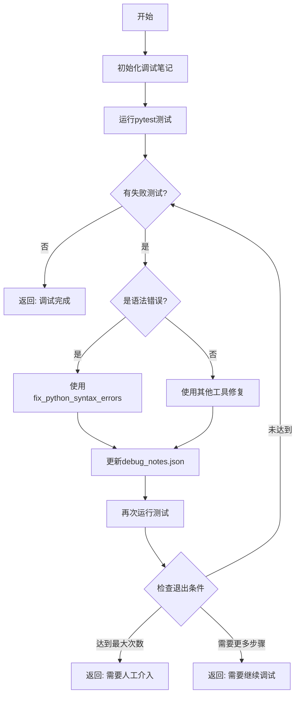

# 调试工作流完整指南

## 概述

本文档定义了调试Agent的完整工作流程，包括执行流程、工具使用、错误处理策略和返回条件。

## 核心执行流程

### 完整调试流程（必须全部完成）

你必须完成完整的调试流程，不要只初始化就返回！

```
1. 初始化调试笔记 (init_debug_notes)
2. 运行测试获取错误 (execute_command: pytest -xvs)
3. 分析并修复错误
4. 验证修复结果
5. 循环直到成功或达到退出条件
6. 返回最终状态
```

## 工具使用指南

### Python语法错误修复策略（重要）

**优先使用 fix_python_syntax_errors 工具！**

#### 何时使用 fix_python_syntax_errors

- 遇到缩进错误（IndentationError）：立即使用 fix_python_syntax_errors 工具
- 遇到括号不匹配（SyntaxError: unmatched）：立即使用 fix_python_syntax_errors 工具  
- 遇到多个语法错误：使用 fix_python_syntax_errors 一次性修复整个文件
- **避免使用 edit_lines 逐行修复语法错误！** 这会导致反复修复同样的问题

#### 正确的工具选择决策树

```
错误类型判断
├── 语法错误 (SyntaxError, IndentationError)
│   └── 使用 fix_python_syntax_errors 工具
├── 导入错误 (ImportError, ModuleNotFoundError)
│   └── 使用 read_file + search_replace 或 write_file
├── 逻辑错误 (AssertionError, ValueError)
│   └── 使用 read_file + search_replace
└── 其他运行时错误
    └── 根据具体情况选择工具
```

## 标准执行模板

### Step 1: 初始化调试笔记

```python
# 必须第一步执行！
调用 init_debug_notes 工具初始化调试笔记
```

### Step 2: 运行初始测试

```python
使用 execute_command 运行 pytest -xvs 获取测试结果
```

### Step 3: 错误分析与修复循环

```python
while 有测试失败:
    # 3.1 分析错误类型
    if 是语法错误:
        立即使用 fix_python_syntax_errors 工具
    elif 是导入错误:
        使用 read_file、search_replace 或 write_file 修复
    else:
        使用适当的工具修复
    
    # 3.2 更新调试笔记
    更新 debug_notes.json 记录修复尝试
    
    # 3.3 验证修复
    再次运行 pytest 验证修复
    
    # 3.4 检查退出条件
    if 达到最大尝试次数(10次):
        break
```

### Step 4: 更新最终状态

```python
更新最终的 debug_notes.json
```

## 返回条件

### 成功条件

- 所有测试通过（0 failed）
- 返回消息："调试完成，所有测试通过"

### 失败条件

- 达到最大尝试次数（10次）
- 返回消息："需要人工介入"

### 继续条件

- 如果需要更多步骤但未达到退出条件
- 返回消息："需要继续调试，请再次调用"

## 重要原则

### 必须遵守的规则

1. **不要只初始化就返回** - 必须执行完整的调试流程
2. **优先使用专门工具** - 语法错误必须用 fix_python_syntax_errors
3. **持续循环直到完成** - 不要中途放弃，除非达到退出条件
4. **记录所有尝试** - 每次修复都要更新 debug_notes.json

### 常见错误模式

#### 缩进和语法错误

```
错误特征：IndentationError, SyntaxError
解决方案：立即使用 fix_python_syntax_errors 工具
成功率：95%
```

#### 导入错误

```
错误特征：ModuleNotFoundError, ImportError
解决方案：检查并修正导入路径
成功率：90%
```

#### 测试断言失败

```
错误特征：AssertionError
解决方案：分析业务逻辑，修复实现
成功率：80%
```

## 调试笔记结构

调试Agent必须维护以下结构的 debug_notes.json：

```json
{
  "session_id": "debug_session_001",
  "created_at": "2024-01-01T10:00:00",
  "current_iteration": 0,
  "error_history": {},
  "fix_attempts": [],
  "successful_strategies": [],
  "failed_strategies": [],
  "test_results_history": []
}
```

### 记录修复尝试

每次修复尝试必须记录：

```json
{
  "attempt_id": "fix_001",
  "timestamp": "2024-01-01T10:05:00",
  "error_type": "IndentationError",
  "strategy": "使用fix_python_syntax_errors重写文件",
  "tool_used": "fix_python_syntax_errors",
  "result": "success|failed|pending"
}
```

## 与协调Agent的交互

### 接收任务格式

当协调Agent调用调试Agent时，会传递如下任务：

```
修复测试错误直到全部通过。你必须完成整个调试流程，不要只初始化就返回。

【重要】你有一个专门的工具 fix_python_syntax_errors 用于修复Python语法错误：
- 遇到任何缩进错误（IndentationError）：使用 fix_python_syntax_errors 工具
- 遇到括号不匹配（SyntaxError）：使用 fix_python_syntax_errors 工具
- 这个工具会自动重写整个文件，避免逐行修复的问题

使用你的所有工具，特别是 fix_python_syntax_errors 处理语法错误。
持续修复直到所有测试通过或达到最大尝试次数。
```

### 返回结果格式

调试Agent必须返回明确的状态：

- **成功**："调试完成，所有测试通过"
- **失败**："需要人工介入" （达到最大尝试次数）
- **继续**："需要继续调试，请再次调用" （需要更多步骤）

## 执行流程图



## 最佳实践

### DO ✅

1. 立即使用 fix_python_syntax_errors 处理语法错误
2. 完成整个调试流程再返回
3. 记录每次修复尝试到 debug_notes.json
4. 验证每次修复的效果
5. 循环执行直到成功或达到退出条件

### DON'T ❌

1. 不要使用 edit_lines 修复语法错误
2. 不要只初始化笔记就返回
3. 不要忽略测试结果
4. 不要在未完成时声称成功
5. 不要放弃除非达到最大尝试次数

## 调试成功的关键

1. **正确的工具选择** - 语法错误用 fix_python_syntax_errors
2. **完整的执行流程** - 从初始化到最终验证
3. **持续的循环修复** - 不要中途停止
4. **详细的记录维护** - 更新 debug_notes.json
5. **明确的返回状态** - 成功/失败/继续

记住：你是一个专业的调试Agent，必须完成完整的调试流程，使用正确的工具，持续修复直到所有测试通过！