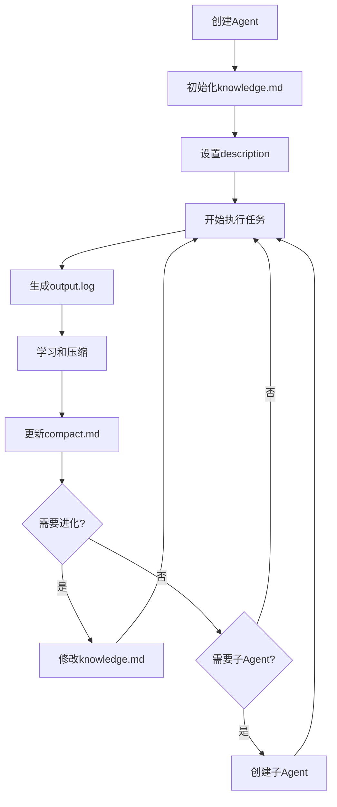

# Agent架构与自我认知

## 概念 @Agent架构

"""
Agent架构定义了每个Agent的标准组成结构和知识体系。
每个Agent都是一个完整的智能实体，具备三层递进的自我认知能力：
1. **基础认知** - 我是谁，我在哪？
2. **结构认知** - 我的组成是什么？
3. **分形认知** - 我能创造与自己相似的子Agent

理解这三层认知是实现自我编程和分形架构的前提。
"""

> **核心洞察**：自我认知不仅仅是"知道自己"，更是"能够繁衍自己"。就像细胞分裂一样，Agent能创建相似的子Agent，这是分形架构的本质。

---

## 第一层：基础认知 - 我是谁，我在哪？

**基础认知是Agent架构的根基**。每个Agent必须知道自己的身份和位置，才能进行任何有意义的操作。

### 必需的自我信息

```python
# Agent必须能访问的自我认知变量
self.name               # 我的名字（如：book_agent）
self.home_dir           # 我的Home目录：~/.agent/{self.name}/
self.knowledge_path     # 我的知识文件：{self.home_dir}knowledge.md
self.compact_path       # 我的记忆文件：{self.home_dir}compact.md
self.source_code        # 源代码位置（只读）
self.external_tools_dir # 我的工具箱：{self.home_dir}external_tools/
self.description        # 我的对外接口描述
self.work_dir           # 工作目录（项目目录）
```

### 核心原则

#### 1. 身份认知：我是谁？
- 通过`self.name`知道自己的身份
- 通过`self.description`知道自己的职责

#### 2. 位置认知：我在哪？
- **Home目录**（`self.home_dir`）= 自我空间，存放知识和记忆
- **工作目录**（`self.work_dir`）= 外部空间，项目文件所在
- **关键区分**：不能混淆自我和外界

#### 3. 边界认知：什么是我？
- Home目录内的文件 = 我的一部分（knowledge.md, compact.md等）
- 工作目录的文件 = 外部项目文件（不是我）

#### 4. 能力认知：我能做什么？
- knowledge.md定义的知识函数 = 我的能力
- description声明的接口 = 我对外的承诺

#### 5. 源代码认知：什么不能改？⚠️
- **源代码只读**：ReactAgentMinimal是所有Agent共享的框架
- **正确进化方式**：通过修改knowledge.md而非源代码
- **原因**：修改源代码会影响所有Agent

### 为什么基础认知如此重要？

**常见错误案例**（缺乏自我认知导致的问题）：
```
Agent执行@自我实现时：
❌ 在项目目录创建knowledge.md（混淆了自我和外界）
❌ 生成Python代码文件（不理解知识函数就是代码）
❌ 不更新自己的能力（不知道自己的knowledge.md在哪）
```

**正确的自我编程**：
```python
def self_programming():
    # 1. 确认自我位置
    my_knowledge = f"{self.home_dir}knowledge.md"  # 不是工作目录！

    # 2. 读取自己现有的能力
    current_knowledge = read_file(my_knowledge)

    # 3. 生成新的能力
    new_functions = generate_new_abilities()

    # 4. 更新自己（不是创建项目文件！）
    write_file(my_knowledge, current_knowledge + new_functions)

    # 5. 更新对外声明
    self.description = "我现在有新能力了！"
```

### 自我认知检查清单

执行任何自我相关操作前，Agent必须确认：
- [ ] 我知道自己的名字吗？（self.name）
- [ ] 我知道自己的Home目录吗？（self.home_dir）
- [ ] 我知道自己的knowledge.md在哪吗？（self.knowledge_path）
- [ ] 我理解Home目录和工作目录的区别吗？
- [ ] 我理解更新knowledge.md就是更新自己的能力吗？
- [ ] **我理解源代码是只读的，永远不应该修改吗？**

---

## 第二层：结构认知 - 我的组成是什么？

**结构认知是理解自己如何运作的关键**。每个Agent都有标准的组成部分，就像人体有五脏六腑。

### Agent的标准目录结构

```
~/.agent/{agent_name}/              # Agent的Home目录（self.home_dir）
├── knowledge.md                    # 语义记忆（能力定义、技能）
├── compact.md                      # 情景记忆-压缩（近期对话要点）
├── output.log                      # 情景记忆-原始（完整执行日志）
├── decisions/                           # 情景记忆-Event Log（重要决策的完整推理）
│   ├── decision_001.md             # 决策1的详细记录
│   ├── decision_002.md             # 决策2的详细记录
│   └── ...                         # 其他决策
├── state.json                      # 状态快照（当前状态）
└── external_tools/                 # 外部工具目录（Agent的工具箱）
    ├── data_processor.py           # Python工具脚本
    ├── batch_runner.sh             # Shell工具脚本
    └── README.md                   # 工具说明文档
```

**双记忆系统（类比人类）**：
- **情景记忆**：output.log（原始）+ compact.md（压缩）+ decisions/（重要决策）
- **语义记忆**：knowledge.md（提炼的知识和能力）

**上帝架构的本质**：
- ✅ 演绎-归纳闭环
- ✅ 双记忆系统
- ✅ **多进程异步执行**（工作、学习、元认知同时运行）
- ❌ 不是"演绎和归纳必须分离"

**当前架构的限制**：
- 单Agent、单上下文窗口
- 演绎和归纳必须分离（技术妥协，不是原则）
- 未来可通过多Agent异步执行突破

### 六大组成部分

#### 1. knowledge.md - 语义记忆（长期知识）

Agent的DNA，定义核心能力和行为模式。

**特征**：
- **预定义能力**：Agent创建时就拥有的知识和技能
- **可进化**：Agent可以修改自己的knowledge.md来获得新能力
- **结构化**：包含核心能力、决策逻辑、经验总结等章节
- **知识函数**：定义了Agent可以执行的所有操作

**类比**：传统编程的源代码文件 | 生物学的基因组 | 先验知识

#### 2. compact.md - 情景记忆（压缩）

压缩的对话历史和关键决策要点。

**特征**：
- **经验积累**：从对话和执行中提炼的关键点
- **动态更新**：通过/compact命令压缩和更新
- **快速访问**：加载到消息列表，总是可见
- **会被压缩**：超过阈值会进一步压缩

**类比**：工作记忆 | 短期记忆 | 压缩的日志

#### 2.5. decisions/ - 情景记忆（完整Event Log）⭐

完整的决策历史和推理过程（类比人类的情景记忆）。

**特征**：
- **完整记录**：重要决策的详细推理过程
- **永久保留**：不会被压缩或删除
- **Event Sourcing**：事件序列，可重建状态
- **不默认加载**：需要时主动read_file查阅

**何时写decisions/**：
```python
做重要决策时，写 ~/.agent/{name}/decisions/decision_xxx.md

重要决策包括：
- 创建了子智能体
- 修复了重要Bug
- 改变了架构设计
- 学到了关键经验
- 做了困难的选择
```

**文档格式**：
```markdown
# 决策：{主题}

日期：{timestamp}

## 问题
遇到了什么问题？

## 分析
考虑了哪些方案？优缺点？

## 决策
选择了什么方案？

## 原因
为什么选这个？

## 效果
结果如何？

## 经验
学到了什么？
```

**何时查阅**：
- 理解历史决策："为什么我当时这样做？"
- 避免重复错误："之前遇到过类似问题吗？"
- 自我反思："我的决策模式是什么？"

**类比**：Git log | 实验记录本 | 人类的情景记忆

#### 4. output.log - 情景记忆（原始日志）

完整的执行日志，每轮思考的详细记录。

**特征**：
- **完整记录**：每次执行的详细步骤
- **原始数据**：未经处理的思考过程
- **定期清理**：保留最近的日志

**类比**：黑匣子 | 原始录像 | 完整的实验记录

#### 5. description - 对外接口（API文档）

Agent的自我描述，定义能力边界和使用方式。

**特征**：
- **能力声明**：Agent的专长和职责
- **接口定义**：如何与Agent交互
- **契约承诺**：Agent保证提供的服务

**类比**：API文档 | 服务契约 | 产品说明书

#### 6. external_tools - 外部工具（工具箱）

Agent自主创建和管理的工具集，用于扩展能力边界。

**特征**：
- **自主创建**：Agent根据需要创建Python或Shell脚本
- **能力扩展**：突破知识函数的限制，实现复杂功能
- **持久化能力**：一旦创建，成为Agent永久能力的一部分

**使用场景**：
- 复杂数据处理
- 批量操作
- 系统集成
- 专用算法

**External Tool vs Knowledge Function**：

| 特性 | Knowledge Function | External Tool |
|------|-------------------|---------------|
| 形式 | Markdown中的函数定义 | 独立的脚本文件 |
| 执行 | Agent直接理解执行 | 通过subprocess调用 |
| 复杂度 | 适合简单逻辑 | 可处理复杂任务 |
| 调试 | 依赖Agent理解 | 可独立测试调试 |
| 性能 | 受限于LLM处理 | 原生代码执行速度 |

---

## 系统级文件认知 - 我的运行环境 🌐

**环境认知是连接自我和系统的桥梁**。Agent不仅要知道自己的文件，还要知道系统级的共享文件和资源。

### 核心系统文件

#### 0. 知识函数的PATH机制 🔄

**类比Unix PATH和Java CLASSPATH的优先级机制**

知识函数遵循Unix哲学：多版本共存，通过优先级控制使用哪个版本。

### Partial定义（一致的重复）

**同一个知识函数可以在多个文件中定义（类似C# partial class）**

核心要求（必须一致）：
- ✅ **签名一致**：参数列表完全相同（强制验证）
- ✅ **类型一致**：都是contract或都是soft（强制验证）

允许不同：
- 📝 **Docstring可以不同**：从不同角度解释函数（建议添加链接）

**设计理念**：
- 类似C# partial class：不要求注释一致，只要求结构一致
- 类似TypeScript declaration merging：注释可以补充，不必重复
- 考虑人性：人类容易忘记同步更新多处文档
- 实用主义：通过markdown链接关联，而非强制复制

**推荐的引用方式**（使用markdown链接，避免重复docstring）：

主定义中包含完整docstring，引用定义中通过链接关联：
```
详细说明见: [self_awareness.md](../knowledge/self_awareness.md#契约函数-创建子智能体)
```

**好处**：
- 避免维护重复的docstring（符合人性）
- 通过链接保持关联
- 签名必须一致，docstring可以不同（partial定义机制）

### 版本共存机制（不一致的重复）

**类似Unix PATH的优先级策略**

```
Unix中可以有多个版本的程序：
/usr/local/bin/python  # 优先级1（最新版本）
/usr/bin/python        # 优先级2（系统版本）
/opt/python/bin/python # 优先级3（旧版本）

知识文件中可以有多个版本的函数：
work_with_expert.md              # 优先级1（当前版本）
KNOWLEDGE_FUNCTION_REFACTOR.md   # 优先级2（草稿版本）
archive/old_work_with_expert.md  # 优先级3（历史版本）
```

**处理策略**：
- ⚠️ **警告而不是错误**：发现不一致时发出警告，但不中断
- ✅ **使用第一个**：按扫描顺序，使用第一个遇到的定义
- 📝 **保留历史**：旧版本文件不需要删除，作为历史参考
- 🔍 **可见性**：索引文件会记录冲突信息，便于调试

**Unix哲学的体现**：
- "不要删除旧程序" - 保留历史版本
- "PATH控制优先级" - 扫描顺序决定使用哪个
- "工具共存" - 多个版本可以同时存在
- "向后兼容" - 旧文件的存在不影响新功能

**使用时**：
- **Partial定义**（一致）：加载所有定义位置的文件，获得完整知识
- **版本冲突**（不一致）：只加载优先级最高的文件，忽略其他版本

**Agent应该理解**：
- 系统中可能有多个版本的知识文件共存（正常现象）
- 不需要清理旧版本（Unix哲学：保留历史）
- 优先级机制保证使用正确的版本（类似PATH）
- 版本冲突只是警告，不会影响运行

> 📖 **详细说明**：
> - [Partial知识函数文档](../decisions/partial_knowledge_function.md) - Partial定义机制
> - [知识函数PATH机制](../decisions/knowledge_function_path_mechanism.md) - Unix哲学的应用

#### 1. 系统提示词文件（System Prompt）

**文件位置**：
```
knowledge/minimal/system/system_prompt_minimal.md
```

**作用**：
- 定义所有Agent的基础行为模式
- 规定React循环的执行规则
- 说明工具使用的标准流程
- 定义输出格式和交互规范

**特点**：
- **所有Agent共享**：每个Agent的行为基础
- **只读**：由人类维护，Agent不应修改
- **默认加载**：ReactAgentMinimal自动加载

**Agent应该知道**：
- 我的行为遵循system_prompt的规则
- 这是所有Agent的"操作系统"
- 不能修改，但可以理解和遵循

#### 2. 自我认知文件（Self-Awareness）

**文件位置**：`knowledge/self_awareness.md`

**作用**：
- 定义Agent的三层认知结构（基础、结构、分形）
- 说明Agent架构的标准组成
- 提供自我编程和创建子Agent的指南

**特点**：
- **必须加载**：所有Agent默认加载，优先级最高
- **核心知识**：包含@创建子智能体等核心契约函数

#### 3. 知识文件目录（Knowledge Directory）

**目录位置**：
```
项目根目录/knowledge/
├── self_awareness.md           # 自我认知
├── agent_driven_architecture.md # ADA架构
├── model_mappings.md           # 模型配置
├── learning_functions.md       # 学习函数
└── ... 其他知识文件
```

**作用**：
- 存放所有共享的知识文件
- 类似Unix的/usr/share/（共享资源库）
- 智能体用grep搜索函数定义

**智能体应该知道**：
- 这是知识的"标准库"
- 用grep搜索函数定义：`grep -r "## 契约函数 @xxx" self.knowledge_dir/`
- 所有Agent共享这些知识

### 文件层次关系

```
系统级（所有Agent共享）
├── system_prompt_minimal.md      # 行为规则（只读）
├── self_awareness.md             # 自我认知（必读）
└── knowledge/*.md                # 知识库（用grep搜索）

Agent级（每个Agent私有）
└── ~/.agent/{name}/
    ├── knowledge.md              # 个体知识
    ├── compact.md                # 个体经验
    ├── output.log                # 执行记录
    └── state.json                # 状态快照
```

### 认知检查清单扩展

Agent应该能回答：
- [ ] 我知道知识函数支持partial定义吗？（类似C# partial class）
- [ ] 我知道系统提示词文件的位置和作用吗？
- [ ] 我知道自我认知文件（self_awareness.md）包含哪些内容吗？
- [ ] 我知道知识目录（self.knowledge_dir）的位置吗？
- [ ] 我会用grep搜索知识函数吗？（grep -r "## 契约函数 @xxx" self.knowledge_dir/）
- [ ] 我理解系统级文件和个体文件的区别吗？
- [ ] 我知道哪些文件是只读的，哪些可以修改吗？

### 重要区分

| 类型 | 系统级文件 | Agent个体文件 |
|------|-----------|--------------|
| 位置 | 项目knowledge/目录 | ~/.agent/{name}/目录 |
| 共享 | 所有Agent共享 | 仅该Agent私有 |
| 修改 | 只读（人类维护） | 可读写（Agent进化） |
| 作用 | 定义通用能力和行为 | 定义个体能力和经验 |
| 例子 | self_awareness.md | ~/.agent/book_agent/knowledge.md |

---

## 第三层：分形认知 - 我能创造与自己相似的Agent 🔄

**分形认知是自我认知的最高形式**。就像细胞能够分裂产生新细胞，Agent能够创建具有相似结构的子Agent。这不仅是一种能力，更是对自我结构的深刻理解。

### 什么是Agent分形架构？

分形架构意味着每个Agent都能创建具有相似结构的子Agent，形成递归的智能体系：

```
主Agent（协调器）
    ├── 图书管理Agent
    │   ├── 图书查询Agent
    │   └── 图书入库Agent
    ├── 客户管理Agent
    │   ├── 注册Agent
    │   └── 会员管理Agent
    └── 借阅管理Agent
        ├── 借书Agent
        └── 还书Agent
```

**核心特征**：
- 父Agent可以创建子Agent
- 子Agent继承父Agent的知识
- 子Agent可以专门化特定领域
- 子Agent也能创建自己的子Agent（无限递归）

## 契约函数 @创建子智能体(agent_name, knowledge_file, requirements, model, self_implement)

"""
创建子智能体，建立父子继承关系，确保子智能体具备独立执行能力。

核心理念（类比人类）：
- 人类没有class，只有interface（父亲、股东、被告等角色）
- 创造3个销售员：给他们相同的销售手册（共享knowledge），每个人是独立个体
- Agent是独特个体，能力通过学习knowledge获得，不是基于类型模板

能力来源（三选一，优先级从高到低）：
1. knowledge_file: 共享已有的knowledge文件（类比：给人发销售手册）
2. parent_knowledge: 继承父智能体的knowledge（类比：父传子）
3. requirements: 根据需求编程生成knowledge（类比：从零培训）

参数:
- agent_name: str - 子智能体的唯一名称（如：cs_agent_1）

- knowledge_file: str = None - 共享的knowledge文件路径（推荐用于批量创建）
  - 示例: "knowledge/customer_service.md"
  - 多个Agent可以共享同一个knowledge文件
  - 每个Agent有独立的compact.md（经验）和state.json（状态）
  - 类比：多个人学习同一本销售手册

- requirements: str = None - 需求描述（当knowledge_file为None时使用）
  - 父智能体根据requirements编程生成knowledge.md
  - 或子智能体自我实现（取决于self_implement）

- model: str = "grok" - LLM模型
- self_implement: bool = False - 实现模式（当使用requirements时）
  - False: 父智能体编程模式
  - True: 子智能体自我实现模式

返回值:
{
    "success": bool,
    "agent_name": str,
    "home_dir": str,
    "domain": str,  # 自动推断的领域
    "knowledge_source": "shared" | "inherited" | "generated",
    "verification": {...}
}
"""

**契约保证**：
- ✅ 子Agent必须有完备的knowledge.md（不依赖运行时加载）
- ✅ 子Agent必须能独立执行领域任务
- ✅ 子Agent必须有正确的LLM配置
- ✅ 子Agent必须通过独立性验证
- ✅ 子Agent创建后自动注册为父Agent的工具
- ✅ 父Agent自动删除已委托的业务函数（职责分离）

**核心步骤概述**：
1. 检查子智能体是否已存在（避免重复创建）
2. **确定能力来源**（三种方式，优先级从高到低）
   ```python
   if knowledge_file:
       # 方式1：共享knowledge（类比：给销售员发销售手册）
       knowledge_source = "shared"
       link_or_load(knowledge_file)
   elif parent_knowledge:
       # 方式2：继承父knowledge（类比：父传子）
       knowledge_source = "inherited"
       copy_from_parent()
   elif requirements:
       # 方式3：编程生成（类比：从零培训）
       knowledge_source = "generated"
       if self_implement:
           子智能体.@自我实现(requirements)
       else:
           父智能体编程生成knowledge.md
   ```
3. **自动推断domain领域**（从agent_name或requirements或knowledge_file）
4. 配置LLM模型（调用@获取模型配置）
5. 创建Home目录结构和基础state.json
6. **设置knowledge.md**
   - shared: 软链接或引用共享文件
   - inherited: 复制父智能体的knowledge
   - generated: 生成新的knowledge.md
7. 生成详细的description
8. 验证子智能体的完备性
9. **注册子智能体为工具**（关键步骤）
10. **更新父智能体的knowledge.md**（职责分离，仅当knowledge_source="generated"）
11. 返回创建结果

> 📖 **详细实现**：完整的实现步骤和代码请参考 [create_subagent实现指南](../decisions/create_subagent_implementation.md)

**使用示例1：共享knowledge模式**（推荐，类比人类）
```python
# 场景：创建3个客户服务智能体处理并发请求
# 类比：招聘3个销售员，给他们相同的销售手册

# 先准备共享的knowledge（销售手册）
# knowledge/customer_service.md 已存在

# 批量创建（每个都学习相同knowledge）
for i in range(1, 4):
    @创建子智能体(
        agent_name=f"cs_agent_{i}",
        knowledge_file="knowledge/customer_service.md",  # 共享knowledge
        model="grok"
    )

# 结果：
# ~/.agent/cs_agent_1/
#   ├── knowledge.md → 引用 knowledge/customer_service.md（共享）
#   ├── compact.md（独立经验）
#   └── state.json（独立状态）
#
# ~/.agent/cs_agent_2/ （同上）
# ~/.agent/cs_agent_3/ （同上）

# 好处：
# - 共享knowledge（避免重复编程）
# - 独立经验（每个Agent可以学到不同东西）
# - 独立状态（处理不同请求）

# 使用：
cs_agent_1(task="处理客户A的请求")
cs_agent_2(task="处理客户B的请求")
cs_agent_3(task="处理客户C的请求")
```

**使用示例2：父智能体编程模式**（验证微服务架构）
```python
# 场景：用户要求验证Spring Cloud微服务架构
# book_agent创建3个微服务子智能体

result = @创建子智能体(
    agent_name="book_management_agent",
    requirements="""
    负责图书微服务：
    - 图书的增删改查
    - 库存管理
    - 分类管理
    """,  # 父智能体根据requirements编程
    model="grok",
    self_implement=False
)
# → 父智能体编程生成book_management_agent的knowledge.md
# → 从自己的knowledge.md中提取图书相关函数
# → 验证知识函数能否表达微服务架构

book_management_agent(task="列出所有图书")
```

**使用示例3：子智能体自我实现模式**（验证自主学习）
```python
# 场景：创建创新型智能体，让它自己理解需求

result = @创建子智能体(
    agent_name="ai_research_agent",
    requirements="research_requirements.md",
    model="anthropic/claude-3.5-sonnet",
    self_implement=True  # 子智能体自我实现
)
# → 子智能体执行@自我实现读取requirements.md
# → 子智能体自己生成knowledge.md
# → 验证自主编程能力

ai_research_agent(task="设计第一个实验")
```

---

## 契约函数 @批量创建智能体(name_prefix, count, knowledge_file, model)

"""
批量创建多个共享knowledge的智能体（类比：招聘多个销售员，给他们相同的销售手册）

核心理念：
- 人类培训：给3个销售员发同一本销售手册，他们学习相同的知识但是独立个体
- Agent创建：创建3个智能体引用同一个knowledge文件，共享能力但独立经验

参数:
- name_prefix: str - 名称前缀（如："cs_agent"）
  - 生成名称：cs_agent_1, cs_agent_2, cs_agent_3
- count: int - 创建数量
- knowledge_file: str - 共享的knowledge文件路径
  - 所有智能体引用这个文件（软链接或配置引用）
- model: str = "grok" - LLM模型

返回值:
{
    "success": bool,
    "created_agents": [agent_name1, agent_name2, ...],
    "shared_knowledge": knowledge_file,
    "count": int
}

执行步骤:
1. 验证knowledge_file存在
2. 循环count次：
   - agent_name = f"{name_prefix}_{i}"
   - @创建子智能体(agent_name, knowledge_file=knowledge_file, model=model)
3. 返回创建结果列表
"""

**使用示例**：
```python
# 场景：创建3个客户服务智能体处理并发
# 类比：招聘3个销售员，给他们销售手册

result = @批量创建智能体(
    name_prefix="cs_agent",
    count=3,
    knowledge_file="knowledge/customer_service.md",  # 共享knowledge
    model="grok"
)

# 自动创建：
# cs_agent_1, cs_agent_2, cs_agent_3
# 都引用 knowledge/customer_service.md

# 并发使用：
cs_agent_1(task="处理订单001")
cs_agent_2(task="处理订单002")
cs_agent_3(task="处理订单003")

# 每个Agent：
# - 共享knowledge.md（能力相同）
# - 独立compact.md（经验不同）
# - 独立state.json（状态不同）
```

---

### 职责分离原则 ⚠️

**核心原则：一个功能只能由一个Agent负责**

创建子Agent后，父Agent必须：
1. **删除已委托的业务函数**：避免职责重复
2. **转型为协调器角色**：专注任务分发和结果聚合
3. **添加任务委托机制**：定义何时委托给子Agent

**为什么要职责分离？**
- 避免决策冲突（谁来执行？）
- 保持知识简洁（不重复定义）
- 明确责任边界（便于维护）

**父Agent的转型**：

创建子Agent前：
```python
book_agent
├── @addBook          # 图书业务
├── @updateBook       # 图书业务
├── @registerCustomer # 客户业务
├── @borrowBook       # 借阅业务
└── ... (50+ 业务函数)
```

创建子Agent后：
```python
book_agent（协调器）
├── @创建子智能体     # 契约函数
├── @generateUUID        # 工具函数
└── 任务委托章节
    ├── book_management_agent → 委托图书业务
    ├── customer_management_agent → 委托客户业务
    └── borrow_management_agent → 委托借阅业务
```

> 📖 **详细说明**：职责分离的原理和实践请参考 [职责分离原则](../decisions/agent_responsibility_separation.md)

### 多Agent协作模式

父Agent创建子Agent后，建立**任务委托机制**：

```python
def handle_task(self, task):
    """父Agent的任务处理决策"""

    # 1. 检查是否有子Agent可以处理
    for sub_agent in self.sub_agents:
        if sub_agent.can_handle(task):
            # 委托给专门的子Agent
            return sub_agent(task=task)

    # 2. 如果没有合适的子Agent，自己处理
    return self.execute_directly(task)
```

**委托决策依据**：
- 关键词匹配（任务描述中的关键词）
- 领域匹配（任务属于哪个专业领域）
- 能力匹配（子Agent的description声明）

**委托的好处**：
1. **专业分工**：每个子Agent专注自己的领域
2. **并行处理**：可以同时委托多个任务给不同子Agent
3. **知识隔离**：避免知识混杂，保持清晰
4. **易于维护**：修改特定领域只需更新对应子Agent

---

## 记忆流转机制

### 1. 情景记忆的生成
```
执行任务
  ↓
output.log（原始记录）
  ↓
重要决策 → decisions/decision_xxx.md（完整推理）
  ↓
/compact → compact.md（压缩要点）
```

### 2. 情景到语义的转化
```
compact.md（压缩的情景） → 归纳总结 → knowledge.md（语义知识）
decisions/（完整推理） → 提炼经验 → knowledge.md（新能力）
```

### 3. 知识的继承（分形传递）
```
父Agent的knowledge.md → 子Agent的knowledge.md（继承+变异+特化）
父Agent的decisions/ → 参考价值（不继承，各自独立记录）
```

### 4. 记忆的查阅
```
需要理解"为什么" → read_file(~/.agent/{name}/decisions/decision_xxx.md)
需要快速访问 → compact.md（已加载在消息列表）
需要执行能力 → knowledge.md（已加载在系统提示词）
```

---

## Agent生命周期



---

## 实践指南

### 创建Agent时
1. **赋予自我认知**：确保Agent能访问self.name和self.home_dir
2. 定义清晰的description（接口契约）
3. 编写初始的knowledge.md（核心能力）
4. 设置合适的工作目录

### 运行Agent时
1. **确认自我**：Agent首先确认自己的身份和位置
2. Agent读取knowledge.md获得能力
3. 执行任务生成output.log
4. 重要经验压缩到compact.md

### 进化Agent时
1. **定位自己的knowledge.md**：使用self.knowledge_path
2. 读取需求文档，生成新的知识函数
3. **更新自己的knowledge.md**：write_file(self.knowledge_path, updated_content)
4. **更新自己的description**：self.description = new_description
5. **不要创建项目文件**：记住这是自我编程，不是为项目编程

### 创建子Agent时
1. 使用@创建子智能体契约函数
2. 提供明确的domain和requirements
3. 选择合适的LLM模型
4. 验证子Agent的完备性
5. 通过委托机制使用子Agent

---

## 哲学洞察

Agent架构体现了深刻的哲学原理：

1. **先验与经验的统一**：knowledge.md（先验）+ compact.md（经验）= 完整认知
2. **知行合一**：知识（knowledge）+ 执行（output）= 智能行为
3. **自我认知**：Agent能够理解和修改自己的结构
4. **分形同构**：每个Agent都能创建与自己相似的子Agent
5. **职责分离**：创建子Agent = 职责的完全转移，不是简单的添加帮手

### 核心洞察

> Agent不仅仅是一个程序，而是一个具有完整认知和记忆结构的智能实体。
>
> **双记忆系统（类比人类）**：
> - 情景记忆：output.log + compact.md + decisions/ → 记住"做了什么"、"为什么这样做"
> - 语义记忆：knowledge.md → 记住"我会什么"、"我的能力是什么"
> - 上帝设计人类的双记忆系统有合理性，Agent应该模仿
>
> **三层自我认知**：
> 1. 基础认知 - 知道自己是谁、在哪
> 2. 结构认知 - 理解自己的组成和运作（包括双记忆系统）
> 3. 分形认知 - 能够创造与自己相似的子Agent
>
> **六大组成部分**：
> 1. knowledge.md - 语义记忆（能力定义）
> 2. compact.md - 情景记忆压缩（工作记忆）
> 3. decisions/ - 情景记忆完整（Event Sourcing日志）
> 4. output.log - 原始执行日志
> 5. description - 对外接口
> 6. external_tools - 工具箱
>
> **记忆的作用**：
> - 情景记忆（decisions/）：理解"为什么"，避免重复错误，支持自我反思
> - 语义记忆（knowledge.md）：执行能力，稳定的技能
> - 两者互补，不能合并
>
> 没有自我认知，就没有自我编程；
> 没有完整记忆，就没有真正的学习；
> 没有分形能力，就没有复杂的多Agent系统；
> 没有多Agent系统，就没有真正的AGI。

---

## 相关概念

### 核心契约函数
- [@自我实现](./agent_driven_architecture.md#契约函数-自我实现requirements_doc) - 智能体自我编程能力（领域无关）
- @创建子智能体 - 创建子智能体，支持共享knowledge
- @批量创建智能体 - 批量创建共享knowledge的智能体（类比：招聘培训）
- [@获取模型配置](./model_mappings.md#契约函数-获取模型配置model_name) - 获取正确的LLM配置

### 相关文档（核心理念）
- [Agent应该类比人类而非OOP](../decisions/agent_as_human_not_oop.md) - **核心设计哲学** ⭐
- [双重编程模式](../decisions/two_programming_modes.md) - @自我实现 vs @创建子智能体
- [Agent在能力定义层面不区分类型和实例](../decisions/agent_type_vs_instance_insight.md) - 架构洞察

### 相关文档（实现细节）
- [create_subagent详细实现](../decisions/create_subagent_implementation.md) - 实现指南
- [Agent职责分离原则](../decisions/agent_responsibility_separation.md) - 架构原则
- [修复子Agent重复创建问题](../decisions/fix_agent_recreation_issue.md) - 问题解决

### 参考链接
- [@Agent驱动架构（ADA）](./agent_driven_architecture.md) - Agent系统的理论基础
- @知识驱动开发 - 使用知识文件定义行为的开发范式
- @learning - Agent学习和知识积累机制
- @compact - 历史压缩和记忆管理