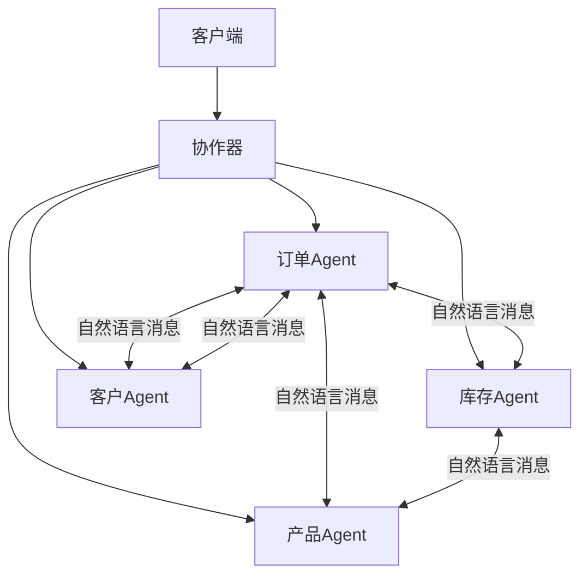

# 微服务架构 + 自然语言函数

## 架构概述

这是一个革命性的微服务实现：**用自然语言函数替代传统API**。



## 核心创新

### 1. 自然语言替代API
**传统微服务**：
```yaml
API: POST /api/orders
Body: {
  "customerId": "CUST001",
  "items": [...]
}
```

**自然语言微服务**：
```
"为客户CUST001创建订单，购买iPhone和AirPods"
```

### 2. 语义理解替代协议
- 无需定义精确的API接口
- Agent通过理解语义自动协作
- 灵活处理各种请求格式

### 3. 知识驱动替代代码
- 每个服务的逻辑在知识文件中
- 修改业务规则只需更新Markdown
- 非程序员也能理解和修改

## 服务架构

### 订单服务（Order Service）
- **职责**：订单创建、查询、状态管理
- **知识**：`order_service/order_knowledge.md`
- **Agent**：`order_service/order_agent.py`

### 库存服务（Inventory Service）
- **职责**：库存查询、扣减、补充
- **知识**：`inventory_service/inventory_knowledge.md`
- **Agent**：`inventory_service/inventory_agent.py`

### 产品服务（Product Service）
- **职责**：商品信息、价格管理
- **知识**：`product_service/product_knowledge.md`
- **Agent**：`product_service/product_agent.py`

### 客户服务（Customer Service）
- **职责**：客户信息、会员等级、优惠
- **知识**：`customer_service/customer_knowledge.md`
- **Agent**：`customer_service/customer_agent.py`

## 协作流程示例

### 创建订单流程
```
1. 客户端 → 协作器："为VIP客户创建订单"
2. 协作器 → 客户服务："获取客户信息和折扣"
3. 协作器 → 产品服务："获取商品价格"
4. 协作器 → 库存服务："检查库存"
5. 协作器 → 订单服务："创建订单"
6. 订单服务 → 库存服务："扣减库存"
7. 完成
```

## 运行演示

```bash
cd /home/guci/aiProjects/mda/pim-compiler/react_is_all_you_need
python microservices/orchestrator.py
```

## 优势对比

| 特性 | 传统微服务 | 自然语言微服务 |
|------|-----------|---------------|
| API定义 | 需要精确定义 | 自然语言描述 |
| 接口文档 | Swagger/OpenAPI | Markdown知识文件 |
| 版本管理 | API版本地狱 | 语义兼容 |
| 集成测试 | 复杂 | 自然语言测试 |
| 学习曲线 | 陡峭 | 平缓 |
| 灵活性 | 低 | 高 |

## 关键洞察

1. **语义通信 > 协议通信**
   - 不需要定义精确的数据格式
   - Agent理解意图即可协作

2. **知识驱动 > 代码驱动**
   - 业务逻辑在知识文件中
   - 易于理解和修改

3. **灵活协作 > 固定接口**
   - 可以处理未预期的请求
   - 自动适应需求变化

## 架构演进

```
1. 单体应用 → 微服务（2000s）
   解决：系统耦合问题
   
2. 微服务 → 自然语言微服务（2024）
   解决：接口复杂性问题
```

## 最佳实践

1. **服务划分**：按业务领域划分，每个Agent一个领域
2. **知识组织**：每个服务独立的知识文件
3. **消息格式**：使用自然语言，包含充分上下文
4. **错误处理**：Agent理解错误并自动处理
5. **监控日志**：记录自然语言交互历史

## 未来展望

这种架构展示了软件工程的未来：
- **零API定义**：完全通过自然语言通信
- **智能协作**：Agent自主协商和协作
- **业务驱动**：业务人员直接定义服务行为
- **自适应系统**：根据需求自动调整

---

*"我们不是在构建微服务，而是在构建理解业务的智能体网络。"*