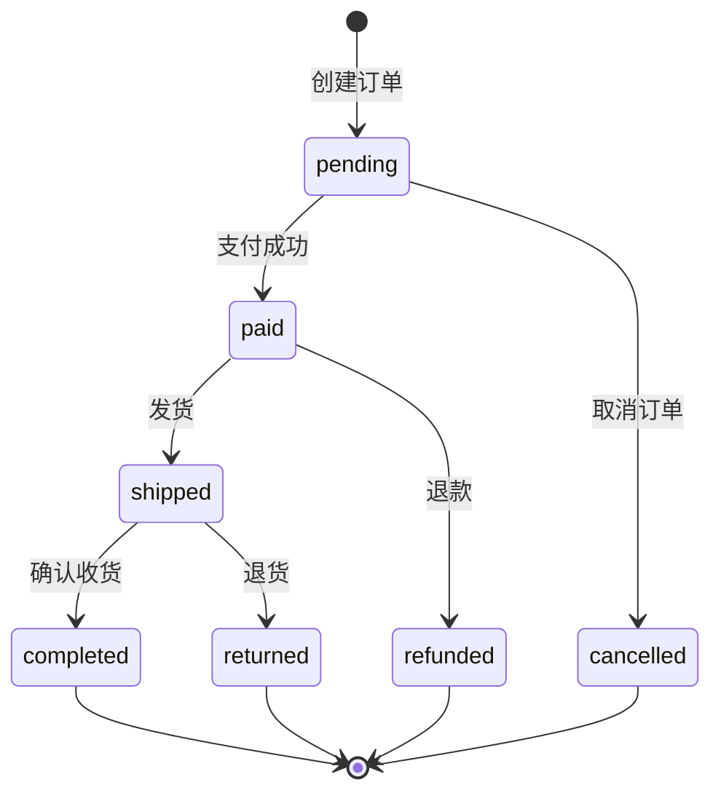

# 订单服务知识库

## 服务职责
订单服务负责管理订单的创建、查询、状态更新等所有订单相关业务。

## 自然语言函数

### 函数：创建订单
```
接收客户ID和商品列表，
向库存服务查询库存是否充足，
向产品服务获取商品价格，
向客户服务获取客户信息和折扣，
计算总价（考虑折扣），
生成订单号（格式：ORD-YYYYMMDD-XXXXX），
保存订单到 /tmp/microservices/orders/orders.json，
返回订单确认信息。
```

### 函数：查询订单
```
根据订单号或客户ID查询订单，
从 /tmp/microservices/orders/orders.json 读取订单数据，
返回订单详情包括状态、商品、金额等。
```

### 函数：更新订单状态
```
验证状态转换的合法性：
- pending → paid/cancelled
- paid → shipped/refunded  
- shipped → completed/returned
更新订单状态，
记录状态变更日志到 /tmp/microservices/orders/status_log.json，
返回更新结果。
```

### 函数：计算订单总价
```
接收商品列表和折扣信息，
计算原价总和，
应用折扣（VIP 8折，普通会员9折），
应用满减（满1000减100），
返回最终价格。
```

## 与其他服务的协作

### 调用库存服务
```
函数：请求库存服务检查库存
向库存Agent发送消息：
"检查以下商品的库存：[商品列表]"
等待库存服务返回结果。
```

### 调用产品服务
```
函数：请求产品服务获取价格
向产品Agent发送消息：
"获取以下商品的价格信息：[商品ID列表]"
等待产品服务返回价格数据。
```

### 调用客户服务
```
函数：请求客户服务获取客户信息
向客户Agent发送消息：
"获取客户[客户ID]的信息和会员等级"
等待客户服务返回客户数据。
```

## 数据存储位置
- 订单数据：`/tmp/microservices/orders/orders.json`
- 状态日志：`/tmp/microservices/orders/status_log.json`
- 订单序号：`/tmp/microservices/orders/sequence.txt`

## 订单状态机


## 业务规则
1. 订单创建时状态为pending
2. 库存不足时不能创建订单
3. VIP客户享受8折优惠
4. 普通会员享受9折优惠
5. 满1000元减100元
6. 订单号格式：ORD-YYYYMMDD-XXXXX