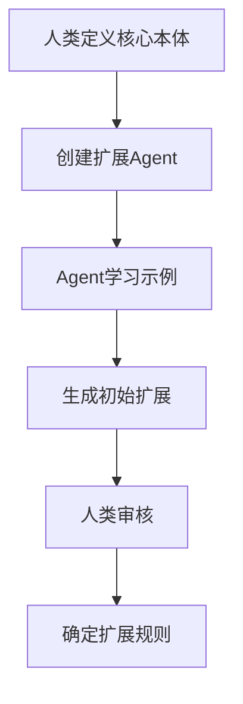

# 人机协作本体论：静态核心 + 动态扩展

## 1. 核心理念

**人类设计静态核心，Agent动态扩展本体论**

这是一个革命性的本体构建模式：
- 🧠 **人类**：提供稳定的认知框架（类似宪法）
- 🤖 **Agent**：在框架内动态扩展（类似判例法）
- 🔄 **协作**：人类智慧 + AI能力的完美结合

## 2. 静态核心（人类设计）

### 2.1 最小认知原语（仅10个）
```turtle
@prefix core: <http://ontology.core#> .

# 存在层（What exists）
core:Thing           # 万物之源
core:Entity          # 具体实体
core:Concept         # 抽象概念

# 关系层（How related）  
core:Relation        # 关系本身
core:partOf          # 部分关系
core:instanceOf      # 实例关系
core:relatedTo       # 一般关联

# 过程层（What happens）
core:Process         # 过程/变化
core:causes          # 因果关系
core:transformsTo    # 转换关系
```

### 2.2 设计原则
- **最小化**：只包含不可再简化的概念
- **普适性**：适用于任何领域
- **稳定性**：一旦确定，极少改变
- **可组合**：通过组合表达复杂概念

## 3. 动态扩展（Agent自主进行）

### 3.1 Agent扩展机制
```python
class OntologyExtensionAgent:
    """本体扩展Agent"""
    
    def __init__(self, static_core):
        self.core = static_core
        self.extensions = {}
        self.learning_history = []
    
    def analyze_new_domain(self, domain_text):
        """分析新领域，提取本体扩展"""
        
        # Step 1: 识别新概念
        prompt = f"""
        基于核心本体：{self.core}
        分析文本：{domain_text}
        
        识别：
        1. 新的实体类型（必须是core:Entity的子类）
        2. 新的关系类型（必须是core:Relation的子类）
        3. 新的过程类型（必须是core:Process的子类）
        
        返回格式：
        - 新概念名称
        - 父类（从核心本体选择）
        - 定义
        - 与其他概念的关系
        """
        
        new_concepts = self.llm.extract(prompt)
        return new_concepts
    
    def validate_extension(self, new_concepts):
        """验证扩展的一致性"""
        
        # 检查是否与核心本体一致
        for concept in new_concepts:
            if not self.is_consistent_with_core(concept):
                self.request_human_review(concept)
        
        return validated_concepts
    
    def evolve_ontology(self, feedback):
        """根据使用反馈演化本体"""
        
        # 记录哪些扩展被频繁使用
        # 提升常用扩展为准核心概念
        # 淘汰很少使用的扩展
        pass
```

### 3.2 扩展示例：代码领域
```turtle
# Agent自动生成的代码领域扩展
@prefix code: <http://ontology.code#> .

# 实体扩展（Agent发现的）
code:Class rdfs:subClassOf core:Entity ;
    core:definition "A blueprint for creating objects" ;
    core:discoveredBy "CodeAnalysisAgent" ;
    core:confidence 0.95 .

code:Function rdfs:subClassOf core:Process ;
    core:definition "A reusable block of code" ;
    core:pattern "def|function|fn|func" ;
    core:confidence 0.98 .

# 关系扩展（Agent发现的）
code:inherits rdfs:subPropertyOf core:instanceOf ;
    core:definition "Class inheritance relationship" ;
    core:confidence 0.92 .

code:calls rdfs:subPropertyOf core:causes ;
    core:definition "Function invocation relationship" ;
    core:confidence 0.89 .
```

### 3.3 扩展示例：文档领域
```turtle
# Agent自动生成的文档领域扩展
@prefix doc: <http://ontology.doc#> .

doc:Chapter rdfs:subClassOf core:Entity ;
    core:definition "A major section of a document" ;
    core:pattern "Chapter|章|Section" ;
    core:confidence 0.91 .

doc:cites rdfs:subPropertyOf core:relatedTo ;
    core:definition "Reference relationship" ;
    core:confidence 0.87 .
```

## 4. 协作工作流

### 4.1 初始化阶段


### 4.2 运行时扩展
```python
def runtime_extension_workflow(new_content):
    """运行时动态扩展流程"""
    
    # 1. Agent分析新内容
    analysis = agent.analyze(new_content)
    
    # 2. 检查是否需要新概念
    if analysis.requires_new_concepts:
        # 3. 生成扩展提案
        extension = agent.propose_extension(analysis)
        
        # 4. 自动验证一致性
        if extension.is_consistent:
            # 5. 临时应用扩展
            ontology.apply_temporary(extension)
            
            # 6. 收集使用统计
            usage_stats = monitor_usage(extension)
            
            # 7. 达到阈值后提交人类审核
            if usage_stats.frequency > THRESHOLD:
                human_review_queue.add(extension)
        else:
            # 不一致的扩展需要立即人类干预
            request_human_help(extension)
    
    return process_with_ontology(new_content)
```

### 4.3 演化机制
```python
class OntologyEvolution:
    """本体演化管理"""
    
    def __init__(self):
        self.extensions = {}
        self.usage_stats = {}
        self.evolution_log = []
    
    def promote_to_semi_core(self, extension):
        """将高频扩展提升为准核心概念"""
        if self.usage_stats[extension] > HIGH_THRESHOLD:
            # Agent自主决定提升
            self.semi_core.add(extension)
            self.log_evolution("promoted", extension)
    
    def deprecate_unused(self, extension):
        """废弃不常用的扩展"""
        if self.usage_stats[extension] < LOW_THRESHOLD:
            # Agent自主决定废弃
            self.deprecated.add(extension)
            self.log_evolution("deprecated", extension)
    
    def request_core_update(self, pattern):
        """发现模式后请求更新核心本体"""
        if self.detect_universal_pattern(pattern):
            # 需要人类决定是否更新核心
            human_decision = request_core_update(pattern)
            if human_decision.approved:
                update_static_core(pattern)
```

## 5. 关键优势

### 5.1 人类优势发挥
- **抽象思维**：定义最本质的概念
- **价值判断**：决定什么是重要的
- **一致性保证**：维护逻辑coherence
- **长期规划**：考虑演化方向

### 5.2 Agent优势发挥
- **规模处理**：分析海量文本
- **模式发现**：识别重复出现的概念
- **快速适应**：实时扩展到新领域
- **统计学习**：基于使用频率优化

### 5.3 协同效应
- **稳定 + 灵活**：核心稳定，扩展灵活
- **效率 + 质量**：Agent效率，人类质量
- **自动 + 可控**：自动扩展，人类可控
- **演化 + 收敛**：持续演化，逐渐收敛

## 6. 实现示例

### 6.1 自然语言函数：扩展本体到新领域
```markdown
### 函数：扩展本体到新领域(domain_name, sample_texts, core_ontology)
"""Agent自主扩展本体到新领域"""
步骤：
1. 加载核心本体
2. 分析样本文本，提取领域特征
3. 识别候选概念：
   - 高频名词 → 可能的Entity
   - 高频动词 → 可能的Process
   - 高频形容词 → 可能的Property
4. 建立概念层次：
   - 使用聚类找到概念分组
   - 使用共现分析找到关系
5. 映射到核心本体：
   - 每个新概念必须是核心概念的子类
   - 验证逻辑一致性
6. 生成扩展本体（Turtle格式）
7. 计算置信度分数
8. 如果置信度 < 0.8，标记需要人类审核
返回：扩展本体 + 置信度报告
```

### 6.2 实际运行
```python
# 人类定义的核心（一次性）
static_core = load_core_ontology()

# Agent处理新领域（自动）
agent = OntologyExtensionAgent(static_core)

# 遇到Python代码
python_extension = agent.extend_to_domain(
    "python", 
    sample_code_files
)
# 自动生成：Class, Method, Module, import, inherits...

# 遇到学术论文
paper_extension = agent.extend_to_domain(
    "academic", 
    sample_papers
)
# 自动生成：Abstract, Citation, Author, References...

# 遇到从未见过的领域（如量子计算）
quantum_extension = agent.extend_to_domain(
    "quantum",
    quantum_texts
)
# 自动生成：Qubit, Entanglement, Superposition...
# 但置信度较低，请求人类验证
```

## 7. 演化路径

### 7.1 短期（Agent自主）
- 快速扩展到新领域
- 实时适应新概念
- 统计验证有效性

### 7.2 中期（人机协作）
- 人类审核高频扩展
- 提炼领域无关模式
- 优化核心本体

### 7.3 长期（知识结晶）
- 形成领域标准本体
- 跨领域知识迁移
- 通用认知模型

## 8. 实践案例

### 8.1 理解React Agent代码库
```python
# Agent自动扩展
extensions = agent.analyze_codebase("react_is_all_you_need/")

# 发现的概念
- ag:NaturalLanguageFunction (置信度: 0.93)
- ag:CompactMemory (置信度: 0.91)  
- ag:SOP (置信度: 0.89)

# 发现的关系
- ag:implements (置信度: 0.87)
- ag:compresses (置信度: 0.85)

# 需要人类确认的
- ag:metacognitive (置信度: 0.72) # 低置信度
```

### 8.2 跨领域迁移
```python
# 从代码领域迁移到文档领域
doc_ontology = agent.transfer_knowledge(
    source_domain="code",
    target_domain="documentation",
    analogies={
        "Class": "Chapter",
        "Method": "Section", 
        "inherits": "extends"
    }
)
```

## 9. 核心洞察

1. **人类提供框架，Agent填充细节**
   - 类似于人类定义语法，Agent学习词汇

2. **置信度机制保证质量**
   - 高置信度自动应用
   - 低置信度人类审核

3. **使用频率驱动演化**
   - 常用概念自动提升
   - 罕用概念自动淘汰

4. **领域知识可迁移**
   - 通过核心本体作为桥梁
   - 实现跨领域理解

## 10. 结论

**静态核心 + 动态扩展**模式完美结合了：
- 人类的**抽象能力**和**价值判断**
- Agent的**处理能力**和**学习能力**

这不仅解决了通用本体论的难题，还开创了人机协作构建知识的新范式。

最终，我们得到的不是一个固定的本体，而是一个**活的、会成长的认知系统**。