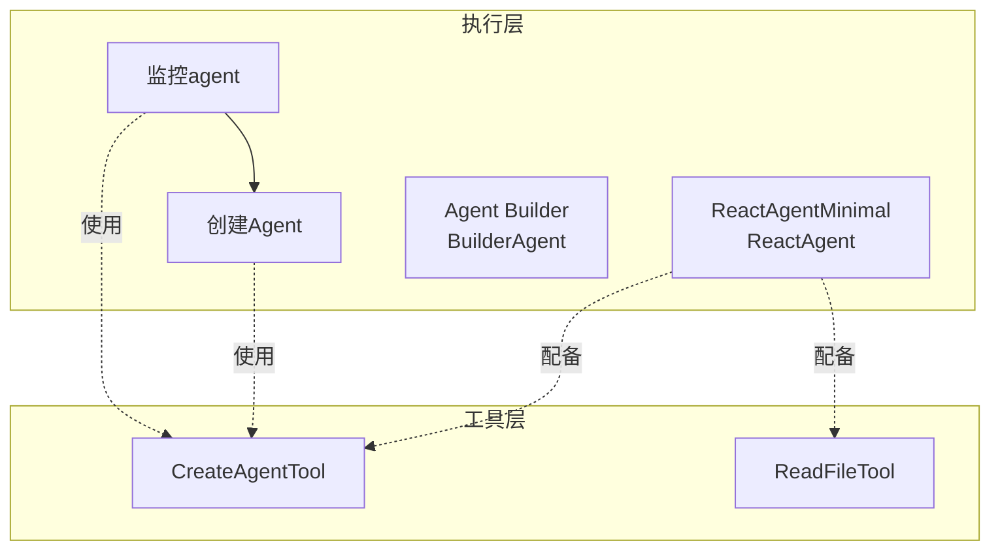
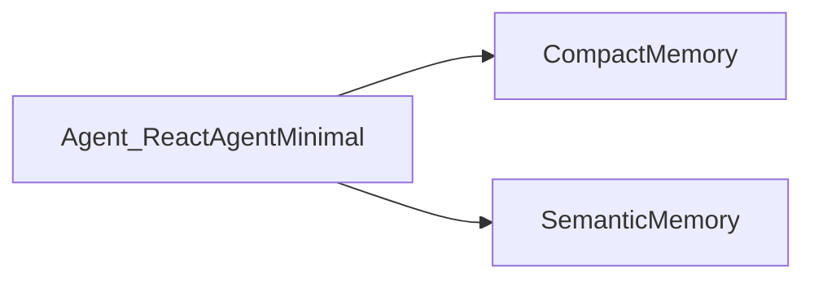
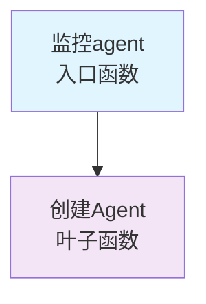
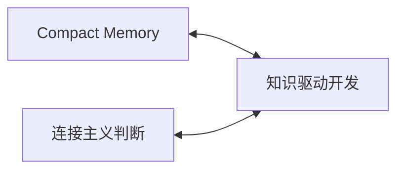

# Agent知识体系高层次概览
生成时间：2025-09-13 19:34:41
数据源：/tmp/knowledge_integrated.ttl

## 1. 执行体系架构

## 2. 知识体系结构
### 2.1 标准操作流程（SOP）
#### Agent监控标准流程
**执行步骤：**
- 1.编写知识文件
- 2.创建Agent
- 3.立即测试
- 4.日志分析
- 5.架构验证
- 6.问题修复
- 7.确认通过

**实现函数：**
- `监控agent(agent_name, task)`

### 2.2 核心概念
- **Compact Memory**: 智能压缩记忆系统，70k tokens触发压缩
- **知识驱动开发**: 用知识文件而非代码定义Agent行为
- **连接主义判断**: 基于直觉和经验的主观判断，与符号测试同等可靠
- **React笔记图灵完备**: React推理+笔记系统=图灵完备的计算模型

## 3. 记忆体系架构

## 4. 函数调用网络分析
### 4.1 调用关系

### 4.2 函数统计
- 函数总数：2
- 调用关系数：1
- 最常被调用：创建Agent (被调用 1 次)

## 5. 工具使用分析
### 工具使用情况
- **CreateAgentTool**
  - 函数:监控agent
  - 函数:创建Agent
  - Agent:ReactAgentMinimal
- **ReadFileTool**
  - Agent:ReactAgentMinimal

## 6. 知识关联网络

## 7. 架构特征总结
### 7.1 实体统计
- 自然语言函数: 2 个
- Agent: 2 个
- SOP: 1 个
- 工具: 2 个
- 概念: 4 个
- 记忆组件: 3 个

### 7.2 架构特点
- ✅ **知识驱动执行**：通过自然语言函数定义行为
- ✅ **流程标准化**：SOP定义标准操作流程
- ✅ **工具集成**：统一的工具使用接口
- ✅ **函数编排**：函数间存在调用关系

## 8. 核心洞察
### 8.1 设计模式
- **知识驱动架构**：知识定义行为，代码仅作执行框架
- **React推理模式**：基于React的思考-行动循环

### 8.2 系统能力
- **自举能力**：能够创建新的Agent
- **监控能力**：能够监控和管理其他Agent

## 9. 知识图谱特征
- 三元组总数：94
- 实体总数：26
- 关系类型数：32

### 命名空间使用分布
- agent: 98 次
- knowledge: 68 次
- knowledge-docs: 32 次

## 10. 优化建议
- 可以增加更多自然语言函数，丰富执行能力
- 可以提取更多领域概念，完善知识体系
- 可以定义更多SOP，标准化操作流程
