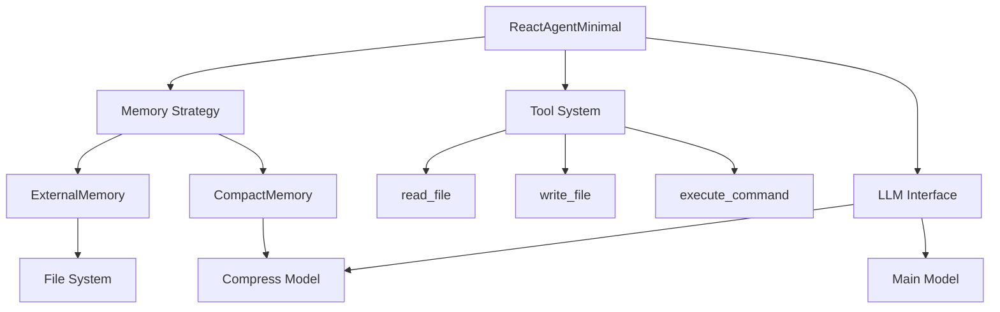

# ReactAgentMinimal 架构设计

## 1. 总体架构

### 1.1 系统层次

```
┌─────────────────────────────────────────────┐
│              用户接口层                      │
│         agent.execute(task="...")           │
├─────────────────────────────────────────────┤
│              模式选择层                      │
│   minimal_mode=True    minimal_mode=False   │
│   (智能工具模式)        (图灵完备模式)       │
├─────────────────────────────────────────────┤
│              核心执行引擎                    │
│          React循环 + 工具调用                │
├─────────────────────────────────────────────┤
│              记忆管理层                      │
│   Compact内存         外部化内存             │
│   (内部压缩)          (文件系统)             │
├─────────────────────────────────────────────┤
│              LLM接口层                       │
│   主模型(任务)       压缩模型(Compact)       │
└─────────────────────────────────────────────┘
```

### 1.2 核心组件

```python
class ReactAgentMinimal:
    """极简React Agent实现"""
    
    # 核心配置
    - model: str              # LLM模型
    - work_dir: Path          # 工作目录
    - minimal_mode: bool      # 模式选择
    - max_rounds: int         # 最大轮数
    
    # 记忆管理
    - memory_strategy: MemoryStrategy  # 策略模式
    
    # 工具集
    - tools: List[Tool]       # 可用工具
```

## 2. 双模式设计

### 2.1 极简模式（Intelligent Tool）

**特征**：
- 快速响应
- 内存压缩（Compact）
- 无外部状态
- 适合交互式任务

**执行流程**：
```
User Request
    ↓
System Prompt (with knowledge)
    ↓
React Loop
    ↓
Compact when > 70k tokens
    ↓
Response
```

### 2.2 完整模式（Turing Complete）

**特征**：
- 图灵完备
- 外部化状态
- 完整事件流
- 适合自主agent

**执行流程**：
```
User Request
    ↓
Load External State (task_process.md + 最近3个session)
    ↓
React Loop with State Updates
    ↓
Write Session Record
    ↓
Update World State
    ↓
Response
```

## 3. 设计原则

### 3.1 大道至简
- 核心代码保持500行左右
- 拒绝过度设计
- 优先使用知识文件而非代码

### 3.2 冯·诺依曼架构
```
Agent(CPU) + FileSystem(Memory) = Turing Complete Computer
```

### 3.3 Event Sourcing
```
Memory = State + Event Stream
```

## 4. 关键创新

### 4.1 去除滑动窗口
- **旧方案**：机械截断最旧的消息
- **新方案**：智能压缩保留语义

### 4.2 压缩即智能
- 压缩不是简单的文本摘要
- 而是对重要性的判断
- 体现了选择性记忆的智能

### 4.3 双模式统一
- 同一套代码支持两种模式
- 用户按需选择
- 避免一刀切

## 5. 模块关系



## 6. 扩展性设计

### 6.1 策略模式
```python
class MemoryStrategy(Protocol):
    def initialize(self) -> List[Dict]
    def update(self, messages: List[Dict]) -> List[Dict]
    def persist(self) -> None
```

### 6.2 工具插件化
```python
class Tool(Protocol):
    name: str
    description: str
    def execute(self, **kwargs) -> str
```

### 6.3 模型适配器
```python
class LLMAdapter(Protocol):
    def call(self, messages: List[Dict]) -> Dict
```

## 7. 性能特征

| 模式 | 响应时间 | 内存使用 | 上下文效率 | 适用场景 |
|------|---------|----------|------------|----------|
| 极简 | <5s | 低 | 高(压缩) | 交互对话 |
| 完整 | 10-30s | 高 | 中 | 自主任务 |

## 8. 未来演进方向

1. **多Agent协作**：基于外部化状态实现Agent间通信
2. **分布式记忆**：使用分布式存储扩展记忆容量
3. **增量学习**：通过积累knowledge文件实现持续学习

但核心始终保持简单。