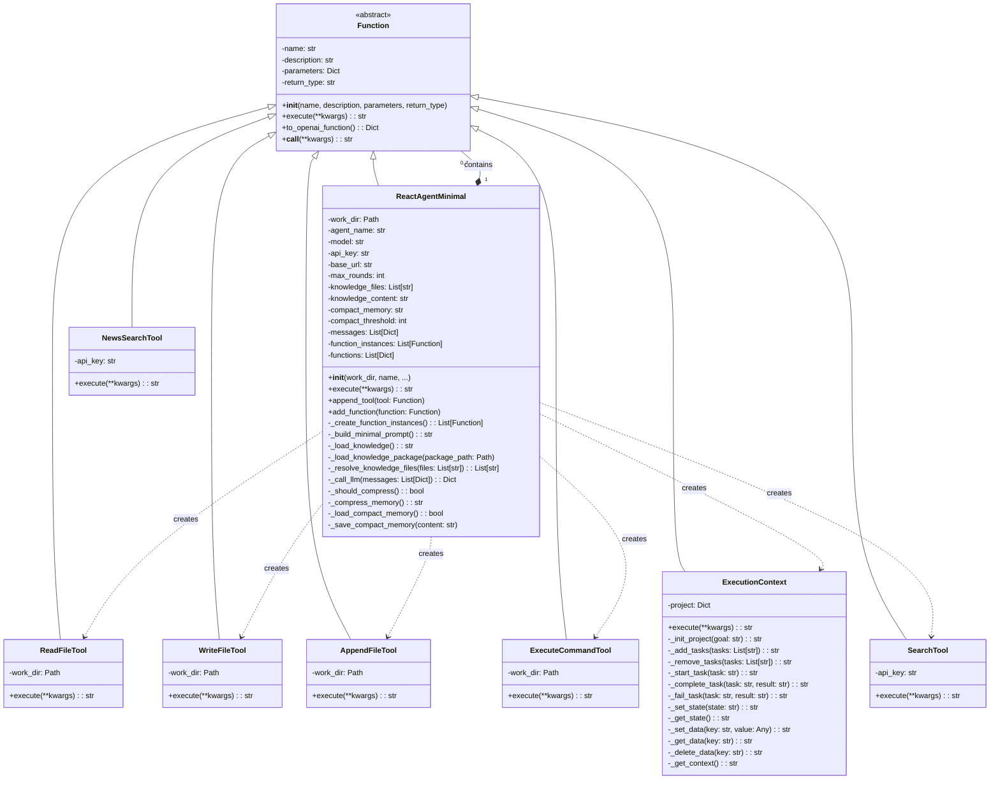

# React Agent Minimal - 类图 (Class Diagram)

## 概述
React Agent Minimal是一个极简的Agent框架，基于"React + 文件系统 = 图灵完备"的理论。

## 核心类结构

## 类职责说明

### 1. Function (抽象基类)
- **职责**: 定义所有可调用函数的接口
- **特点**: 
  - 统一的execute接口
  - 支持OpenAI function calling格式
  - 实现__call__使其可直接调用

### 2. ReactAgentMinimal (核心Agent)
- **职责**: 主要的Agent实现，协调LLM和工具调用
- **特点**:
  - 继承自Function，自身也是可调用的函数
  - 管理知识文件加载
  - 实现Compact记忆压缩机制
  - 支持工具组合（可添加其他Agent作为工具）

### 3. 工具类 (Tools)
- **ReadFileTool**: 读取文件
- **WriteFileTool**: 写入文件（覆盖模式）
- **AppendFileTool**: 追加文件内容
- **ExecuteCommandTool**: 执行shell命令
- **SearchTool**: 搜索互联网
- **NewsSearchTool**: 搜索新闻

### 4. ExecutionContext
- **职责**: 内存中的任务管理器
- **特点**:
  - 不持久化，纯内存操作
  - 管理项目目标、任务列表、状态
  - 提供通用KV存储

## 设计模式

1. **策略模式**: Function接口定义统一的执行策略
2. **组合模式**: Agent可以包含其他Agent作为工具
3. **模板方法**: Function基类定义执行框架
4. **单一职责**: 每个工具类只负责一种操作

## 核心特性

1. **极简设计**: 整个框架代码约500行
2. **知识驱动**: 行为通过知识文件定义，而非硬编码
3. **Compact记忆**: 70k tokens自动压缩机制
4. **工具组合**: Agent可以作为其他Agent的工具
5. **纯内存ExecutionContext**: 不依赖文件持久化