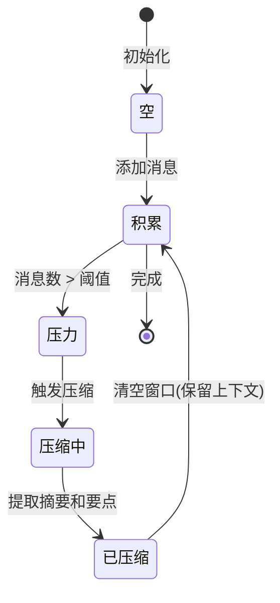

# React Agent 极简版 - 类图

## 概述
此UML类图展示了React Agent系统的**极简**架构，展现了简约之美。

## 类图

```mermaid
classDiagram
    %% 核心Agent
    class ReactAgentMinimal {
        -Path work_dir
        -String model
        -String api_key
        -String base_url
        -MemoryWithNaturalDecay memory
        -int max_rounds
        -List tools
        -Dict stats
        +__init__(work_dir, model, api_key, base_url, pressure_threshold, max_rounds)
        +run(task: String) Dict
        -_detect_base_url_for_key(api_key: String) String
        -_define_tools() List
        -_call_llm(messages: List, tools: List) Dict
        -_execute_tool(tool_name: String, args: Dict) String
    }

    %% 记忆系统
    class MemoryWithNaturalDecay {
        -List~Dict~ messages
        -List~CompressedMemory~ compressed_history
        -int pressure_threshold
        -Path work_dir
        -bool enable_persistence
        -Dict stats
        +__init__(pressure_threshold: int, work_dir: String, enable_persistence: bool)
        +add_message(role: String, content: String, metadata: Dict)
        +should_compact() bool
        +compact() CompressedMemory
        +get_context_window() List
        +get_full_history() List
        +clear_window()
        +save()
        +load()
        -_extract_key_points(messages: List) List
        -_extract_task_results(messages: List) List
        -_generate_summary(messages: List) String
        -_save_history()
        -_load_history()
    }

    class CompressedMemory {
        +String timestamp
        +String summary
        +int message_count
        +List~String~ key_points
        +List~String~ task_results
        +to_dict() Dict
        +from_dict(data: Dict)$ CompressedMemory
    }

    %% 工具输入模型 (Pydantic)
    class BaseModel {
        <<abstract>>
        <<pydantic>>
    }

    class FileInput {
        +String file_path
        +String content
    }

    class DirectoryInput {
        +String directory_path
    }

    class CommandInput {
        +String command
        +String working_dir
    }

    class SearchInput {
        +String pattern
        +String directory
    }

    class SearchReplaceInput {
        +String file_path
        +String search_pattern
        +String replace_text
        +bool use_regex
        +bool preview
        +int max_replacements
    }

    class EditLinesInput {
        +String file_path
        +int start_line
        +int end_line
        +String new_content
    }

    class FindSymbolInput {
        +String symbol_name
        +String symbol_type
        +String search_dir
        +bool include_imports
    }

    class ExtractCodeInput {
        +String file_path
        +String target
        +bool include_docstring
        +bool include_decorators
    }

    class DiffInput {
        +String file_path
        +String diff_content
        +bool reverse
    }

    class GoogleSearchInput {
        +String query
        +String site
        +int num
    }

    class WebPageInput {
        +String url
    }

    %% 工具创建函数
    class ToolFactory {
        <<function>>
        +create_tools(work_dir: String) List~Tool~
    }

    %% 关系
    ReactAgentMinimal --> MemoryWithNaturalDecay : 包含
    MemoryWithNaturalDecay --> CompressedMemory : 创建
    ReactAgentMinimal --> ToolFactory : 使用
    
    %% 工具输入继承关系
    BaseModel <|-- FileInput : 继承
    BaseModel <|-- DirectoryInput : 继承
    BaseModel <|-- CommandInput : 继承
    BaseModel <|-- SearchInput : 继承
    BaseModel <|-- SearchReplaceInput : 继承
    BaseModel <|-- EditLinesInput : 继承
    BaseModel <|-- FindSymbolInput : 继承
    BaseModel <|-- ExtractCodeInput : 继承
    BaseModel <|-- DiffInput : 继承
    BaseModel <|-- GoogleSearchInput : 继承
    BaseModel <|-- WebPageInput : 继承
    
    %% 工具使用关系
    ReactAgentMinimal ..> FileInput : 使用
    ReactAgentMinimal ..> DirectoryInput : 使用
    ReactAgentMinimal ..> CommandInput : 使用
    ReactAgentMinimal ..> SearchInput : 使用
    ReactAgentMinimal ..> SearchReplaceInput : 使用
    ReactAgentMinimal ..> EditLinesInput : 使用
    ReactAgentMinimal ..> FindSymbolInput : 使用
    ReactAgentMinimal ..> ExtractCodeInput : 使用
    ReactAgentMinimal ..> DiffInput : 使用
    ReactAgentMinimal ..> GoogleSearchInput : 使用
    ReactAgentMinimal ..> WebPageInput : 使用

    %% 样式
    class ReactAgentMinimal {
        <<主类>>
    }
    
    class MemoryWithNaturalDecay {
        <<核心记忆>>
    }
    
    class CompressedMemory {
        <<数据类>>
    }
```



## 关键设计特性

### 1. **极致简约**
- 整个系统只有**3个核心类**
- **1个Agent类**：ReactAgentMinimal
- **1个记忆系统**：MemoryWithNaturalDecay
- **1个记忆单元**：CompressedMemory

### 2. **自然记忆模式**
记忆系统模仿人类记忆：
- **基于压力的压缩**：消息数超过阈值时自动压缩
- **自然衰减**：旧记忆随时间变得更抽象
- **分层历史**：压缩的记忆形成自然层次

### 3. **清晰的工具系统**
- 所有工具使用Pydantic模型进行验证
- 强类型确保可靠性
- 通过简单的工厂函数创建工具

### 4. **最小依赖**
```
ReactAgentMinimal
    └── MemoryWithNaturalDecay
        └── CompressedMemory
```

## 记忆流程



## 压缩过程

压缩过程提取：
1. **摘要**：对话的高层理解
2. **要点**：重要的事实和决策
3. **任务结果**：完成的动作和成果

## API集成

自动检测和配置：
- **DeepSeek API**
- **OpenRouter API**
- **Moonshot API**
- **Google Gemini API**

## 文件统计

| 文件 | 代码行数 | 用途 |
|------|---------|------|
| react_agent_minimal.py | ~250 | 主Agent逻辑 |
| memory_with_natural_decay.py | ~200 | 记忆系统 |
| tools.py | ~150 | 工具定义 |
| **总计** | **~600** | 完整系统 |

## 设计哲学

> "完美不是没有什么可以添加，而是没有什么可以删除。"
> — 安托万·德·圣埃克苏佩里

这个架构体现了：
- **极简主义**：每一行代码都有其目的
- **自然智能**：模仿人类认知过程
- **呼吸理论**：压缩（吸入）→ 处理 → 解压（呼出）