# Core Module Class Diagram

## Overview
This UML class diagram represents the architecture of the React Agent core module, showing the relationships between agents, memory systems, tools, and configurations.

**Note**: Classes marked with `<<deprecated>>` are legacy implementations. Only `ReactAgentMinimal` and its direct dependencies (`MemoryWithNaturalDecay`, `CompressedMemory`, and Tool Input Models) are actively maintained.

## Class Diagram

```mermaid
classDiagram
    %% Base Classes and Configurations
    class AgentConfig {
        <<deprecated>>
        +String work_dir
        +String name
        +String description
        +int max_retries
        +int timeout
    }

    class BaseAgent {
        <<abstract>>
        <<deprecated>>
        #AgentConfig config
        #String name
        #String description
        #Path work_dir
        #List history
        +__init__(config: AgentConfig)
        +execute_task(task: Any)* Dict
        +reset()
        +get_history() List
        +save_to_file(filename: String, content: String) Path
        +read_from_file(filename: String) String
    }

    %% Memory Systems
    class Message {
        <<deprecated>>
        +String role
        +String content
        +String timestamp
        +Dict metadata
        +__init__(role, content, metadata)
        +to_dict() Dict
        +from_dict(data) Message$
    }

    class CompressedMemory {
        +String timestamp
        +String summary
        +int message_count
        +List~String~ key_points
        +List~String~ task_results
        +to_dict() Dict
        +from_dict(data) CompressedMemory$
    }

    class MemoryWithNaturalDecay {
        -List~Dict~ messages
        -List~CompressedMemory~ compressed_history
        -int pressure_threshold
        -Path work_dir
        -bool enable_persistence
        -Dict stats
        +__init__(pressure_threshold, work_dir, enable_persistence)
        +add_message(role, content, metadata)
        +should_compact() bool
        +compact() CompressedMemory
        +get_context_window() List
        +get_full_history() List
        +clear_window()
        +save()
        +load()
        -_extract_key_points(messages) List
        -_extract_task_results(messages) List
        -_generate_summary(messages) String
    }

    class SimpleMemoryManager {
        <<deprecated>>
        #Path work_dir
        #List~Message~ short_term_memory
        #List~Message~ long_term_memory
        #List~Message~ episodic_memory
        #int max_short_term
        #int max_long_term
        #int max_episodic
        #int max_context_tokens
        +__init__(work_dir, max_context_tokens)
        +add_interaction(role, content, metadata)
        +get_context_messages() List
        +consolidate_memory()
        +save_checkpoint()
        +load_checkpoint()
        #_transfer_to_long_term()
        #_compress_memories(memories) List
        #_extract_key_information(memories) List
    }

    class MemoryManagerAdapter {
        <<deprecated>>
        +__init__(work_dir, max_context_tokens)
        +add_message(role, content) Message
        +get_messages() List
    }

    class NLPLMemorySystem {
        <<deprecated>>
        -Path memory_dir
        -List~MemoryEvent~ events
        -Dict context
        -int max_events
        +__init__(memory_dir, max_events)
        +add_event(event_type, content, metadata)
        +get_relevant_memories(query, limit) List
        +consolidate()
        +save()
        +load()
        -_compute_relevance(event, query) float
    }

    class MemoryEvent {
        <<deprecated>>
        +String timestamp
        +String event_type
        +String content
        +Dict metadata
        +float importance
        +to_dict() Dict
        +from_dict(data) MemoryEvent$
    }

    class CognitiveMemoryIntegration {
        <<deprecated>>
        -SimpleMemoryManager memory_manager
        -NLPLMemorySystem nlpl_memory
        -Path work_dir
        +__init__(work_dir)
        +add_interaction(role, content, metadata)
        +get_context() List
        +save_all()
        +load_all()
    }

    %% Agent Implementations
    class ReactAgent {
        <<deprecated>>
        -Path work_dir
        -String model
        -String api_key
        -String base_url
        -List knowledge_files
        -String interface
        -int max_rounds
        -MemoryManagerAdapter memory
        -CognitiveMemoryIntegration cognitive_memory
        -int window_size
        -List tools
        -Dict stats
        -List message_hooks
        +__init__(work_dir, model, api_key, base_url, ...)
        +run(task) Dict
        +add_message_hook(hook)
        +remove_message_hook(hook)
        -_detect_service() String
        -_detect_context_size() int
        -_load_knowledge() String
        -_define_tools() List
        -_process_hooks(message_type, data)
        -_call_llm(messages, tools) Dict
        -_execute_tool(tool_name, args) String
    }

    class ReactAgentMinimal {
        -Path work_dir
        -String model
        -String api_key
        -String base_url
        -MemoryWithNaturalDecay memory
        -int max_rounds
        -List tools
        -Dict stats
        +__init__(work_dir, model, api_key, base_url, pressure_threshold, max_rounds)
        +run(task) Dict
        -_detect_base_url_for_key(api_key) String
        -_define_tools() List
        -_call_llm(messages, tools) Dict
        -_execute_tool(tool_name, args) String
    }

    class KimiReactAgent {
        <<deprecated>>
        -Path work_dir
        -String model
        -String api_key
        -String base_url
        -List knowledge_files
        -String interface
        -int max_rounds
        -List tools
        -Dict stats
        +__init__(work_dir, model, api_key, knowledge_files, interface, max_rounds)
        +run(task) Dict
        -_load_knowledge() String
        -_define_tools() List
        -_call_llm(messages, tools) Dict
        -_execute_tool(tool_name, args) String
    }

    class KimiReactAgentPSM {
        <<deprecated>>
        -Path work_dir
        -String model
        -String api_key
        -String base_url
        -List knowledge_files
        -String interface
        -int max_rounds
        -List tools
        -Dict stats
        +__init__(work_dir, model, api_key, knowledge_files, interface, max_rounds)
        +run(task) Dict
        +generate_psm(description) String
        -_load_knowledge() String
        -_define_tools() List
        -_call_llm(messages, tools) Dict
        -_execute_tool(tool_name, args) String
    }

    class QwenReactAgent {
        <<deprecated>>
        -Path work_dir
        -String model
        -String api_key
        -String base_url
        -List knowledge_files
        -String interface
        -int max_rounds
        -List tools
        -Dict stats
        +__init__(work_dir, model, api_key, knowledge_files, interface, max_rounds)
        +run(task) Dict
        -_load_knowledge() String
        -_define_tools() List
        -_call_llm(messages, tools) Dict
        -_execute_tool(tool_name, args) String
    }

    %% Tool System
    class AgentToolWrapper {
        <<deprecated>>
        -Any agent
        -String work_dir
        -Dict context
        +__init__(agent, work_dir, context)
        +execute(task) String
        +get_context() Dict
        +update_context(new_context)
    }

    class GenericAgentInput {
        <<deprecated>>
        +String task_description
        +Dict context
        +int max_rounds
    }

    class GenericAgentTool {
        <<deprecated>>
        <<BaseTool>>
        +String name
        +String description
        +GenericAgentInput args_schema
        -AgentToolWrapper agent_wrapper
        +__init__(agent_wrapper, name, description)
        +_run(task_description, context, max_rounds) String
        +_arun(task_description, context, max_rounds) String
    }

    class TeeOutput {
        <<deprecated>>
        -File original
        -File log_file
        +__init__(original, log_path)
        +write(data)
        +flush()
        +close()
    }

    %% Tool Input Models
    class FileInput {
        +String file_path
        +String content
    }

    class DirectoryInput {
        +String directory_path
    }

    class CommandInput {
        +String command
        +String working_dir
    }

    class SearchInput {
        +String pattern
        +String directory
    }

    class SearchReplaceInput {
        +String file_path
        +String search_pattern
        +String replace_text
        +bool use_regex
        +bool preview
        +int max_replacements
    }

    class EditLinesInput {
        +String file_path
        +int start_line
        +int end_line
        +String new_content
    }

    class FindSymbolInput {
        +String symbol_name
        +String symbol_type
        +String search_dir
        +bool include_imports
    }

    class ExtractCodeInput {
        +String file_path
        +String target
        +bool include_docstring
        +bool include_decorators
    }

    class DiffInput {
        +String file_path
        +String diff_content
        +bool reverse
    }

    class GoogleSearchInput {
        +String query
        +String site
        +int num
    }

    class WebPageInput {
        +String url
    }

    %% Relationships
    BaseAgent <|-- ReactAgent : extends (deprecated)
    BaseAgent <|-- ReactAgentMinimal : extends (deprecated base)
    BaseAgent <|-- KimiReactAgent : extends (deprecated)
    BaseAgent <|-- KimiReactAgentPSM : extends (deprecated)
    BaseAgent <|-- QwenReactAgent : extends (deprecated)

    ReactAgent --> AgentConfig : uses (deprecated)
    ReactAgent --> MemoryManagerAdapter : contains (deprecated)
    ReactAgent --> CognitiveMemoryIntegration : contains (deprecated)

    ReactAgentMinimal --> MemoryWithNaturalDecay : contains

    SimpleMemoryManager <|-- MemoryManagerAdapter : extends (deprecated)
    SimpleMemoryManager --> Message : manages (deprecated)
    
    MemoryManagerAdapter --> Message : creates (deprecated)

    MemoryWithNaturalDecay --> CompressedMemory : creates

    NLPLMemorySystem --> MemoryEvent : manages (deprecated)

    CognitiveMemoryIntegration --> SimpleMemoryManager : contains (deprecated)
    CognitiveMemoryIntegration --> NLPLMemorySystem : contains (deprecated)

    GenericAgentTool --> GenericAgentInput : uses (deprecated)
    GenericAgentTool --> AgentToolWrapper : contains (deprecated)
    AgentToolWrapper --> BaseAgent : wraps (deprecated)

    TeeOutput --> AgentToolWrapper : used by (deprecated)

    %% Tool Input relationships
    ReactAgent --> FileInput : uses (deprecated)
    ReactAgent --> DirectoryInput : uses (deprecated)
    ReactAgent --> CommandInput : uses (deprecated)
    ReactAgent --> SearchInput : uses (deprecated)
    ReactAgent --> SearchReplaceInput : uses (deprecated)
    ReactAgent --> EditLinesInput : uses (deprecated)
    ReactAgent --> FindSymbolInput : uses (deprecated)
    ReactAgent --> ExtractCodeInput : uses (deprecated)
    ReactAgent --> DiffInput : uses (deprecated)
    ReactAgent --> GoogleSearchInput : uses (deprecated)
    ReactAgent --> WebPageInput : uses (deprecated)
    
    %% Active relationships for ReactAgentMinimal
    ReactAgentMinimal --> FileInput : uses
    ReactAgentMinimal --> DirectoryInput : uses
    ReactAgentMinimal --> CommandInput : uses
    ReactAgentMinimal --> SearchInput : uses
    ReactAgentMinimal --> SearchReplaceInput : uses
    ReactAgentMinimal --> EditLinesInput : uses
    ReactAgentMinimal --> FindSymbolInput : uses
    ReactAgentMinimal --> ExtractCodeInput : uses
    ReactAgentMinimal --> DiffInput : uses
    ReactAgentMinimal --> GoogleSearchInput : uses
    ReactAgentMinimal --> WebPageInput : uses
```

## Key Design Patterns (Active Architecture)

### 1. **Simplified Architecture**
- **ReactAgentMinimal** is the only active agent implementation
- No inheritance from BaseAgent (deprecated)
- Direct integration with minimal dependencies

### 2. **Natural Decay Memory Pattern**
- **Single memory system**: `MemoryWithNaturalDecay`
- **Compression-based**: Automatic compression when pressure threshold exceeded
- **Natural forgetting**: Mimics human memory decay through compression

### 3. **Minimal Dependencies**
- Only requires:
  - `MemoryWithNaturalDecay` for memory management
  - `CompressedMemory` for storing compressed history
  - Tool Input Models for validation
  - Direct API calls (no complex abstractions)

## Memory Architecture (Active)

### Natural Decay Memory (The Only System)
- **Pressure-based compression**: Automatically compresses when message count exceeds threshold
- **Layered history**: Compressed memories form natural layers over time
- **Persistence**: Optional saving/loading of memory state
- **Simplicity**: Single parameter (`pressure_threshold`) controls behavior

### ~~Deprecated Memory Systems~~
- ~~Three-tier memory (SimpleMemoryManager)~~
- ~~Cognitive Memory Integration~~
- ~~NLPL Memory System~~
- ~~Memory Manager Adapter~~

## Tool System Architecture

### Tool Input Models
- Pydantic models for strong typing and validation
- Comprehensive set covering:
  - File operations (`FileInput`, `DirectoryInput`)
  - Code manipulation (`EditLinesInput`, `SearchReplaceInput`)
  - Code analysis (`FindSymbolInput`, `ExtractCodeInput`)
  - External services (`GoogleSearchInput`, `WebPageInput`)

### Tool Execution Flow
1. Agent receives task
2. LLM decides which tool to use
3. Tool input is validated through Pydantic model
4. Tool is executed with validated input
5. Result is returned to LLM for next decision

## API Integration

### Supported Services
- **OpenRouter**: Default service for model routing
- **DeepSeek**: Direct API support
- **Moonshot (Kimi)**: Direct API support
- **Google Gemini**: Direct API support

### Auto-detection Features
- Service detection based on API URL
- Context size detection based on model name
- Automatic base URL configuration based on API key environment variables