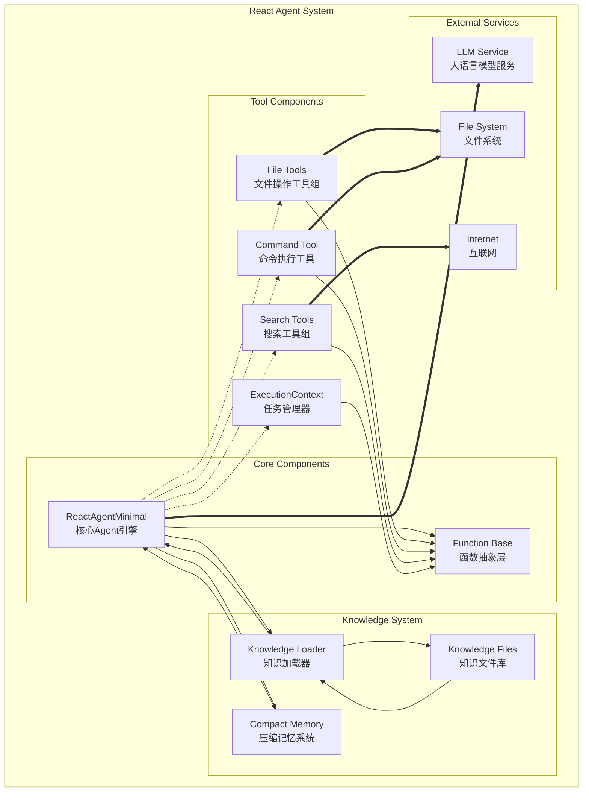
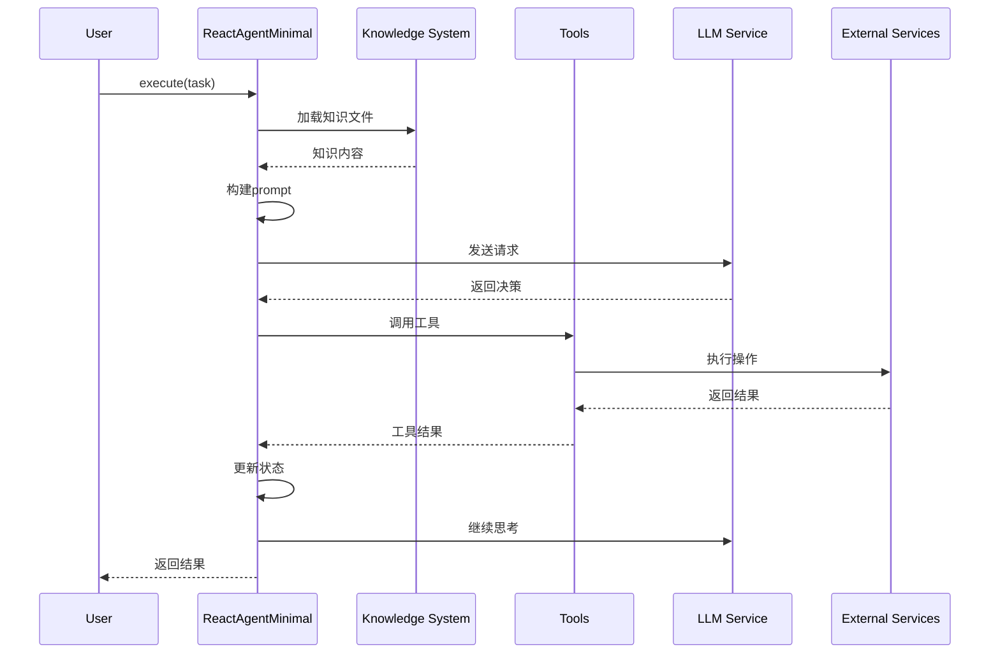
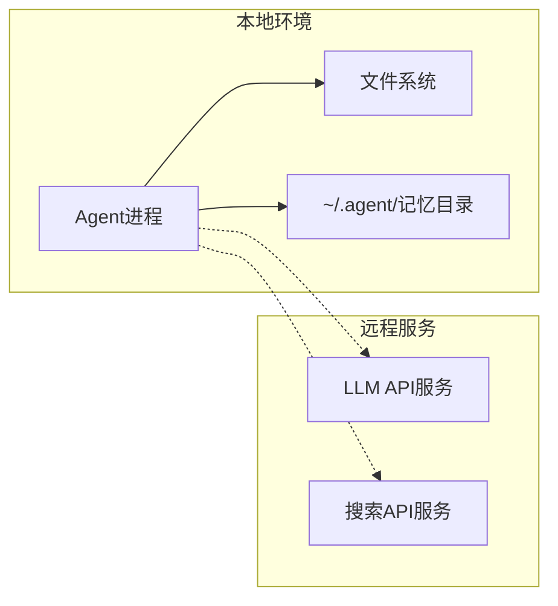

# React Agent Minimal - 组件图 (Component Diagram)

## 系统架构概览



## 组件详细说明

### 1. 核心组件 (Core Components)

#### ReactAgentMinimal
- **职责**: Agent执行引擎
- **接口**:
  - `execute()`: 执行任务
  - `append_tool()`: 添加工具
  - `add_function()`: 添加函数
- **依赖**: Function Base, Knowledge System, LLM Service

#### Function Base
- **职责**: 提供统一的函数接口
- **接口**:
  - `execute()`: 执行函数
  - `to_openai_function()`: 转换为OpenAI格式
- **特点**: 所有工具和Agent都实现此接口

### 2. 工具组件 (Tool Components)

#### File Tools
- **包含**:
  - ReadFileTool: 读取文件
  - WriteFileTool: 写入文件
  - AppendFileTool: 追加文件
- **依赖**: 文件系统

#### Command Tool
- **功能**: 执行shell命令
- **依赖**: 文件系统和系统shell

#### Search Tools
- **包含**:
  - SearchTool: 通用搜索
  - NewsSearchTool: 新闻搜索
- **依赖**: 互联网服务（Serper API）

#### ExecutionContext
- **功能**: 内存中的任务管理
- **特点**: 纯内存操作，不持久化

### 3. 知识系统 (Knowledge System)

#### Knowledge Loader
- **功能**: 加载和解析知识文件
- **特点**:
  - 支持包（package）加载
  - 支持单文件加载
  - 优先级管理

#### Knowledge Files
- **结构**:
  ```
  knowledge/
  ├── minimal/
  │   └── system/
  │       ├── __init__.md
  │       ├── system_prompt_minimal.md
  │       ├── execution_context_guide.md
  │       └── agent_coordination_knowledge.md
  └── mda/
      ├── pim_to_psm_knowledge.md
      └── debugging_unified.md
  ```

#### Compact Memory
- **功能**: 自动压缩长对话历史
- **触发条件**: 超过70k tokens
- **存储位置**: `~/.agent/{agent_name}/compact.md`

### 4. 外部服务 (External Services)

#### LLM Service
- **支持的模型**:
  - Kimi (Moonshot)
  - DeepSeek
  - Claude (via OpenRouter)
  - Gemini
  - Grok
- **接口**: OpenAI兼容API

#### File System
- **用途**:
  - 工作目录管理
  - 文件读写操作
  - 命令执行

#### Internet
- **用途**: 搜索和获取最新信息

## 数据流



## 部署视图



## 特点

1. **松耦合设计**: 组件通过Function接口解耦
2. **可扩展性**: 易于添加新工具和Agent
3. **知识驱动**: 行为由知识文件定义
4. **轻量级**: 核心代码约500行
5. **无状态设计**: ExecutionContext不持久化