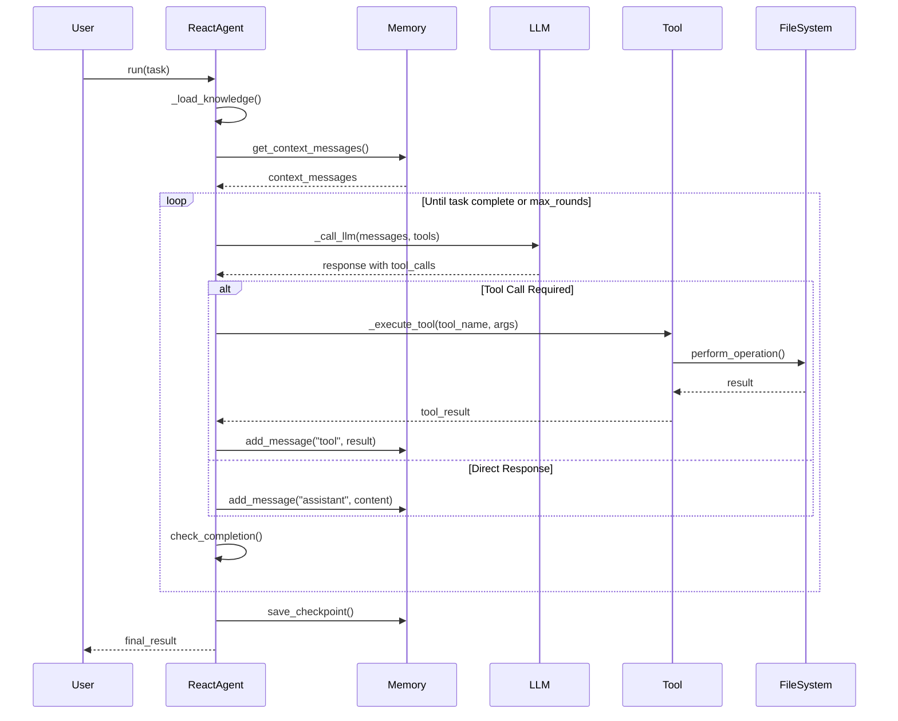
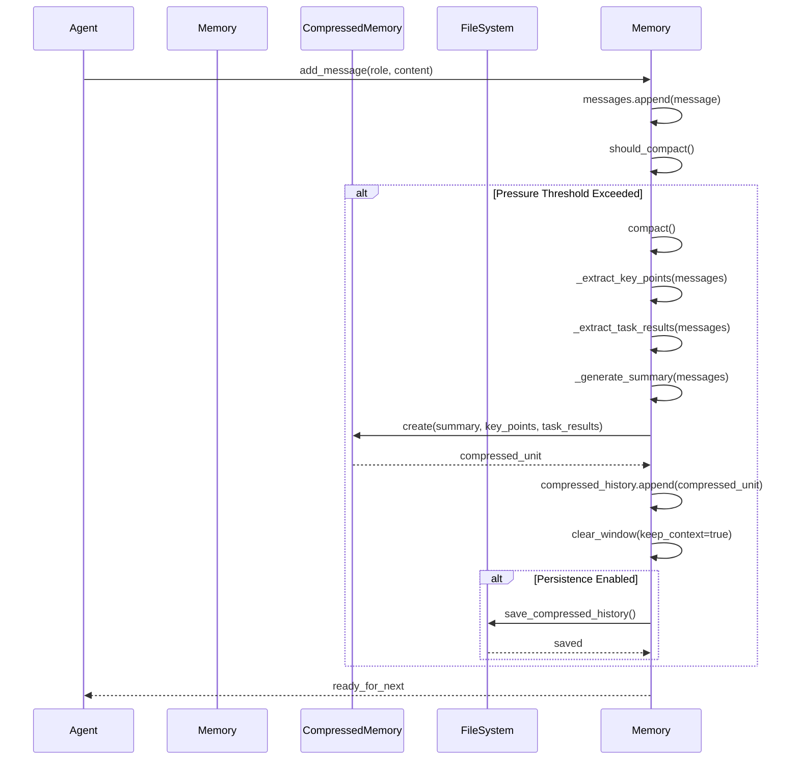
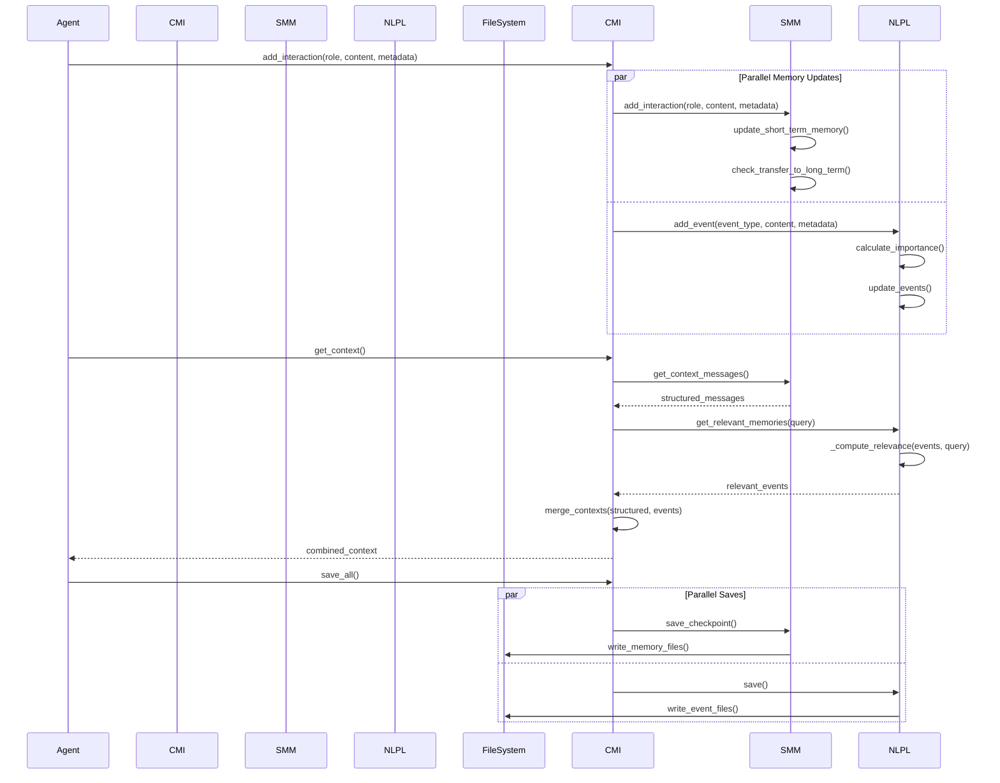
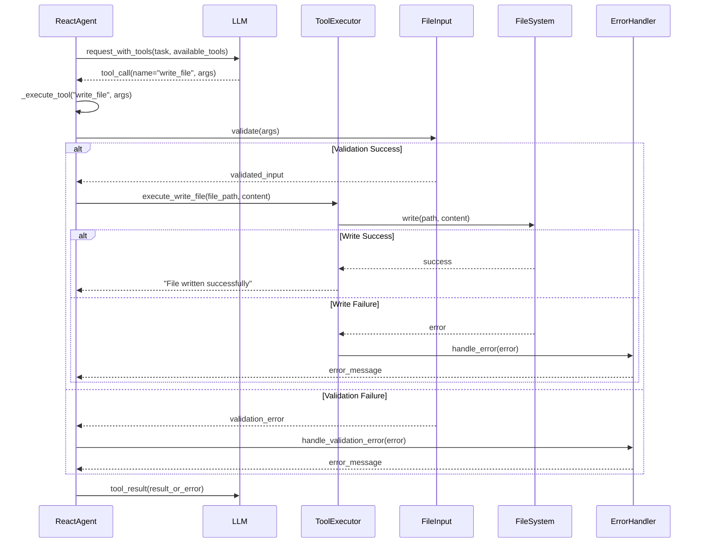
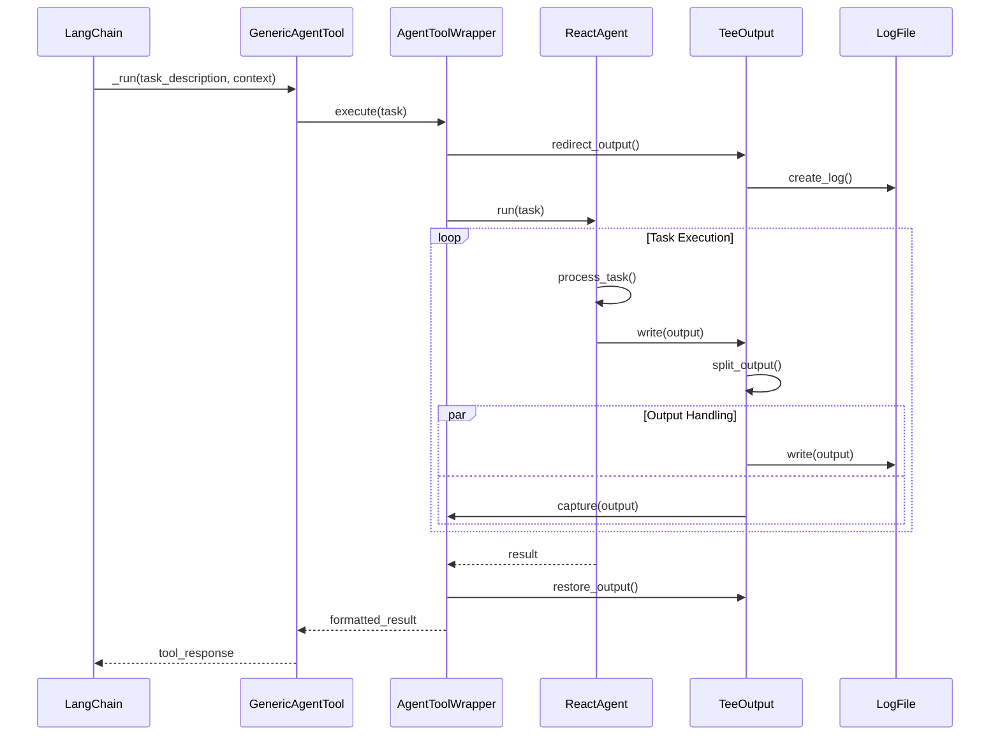
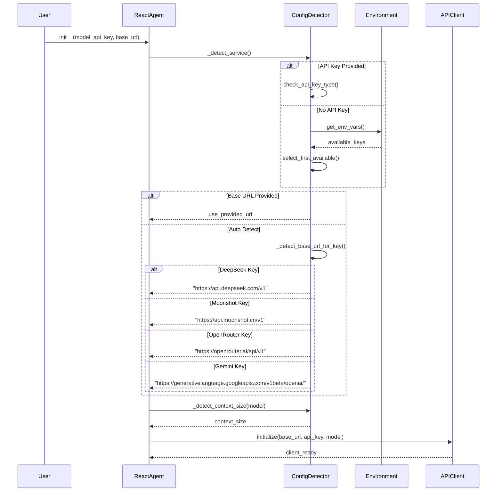
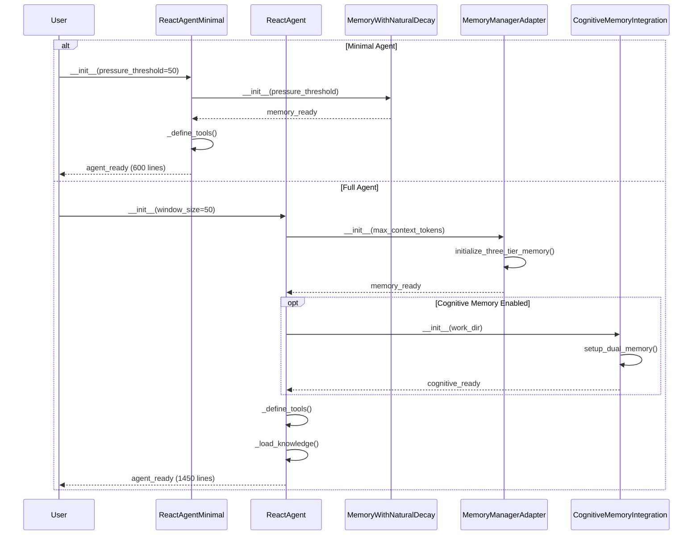
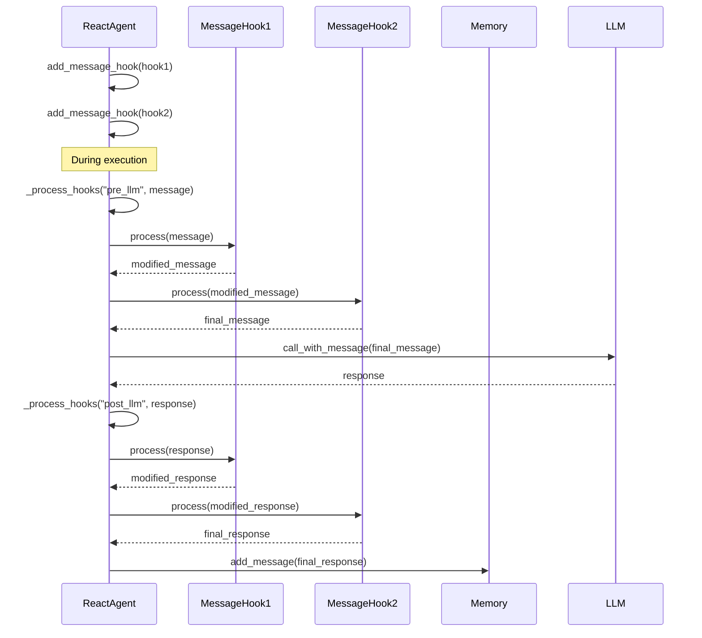
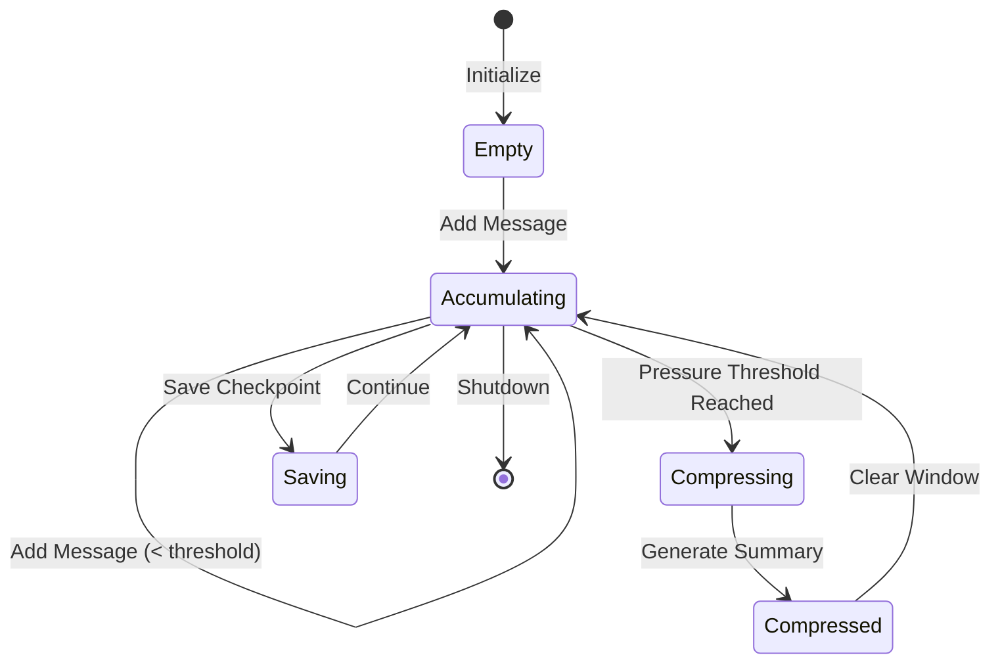
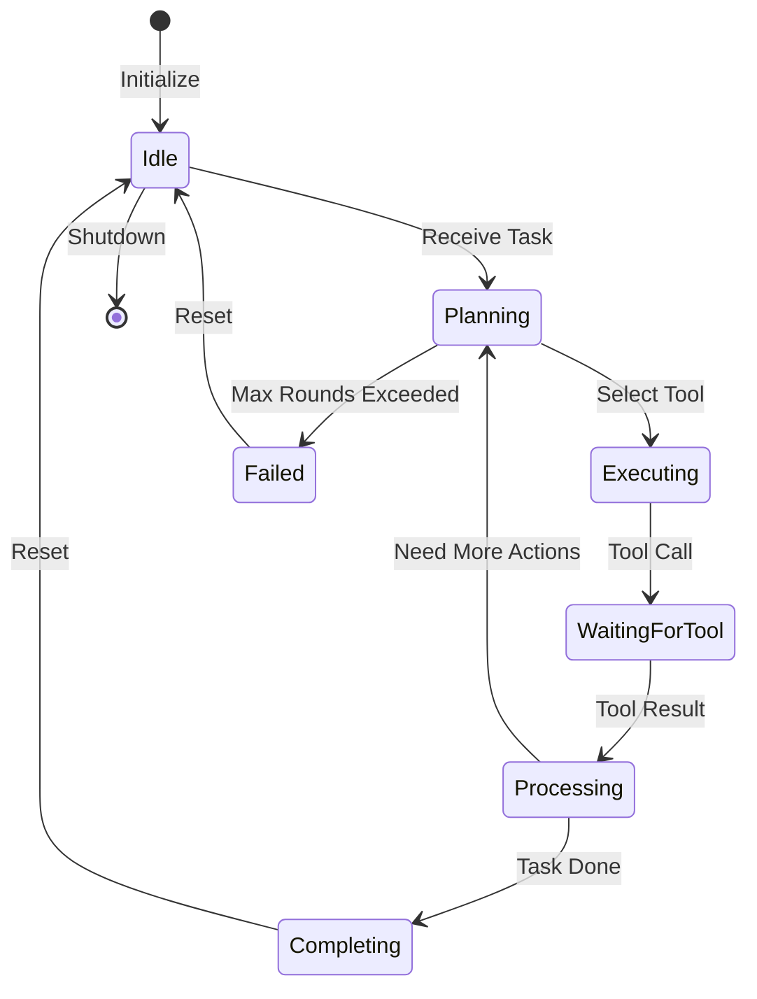

# Core Module Interaction Diagrams

## Overview
These interaction diagrams show the dynamic behavior of the React Agent system, illustrating how components interact during task execution, memory management, and tool usage.

## 1. Task Execution Flow

## 2. Memory Compression Flow (Natural Decay)

## 3. Cognitive Memory Integration Flow

## 4. Tool Execution Flow

## 5. Agent as Tool (LangChain Integration)

## 6. API Service Detection and Configuration

## 7. Minimal vs Full Agent Initialization

## 8. Message Hook System

## Key Interaction Patterns

### 1. **Compression-Based Memory Management**
- Natural pressure-based triggering
- Automatic compression when threshold exceeded
- Layered history preservation

### 2. **Parallel Memory Updates**
- Cognitive Memory Integration updates both structured and event-based memories simultaneously
- Ensures consistency across memory systems

### 3. **Tool Validation Pipeline**
- Pydantic validation before execution
- Error handling at multiple levels
- Graceful degradation on failures

### 4. **Output Redirection for Logging**
- TeeOutput splits output to both console and log files
- Preserves complete execution history
- Enables debugging and analysis

### 5. **Service Auto-Configuration**
- Intelligent detection of API service based on keys and URLs
- Automatic context size configuration
- Fallback mechanisms for reliability

### 6. **Hook-Based Message Processing**
- Pre and post processing hooks
- Chainable modifications
- Non-intrusive monitoring and modification

## State Transitions

### Memory State Transitions

### Agent Execution States

## Performance Characteristics

### Memory Efficiency
- **Natural Decay**: O(1) compression trigger, O(n) compression operation
- **Three-tier Memory**: O(n) transfer operations, O(n²) relevance scoring
- **NLPL Events**: O(n·m) relevance computation (n events, m query terms)

### API Call Optimization
- Batched tool definitions in single request
- Context window management to prevent truncation
- Automatic retry with exponential backoff

### Persistence Strategy
- Lazy writing (only on checkpoint or compression)
- Incremental saves for large histories
- JSON serialization for portability