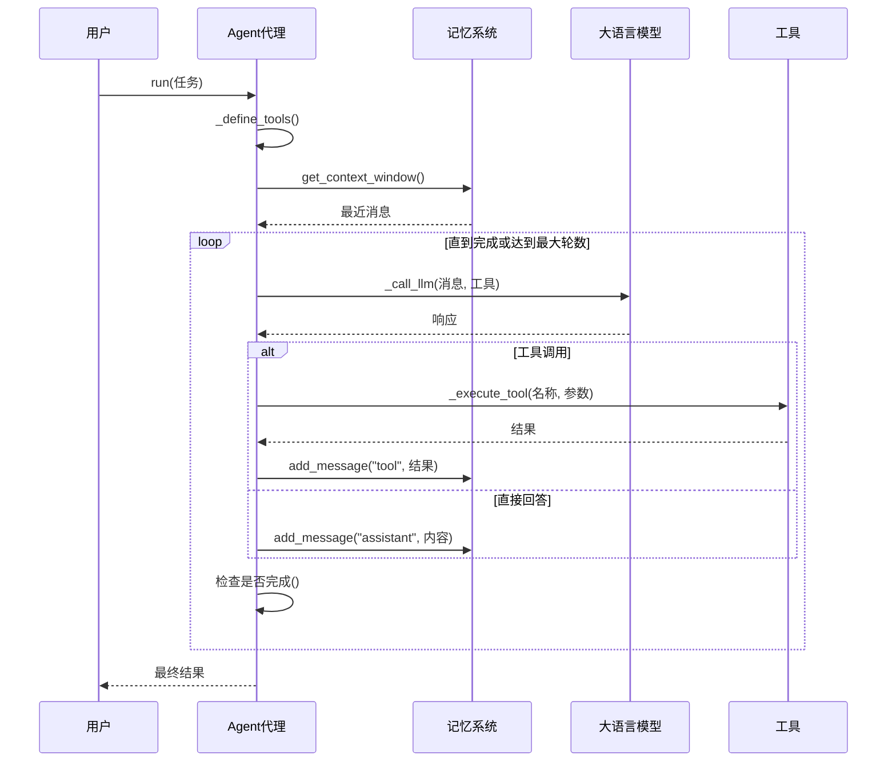
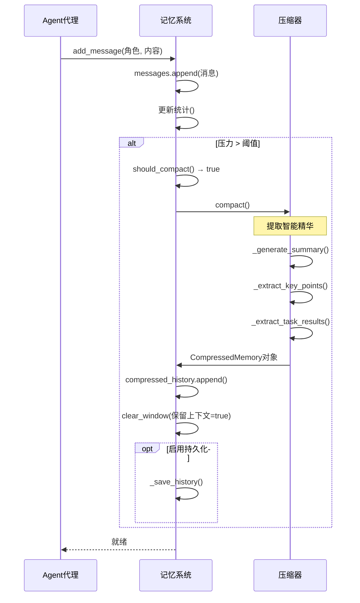
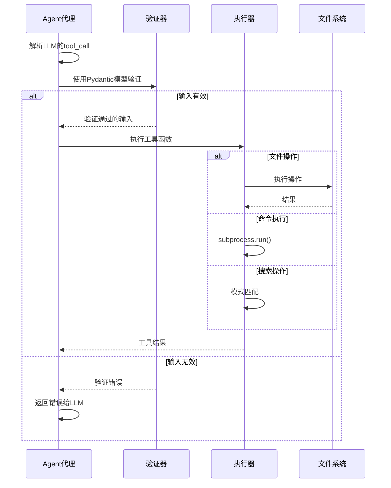
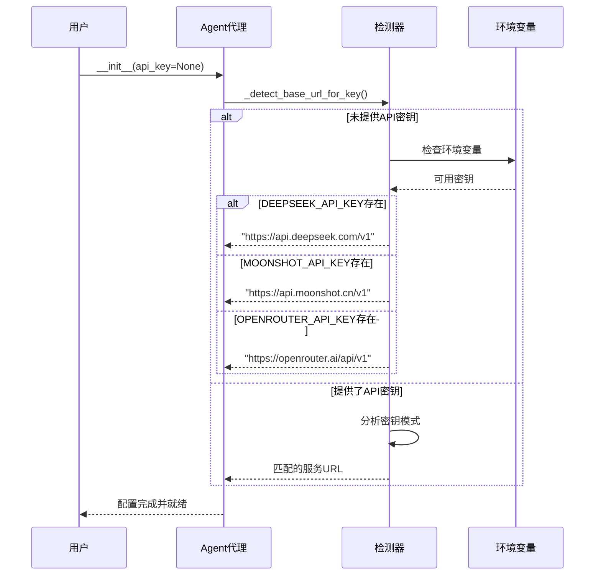
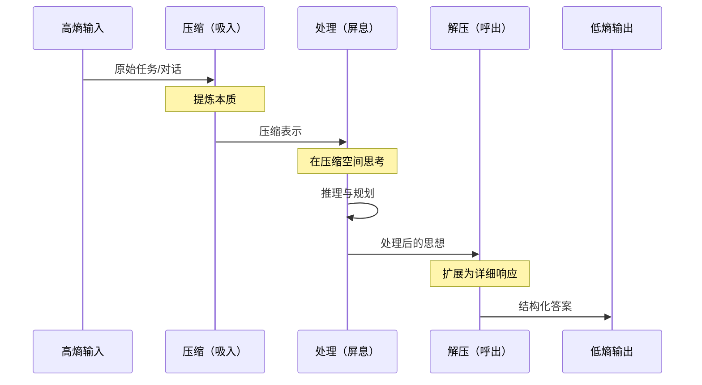
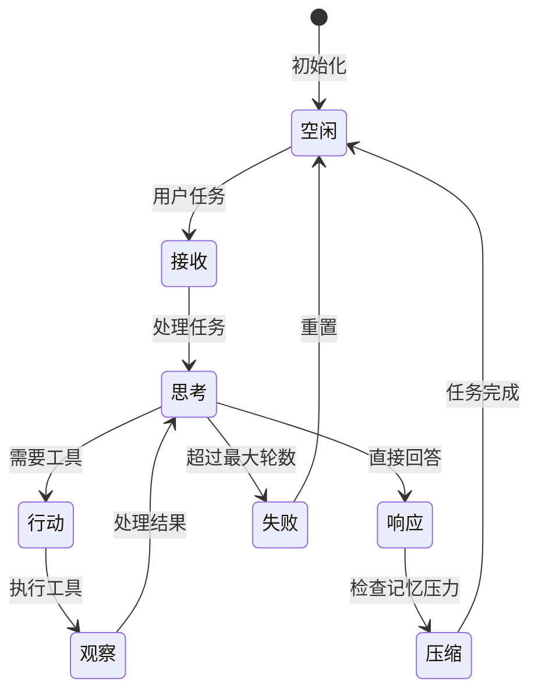
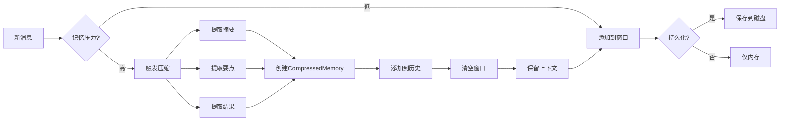
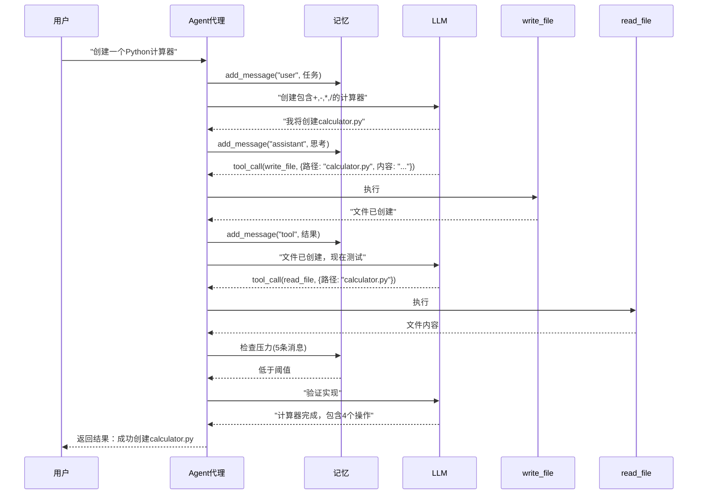

# React Agent 极简版 - 交互图

## 概述
这些交互图展示了极简React Agent系统的动态行为，展现了简约如何带来优雅。

## 1. 主执行流程

## 2. 自然记忆压缩

## 3. 工具执行管道

## 4. API服务自动配置

## 5. 呼吸循环（压缩-处理-解压）

## 6. 状态机

## 7. 记忆生命周期

## 8. 完整任务流程示例

## 性能特征

### 时间复杂度
| 操作 | 复杂度 | 说明 |
|------|--------|------|
| add_message | O(1) | 追加到列表 |
| should_compact | O(1) | 简单比较 |
| compact | O(n) | 处理n条消息 |
| get_context_window | O(k) | 返回k条最近消息 |

### 空间复杂度
| 组件 | 复杂度 | 说明 |
|------|--------|------|
| 消息窗口 | O(阈值) | 受压力阈值限制 |
| 压缩历史 | O(压缩次数) | 对数增长 |
| 总记忆 | O(log n) | 由于压缩 |

## 关键洞察

### 1. **线性简约**
主流程完全线性：
- 接收任务 → 思考 → 行动 → 观察 → 重复

### 2. **自然压力释放**
记忆压缩在压力累积时自然发生：
- 无复杂调度
- 无外部触发
- 只是自然的压力释放

### 3. **最小状态**
系统维护最小状态：
- 当前消息窗口
- 压缩历史
- 简单统计

### 4. **工具透明性**
工具只是带验证的函数：
- 通过Pydantic进行输入验证
- 简单执行
- 清晰结果

## 与复杂系统的对比

| 方面 | 复杂系统 | 极简系统 |
|------|---------|---------| 
| 记忆层数 | 3-6层 | 1层 |
| 状态管理 | 复杂FSM | 简单循环 |
| 配置参数 | 20+ | 1个 |
| 依赖 | 多 | 少 |
| 认知负载 | 高 | 低 |

## 实践中的哲学

交互模式展示了：

1. **呼吸**：压缩 → 处理 → 解压
2. **自然流动**：如水自然找到其水平
3. **涌现**：简单规则产生复杂行为
4. **极简主义**：每个交互都有目的

> "最好的系统不是功能最多的，而是意外最少的。"