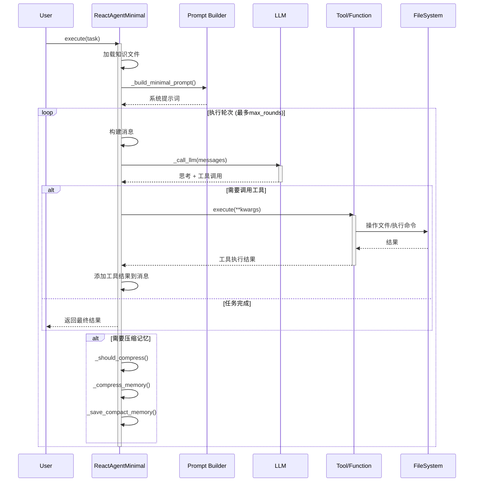
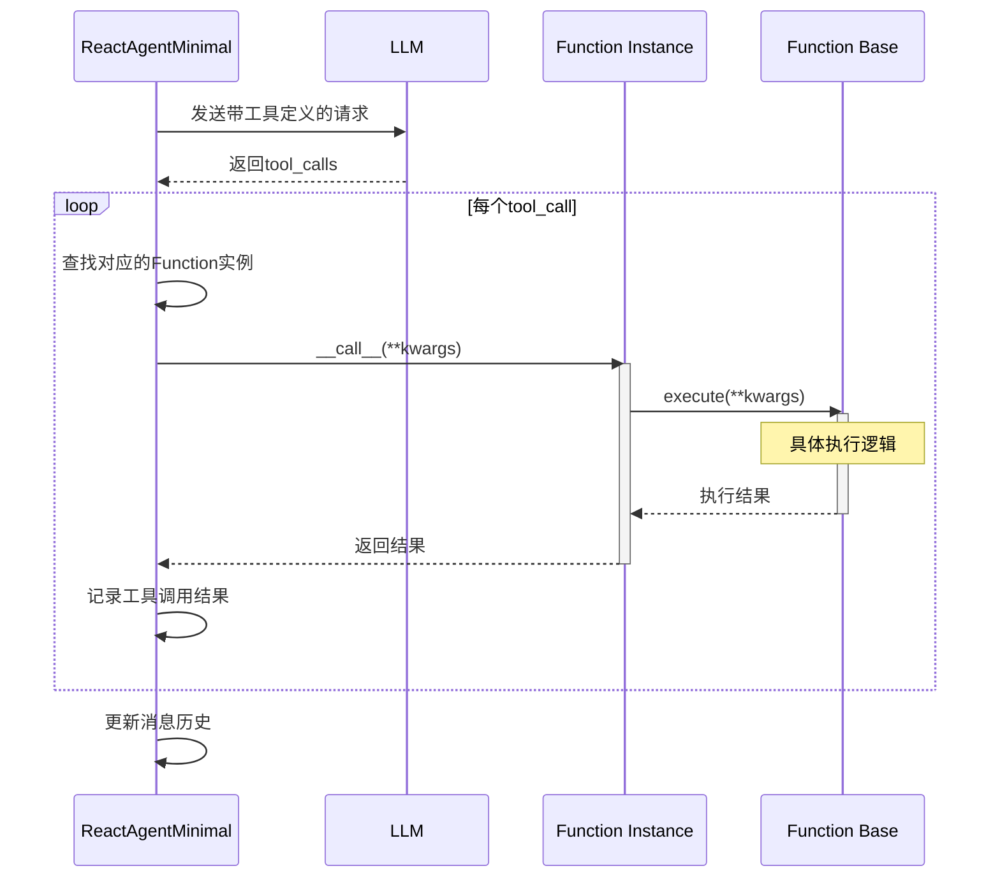
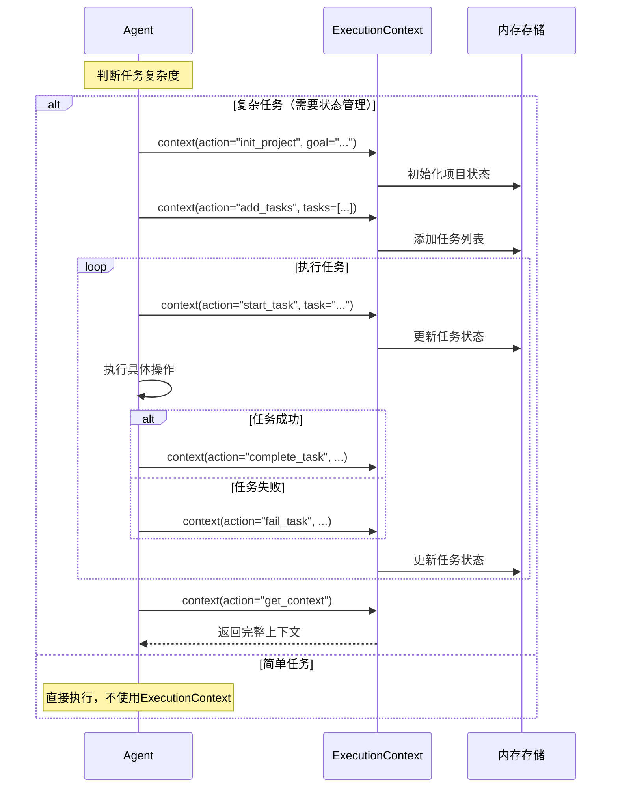
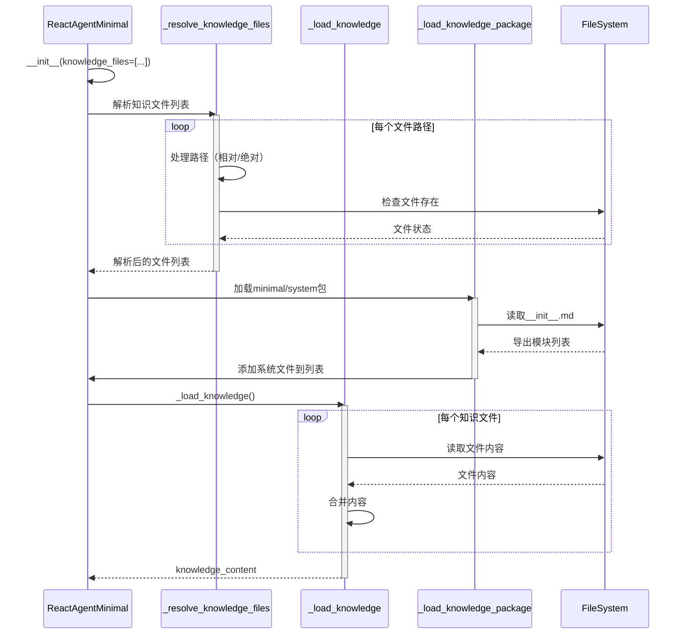
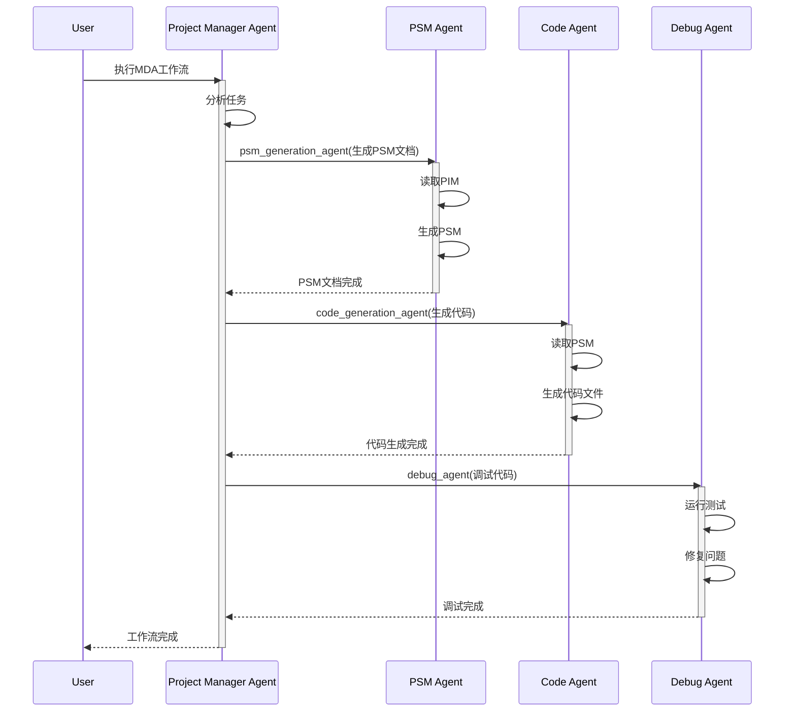
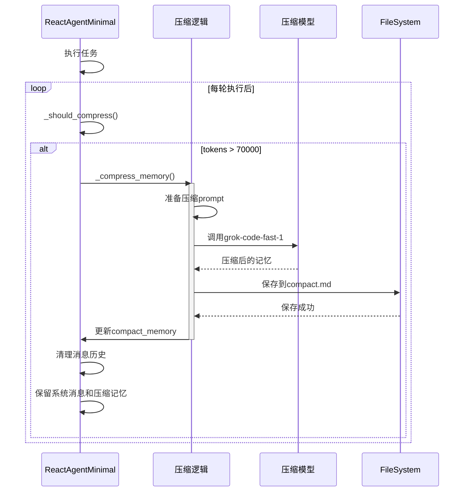

# React Agent Minimal - 序列图 (Sequence Diagram)

## 1. 基本任务执行流程

## 2. 工具调用详细流程

## 3. ExecutionContext使用流程

## 4. 知识文件加载流程

## 5. Agent组合调用流程（Agent作为工具）

## 6. Compact记忆压缩流程

## 关键交互说明

### 1. 函数调用机制
- 所有工具和Agent都实现Function接口
- 通过`to_openai_function()`转换为LLM可理解的格式
- LLM返回tool_calls后，Agent查找并执行对应函数

### 2. 知识系统
- 知识文件在初始化时加载
- 系统知识优先级高于用户指定知识
- 知识内容直接注入到系统提示词中

### 3. 状态管理
- ExecutionContext提供纯内存的状态管理
- 不进行文件持久化
- 适用于复杂多步骤任务

### 4. 记忆管理
- Compact记忆自动触发压缩
- 使用独立的LLM进行智能压缩
- 压缩后的记忆保存到文件供下次使用

### 5. 工具组合
- Agent可以添加其他Agent作为工具
- 实现了天然的LLM切换和任务分发
- 支持构建复杂的工作流