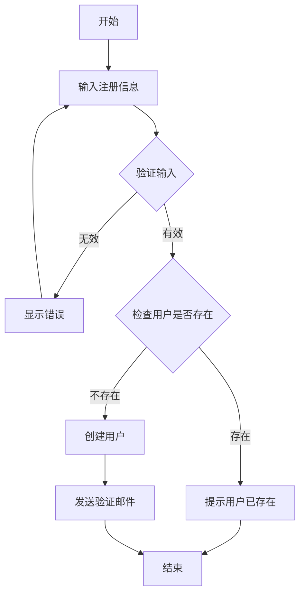

# 用户管理系统（含测试）

## 系统描述
一个完整的用户管理系统，支持用户注册、登录、权限管理等功能，包含完整的测试定义。

## 业务实体

### 用户
系统的核心实体，代表使用系统的人员。
- 用户名（必填，唯一）- 用于登录的唯一标识
- 邮箱（必填，唯一）- 用户的电子邮件地址
- 密码（必填）- 加密存储的登录密码
- 姓名（必填）- 用户的真实姓名
- 手机号 - 用户的手机号码
- 状态（必填）- 用户状态：激活、禁用、待验证
- 注册时间（必填）- 用户注册的时间

## 业务服务

### 用户服务
处理用户相关的业务操作。

#### 操作列表
- 注册用户 - 创建新用户账号
- 用户登录 - 验证用户身份并生成令牌
- 修改密码 - 更新用户密码
- 更新用户信息 - 修改用户基本信息

## 业务规则

1. 密码规则
   - 密码长度至少8位
   - 必须包含大小写字母和数字
   - 密码必须加密存储

2. 用户名规则
   - 用户名长度3-20个字符
   - 只能包含字母、数字和下划线
   - 必须以字母开头

3. 邮箱规则
   - 必须是有效的邮箱格式
   - 注册时需要邮箱验证

## 业务流程

### 用户注册流程

## 测试定义

### 测试：用户实体验证
- ID: test_user_entity_validation
- 名称: 用户实体验证测试
- 描述: 验证用户实体的各种约束条件
- 类型: unit
- 目标: User
- 场景:
  1. 验证必填字段
     - 输入: 缺少用户名的用户数据
     - 期望: 验证失败，提示"用户名必填"
  2. 验证唯一性约束
     - 输入: 重复的用户名
     - 期望: 验证失败，提示"用户名已存在"
  3. 验证邮箱格式
     - 输入: 无效的邮箱格式
     - 期望: 验证失败，提示"邮箱格式无效"

### 测试：用户注册功能
- ID: test_user_registration
- 名称: 用户注册集成测试
- 描述: 测试完整的用户注册流程
- 类型: integration
- 目标: UserService.registerUser
- 前置条件:
  - 数据库已初始化
  - 测试数据已清理
- 场景:
  1. 正常注册流程
     - 输入: {username: "newuser", email: "new@example.com", password: "Test123!"}
     - 期望: 用户创建成功，返回用户ID，发送验证邮件
  2. 重复用户名注册
     - 输入: {username: "existinguser", email: "new2@example.com", password: "Test123!"}
     - 期望: 注册失败，返回错误"用户名已存在"
  3. 弱密码注册
     - 输入: {username: "user123", email: "user@example.com", password: "123"}
     - 期望: 注册失败，返回错误"密码不符合要求"
- 后置条件:
  - 清理测试创建的用户数据

### 测试：用户登录功能
- ID: test_user_login
- 名称: 用户登录测试
- 描述: 测试用户登录功能的各种场景
- 类型: integration
- 目标: UserService.login
- 前置条件:
  - 创建测试用户（状态：激活）
  - 创建禁用状态的测试用户
- 场景:
  1. 正常登录
     - 输入: {username: "testuser", password: "Test123!"}
     - 期望: 登录成功，返回访问令牌
  2. 密码错误
     - 输入: {username: "testuser", password: "wrongpassword"}
     - 期望: 登录失败，返回错误"用户名或密码错误"
  3. 账号被禁用
     - 输入: {username: "disableduser", password: "Test123!"}
     - 期望: 登录失败，返回错误"账号已被禁用"

### 测试：用户注册流程端到端测试
- ID: test_user_registration_e2e
- 名称: 用户注册端到端测试
- 描述: 从UI到数据库的完整注册流程测试
- 类型: e2e
- 目标: UserRegistrationFlow
- 前置条件:
  - 系统运行正常
  - 邮件服务可用
- 场景:
  1. 完整注册流程
     - 步骤:
       1. 访问注册页面
       2. 填写注册表单
       3. 提交注册
       4. 检查邮件
       5. 点击验证链接
       6. 验证账号激活
     - 期望: 用户成功注册并激活
- 期望结果:
  - 用户数据正确保存到数据库
  - 密码已加密存储
  - 验证邮件已发送
  - 用户状态从"待验证"变为"激活"

### 测试：密码加密性能测试
- ID: test_password_encryption_performance
- 名称: 密码加密性能测试
- 描述: 测试密码加密算法的性能
- 类型: performance
- 目标: SecurityService.encryptPassword
- 场景:
  1. 单次加密性能
     - 输入: 标准长度密码（12字符）
     - 期望: 加密时间 < 100ms
  2. 批量加密性能
     - 输入: 1000个密码
     - 期望: 平均加密时间 < 50ms/密码
- 期望结果:
  - 加密性能满足要求
  - 内存使用合理
  - CPU使用率正常