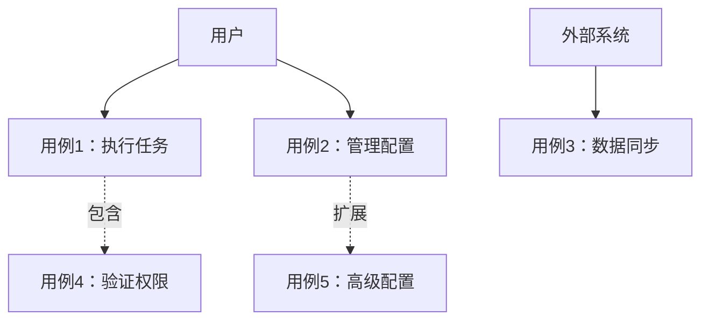
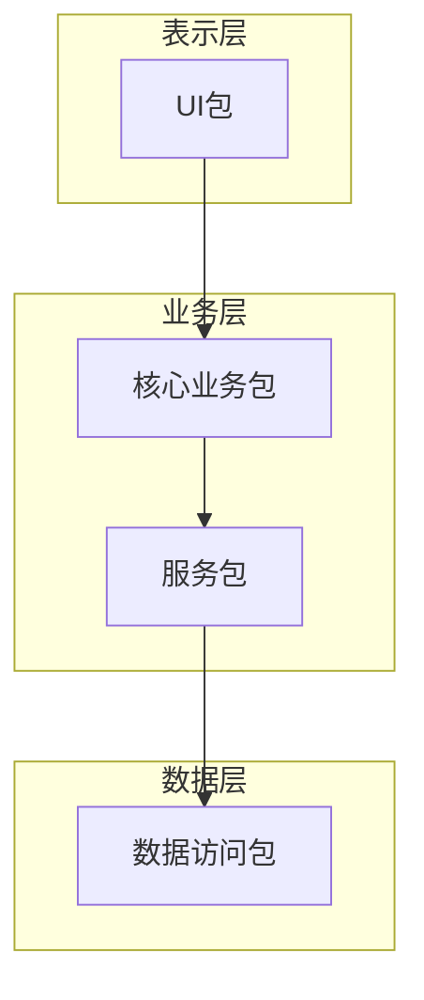
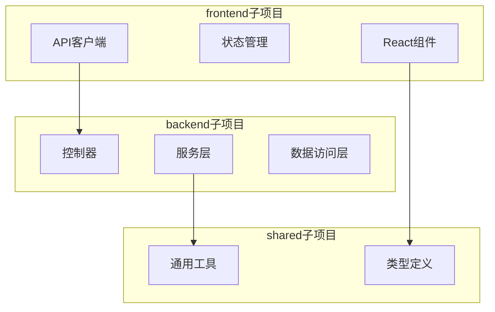
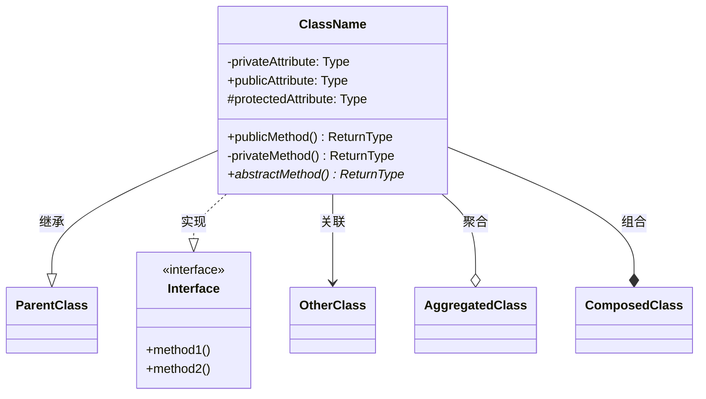
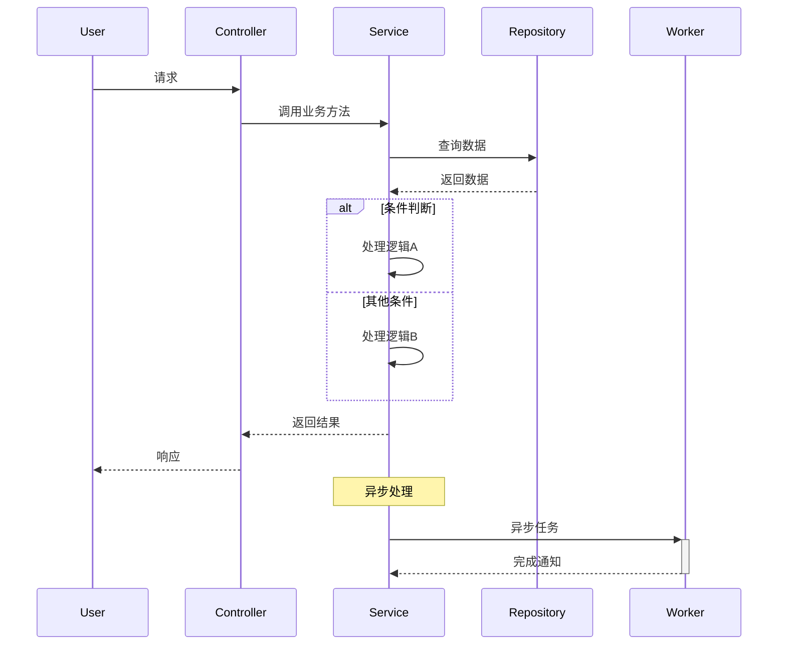

# 项目探索 - UML视角

请使用UML的4个核心视图来深入理解这个项目，生成详细的分析文档。

## 重要说明：子项目处理

如果项目中包含子项目（通过以下特征识别）：
- 子目录中有独立的 README.md
- 子目录中有独立的配置文件（如 package.json, pom.xml, setup.py 等）
- 子目录中有独立的源代码结构
- 子目录名称表明是独立模块（如 frontend/, backend/, core/, plugins/ 等）

则需要：
1. **分别分析每个子项目**，为每个子项目生成独立的UML四视图
2. **分析子项目间的关系**，包括依赖、调用、数据流等
3. **生成整体项目视图**，展示所有子项目的集成关系

### 子项目分析结构示例：
```
# 主项目：ProjectName

## 子项目列表：
1. frontend/ - 前端应用
2. backend/ - 后端服务
3. shared/ - 共享库

## 整体架构图
[展示子项目间的关系]

## 子项目1：frontend
### Use Case视图
### Package视图
### Class视图
### Interaction视图

## 子项目2：backend
[同样的四个视图]

## 子项目间交互
[展示跨项目的交互和依赖]
```

## 1. Use Case视图（用例视图）

分析系统提供的功能和用户交互方式。

### 要求：
- 识别主要的Actor（用户、外部系统、定时任务等）
- 列出核心用例，包括名称和简要描述
- 分析用例之间的关系（包含、扩展、泛化）
- 用mermaid画出用例图

### 示例格式：


## 2. Package视图（包视图）

分析代码的模块组织和依赖关系。

### 要求：
- 识别主要的包/模块及其职责
- 分析包之间的依赖关系
- 识别分层架构（如果有）
- **如果有子项目，展示子项目间的依赖关系**
- 用mermaid画出包图

### 示例格式：

#### 单项目包图：


#### 多子项目包图：


## 3. Class视图（类视图）

分析主要的类、接口及其关系。

### 要求：
- 识别核心类和接口
- 列出重要的属性和方法
- 分析类之间的关系：
  - 继承（泛化）
  - 实现
  - 关联
  - 聚合/组合
  - 依赖
- 用mermaid画出类图

### 示例格式：


## 4. Interaction视图（交互视图）

分析运行时对象的协作模式。

### 要求：
- 选择2-3个关键的业务流程
- 展示对象/组件间的消息传递
- 标注同步/异步调用
- 说明关键的业务规则
- 用mermaid画出序列图

### 示例格式：


## 输出要求

1. **图表质量**：
   - 所有mermaid图表必须语法正确
   - 图表要清晰、布局合理
   - 使用适当的图表类型

2. **文字说明**：
   - 每个视图都要有详细的文字解释
   - 说明设计决策和模式
   - 指出关键发现和潜在问题

3. **诚实标注**：
   - 推测的部分要标注"可能"、"推测"
   - 不确定的地方要说明原因
   - 需要进一步验证的内容要列出

4. **子项目处理**：
   - 如果发现子项目，必须分别分析
   - 明确标注每个子项目的边界和职责
   - 重点分析子项目间的集成和交互

5. **整体理解**：
   - 最后提供一个综合分析
   - 总结项目的架构特点
   - **如果是多子项目，总结整体架构模式**（如微服务、单体应用、插件架构等）
   - 给出改进建议（如果有）

请基于提供的项目信息，生成完整的UML四视图分析文档。如果项目包含子项目，请确保每个子项目都得到充分分析。