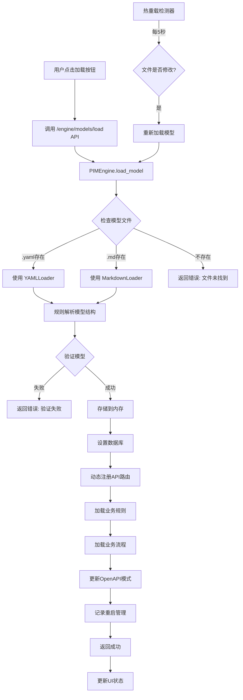

# PIM 加载执行流程

## 概述

PIM 模型从文件加载到可执行状态的完整流程。本文档基于当前代码实现，描述了 PIM 执行引擎如何将模型文件动态加载并生成可执行的 API。

## 执行流程图



## 详细步骤说明

### 1. 触发加载 (Frontend)
```javascript
// models.html 中的加载函数
async function loadModel(modelName) {
    const res = await fetch(`/engine/models/load?model_name=${modelName}`, {
        method: 'POST'
    });
    if (res.ok) {
        await loadModels(); // 刷新模型列表
    }
}
```

### 2. API 入口点 (engine.py)
```python
@self.app.post("/engine/models/load")
async def load_model(model_name: str = Query(...), force: bool = Query(False)):
    """加载指定的模型"""
    result = await self.load_model(model_name)
    return result.dict()
```

### 3. 模型加载主流程
```python
async def load_model(self, model_name: str) -> ModelLoadResult:
    # 步骤 1: 查找模型文件
    model_path = Path(settings.models_path) / f"{model_name}.yaml"
    if not model_path.exists():
        model_path = Path(settings.models_path) / f"{model_name}.md"
    
    # 步骤 2: 使用加载器解析模型
    result = await self.model_loader.load_model(str(model_path))
    
    # 步骤 3: 存储模型和加载时间
    self.models[model_name] = result.model
    self.model_load_times[model_name] = model_path.stat().st_mtime
    
    # 步骤 4: 设置数据库 (创建表)
    await self.data_engine.setup_model(result.model)
    
    # 步骤 5: 注册动态API路由
    await self.api_generator.register_model_routes(result.model, self.app)
    
    # 步骤 6: 加载业务规则
    await self.rule_engine.load_rules(result.model.rules)
    
    # 步骤 7: 加载业务流程
    await self.flow_engine.load_flows(result.model.flows)
    
    # 步骤 8: 更新 OpenAPI
    self.openapi_manager.mark_model_loaded(model_name)
    
    # 步骤 9: 记录重启管理
    self.restart_manager.on_model_loaded(model_name)
```

### 4. 模型解析 (以 Markdown 为例)

#### 4.1 MarkdownLoader 解析流程（基于规则）
```python
async def load(self, file_path: str) -> ModelLoadResult:
    # 读取文件内容
    content = Path(file_path).read_text(encoding='utf-8')
    
    # 使用规则解析自然语言 Markdown（非 LLM）
    model = await self._parse_natural_markdown(content, file_path)
    
    return ModelLoadResult(
        success=True,
        model=model,
        message=f"Successfully loaded model from {file_path}"
    )
```

#### 4.2 解析各个部分（基于规则）
```python
async def _parse_natural_markdown(self, content: str, file_path: str):
    # 分割章节
    sections = self._split_sections(content)
    
    # 解析实体（查找"实体"、"数据"等关键词）
    entities = self._parse_entities(section_content)
    
    # 解析流程（提取 Mermaid 图）
    flows, flow_services = self._parse_flows(section_content)
    
    # 解析规则（查找"规则"章节）
    rules = self._parse_rules(section_content)
    
    # 自动生成 CRUD 服务
    services = self._generate_crud_services(entities)
    
    # 添加流程服务
    services.extend(flow_services)
```

### 5. 数据库设置 (DataEngine)
```python
async def setup_model(self, model: PIMModel):
    # 动态创建 SQLAlchemy 模型类
    for entity in model.entities:
        model_class = self._create_model_class(entity)
        self._models[entity.name] = model_class
        
    # 创建数据库表
    Base.metadata.create_all(bind=self.engine)
    
    logger.info(f"Created database tables for model {model.domain}")
```

### 6. 动态 API 路由注册 (DynamicRouter)
```python
async def register_model_routes(self, model: PIMModel, app):
    # 创建模型专用路由器
    router = APIRouter(prefix=f"/api/{model.domain}", tags=[model.domain])
    
    # 为每个实体生成 CRUD 端点
    for entity in model.entities:
        # 动态创建 Pydantic 模型
        create_model = self._create_pydantic_model(entity, "Create")
        response_model = self._create_pydantic_model(entity, "Response")
        
        # 生成路由：
        # POST /api/{domain}/{entity} - 创建
        # GET /api/{domain}/{entity} - 列表
        # GET /api/{domain}/{entity}/{id} - 获取
        # PUT /api/{domain}/{entity}/{id} - 更新
        # DELETE /api/{domain}/{entity}/{id} - 删除
    
    # 为服务方法生成端点
    for service in model.services:
        for method in service.methods:
            # POST /api/{domain}/{service}/{method}
    
    # 包含路由到主应用
    app.include_router(router)
```

### 7. OpenAPI 管理器
```python
class OpenAPIManager:
    def __init__(self):
        self.loaded_models: Set[str] = set()
        self._openapi_schema = None
    
    def mark_model_loaded(self, model_name: str):
        self.loaded_models.add(model_name)
        self._openapi_schema = None  # 清除缓存
    
    def get_openapi_schema(self, app):
        # 仅包含已加载模型的路由
        routes = [r for r in app.routes 
                 if self._should_include_route(r)]
        # 生成过滤后的 OpenAPI 模式
```

### 8. 热重载机制
```python
async def hot_reload_task(self):
    """后台任务：监控模型文件变化"""
    while True:
        await asyncio.sleep(settings.reload_interval)  # 默认 5 秒
        
        for model_name, load_time in list(self.model_load_times.items()):
            file_path = self._get_model_file_path(model_name)
            if file_path.exists():
                current_mtime = file_path.stat().st_mtime
                if current_mtime > load_time:
                    logger.info(f"Detected change in {model_name}")
                    await self.reload_model(model_name)
```

### 9. 重启管理器
```python
class RestartManager:
    def trigger_restart(self):
        """触发应用重启"""
        if self._is_docker():
            # Docker 环境：干净退出，让容器重启
            os._exit(0)
        else:
            # 本地开发：使用 execv 重启进程
            asyncio.create_task(self._restart_after_delay())
    
    async def _restart_after_delay(self):
        await asyncio.sleep(0.5)  # 允许响应发送
        os.execv(sys.executable, [sys.executable] + sys.argv)
```

## LLM 集成（可选功能）

### 重要说明
核心加载流程**不使用 LLM**。Markdown 解析使用基于规则的方法。LLM 功能是独立的可选模块，通过代码生成 API 提供。

### LLM 转换器
```
src/converters/
├── pim_to_psm_gemini.py         # Gemini API 直接调用
├── pim_to_psm_gemini_langchain.py  # 带缓存的 LangChain 版本
├── pim_to_psm_deepseek.py       # DeepSeek API
├── psm_to_code_gemini.py        # PSM 到代码生成
└── psm_to_code_deepseek.py      # DeepSeek 代码生成
```

### 代码生成 API
```
POST /api/v1/codegen/generate      # 完整代码生成
POST /api/v1/codegen/pim-to-psm    # PIM 转 PSM
GET /api/v1/codegen/llm/providers  # 可用的 LLM 提供商
```

## 加载后的效果

### 1. 内存中的模型
```python
self.models = {
    "图书管理系统": PIMModel(
        domain="library_system",
        entities=[Book, Borrower, BorrowRecord],
        services=[BookService, BorrowerService, BorrowService],
        flows={"borrow_book": ..., "return_book": ...},
        rules={"borrow_limit": ..., "overdue_check": ...}
    )
}
```

### 2. 数据库表（自动创建）
- `library_system_book` (id, title, author, isbn, publisher, stock等)
- `library_system_borrower` (id, name, card_number, phone, status等)
- `library_system_borrow_record` (id, borrower_id, book_id, borrow_date, return_date等)

### 3. 动态生成的 API
```
# 实体 CRUD
POST   /api/library_system/book          # 创建图书
GET    /api/library_system/book          # 查询图书列表
GET    /api/library_system/book/{id}     # 获取图书详情
PUT    /api/library_system/book/{id}     # 更新图书
DELETE /api/library_system/book/{id}     # 删除图书

# 业务流程
POST   /api/library_system/borrow/execute  # 执行借书流程
POST   /api/library_system/return/execute  # 执行还书流程

# OpenAPI 文档
GET    /docs                             # Swagger UI
GET    /openapi.json                     # OpenAPI 规范
```

### 4. 调试界面
- 流程可视化: http://localhost:8001/debug/ui
- 模型管理: http://localhost:8001/models
- API 文档: http://localhost:8001/docs

## 关键特性

1. **热重载**: 文件修改后 5 秒内自动重新加载
2. **多格式支持**: 支持 YAML 和 Markdown 格式
3. **动态 API 生成**: 根据模型自动生成 RESTful API
4. **流程可视化**: 业务流程可在调试界面中可视化执行
5. **规则引擎**: 支持自然语言规则的运行时执行
6. **OpenAPI 集成**: 自动生成和过滤 API 文档
7. **优雅重启**: 支持 Docker 和本地开发环境

## 性能分析

典型的图书管理系统加载时间分解：
- 总时间: ~250ms
- 文件解析: ~50ms
- 数据库表创建: ~80ms  
- API 路由注册: ~100ms
- 规则和流程加载: ~20ms

## 当前限制

1. **无并行加载**: 各组件按顺序加载
2. **规则解析**: Markdown 使用硬编码规则，非 LLM 理解
3. **路由移除**: FastAPI 不易支持动态路由移除（有注释说明）
4. **缓存策略**: 仅基于文件修改时间，不检查内容变化
5. **LLM 集成**: 是可选功能，不在核心加载流程中

## 未来优化方向

1. **并行化**: 数据库设置、API 注册、规则加载可并行
2. **增量加载**: 仅重新加载变更的部分
3. **LLM 解析**: 将 Markdown 解析改为 LLM 理解
4. **缓存优化**: 添加模型解析结果缓存
5. **更好的错误恢复**: 加载失败时的回滚机制