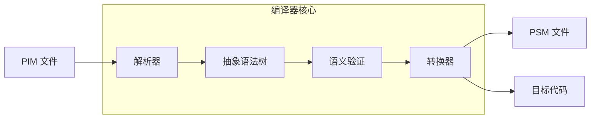
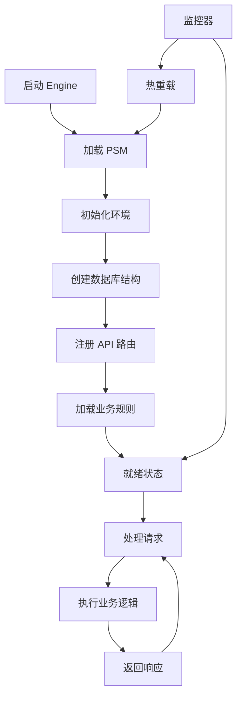

# PIM 架构设计 v2.0

## 概述

本文档描述了 PIM（Platform Independent Model）系统的整体架构设计，采用编译器与执行器分离的模式，类似于 Java 生态系统的设计理念。

## 架构对比

### 传统 Java 架构
```
.java 源文件 → javac 编译器 → .class 字节码 → JVM 执行器
```

### PIM 架构
```
.pim 模型文件 → PIM 编译器 → .psm 中间文件 → PIM Engine 执行器
                     ↓
                目标平台代码（可选）
```

## 核心组件

### 1. PIM 编译器（PIM Compiler）

类似于 `javac`，负责将业务模型转换为可执行的形式。

#### 职责
- **解析 PIM 文件**：支持 YAML、Markdown 等格式
- **语义分析**：验证模型的正确性和完整性
- **生成 PSM**：将 PIM 转换为平台特定模型
- **代码生成**（可选）：生成目标平台的源代码
- **优化**：模型级别的优化

#### 编译流程


#### 使用方式
```bash
# 编译 PIM 到 PSM
pimc compile user_management.pim -o user_management.psm

# 编译 PIM 到代码
pimc generate user_management.pim --platform=fastapi --output=./generated

# 批量编译
pimc compile models/*.pim --output-dir=./compiled
```

### 2. PIM 执行引擎（PIM Engine）

类似于 `JVM`，负责运行编译后的模型。

#### 职责
- **加载 PSM**：动态加载编译后的模型
- **运行时执行**：解释执行业务逻辑
- **资源管理**：数据库连接、API 路由等
- **热重载**：支持模型的动态更新
- **监控**：性能监控和调试支持

#### 执行流程


#### 使用方式
```bash
# 启动引擎
pim-engine start

# 加载模型
pim-engine load user_management.psm

# 查看状态
pim-engine status

# 停止引擎
pim-engine stop
```

## Classpath 概念

### PIM Classpath 结构
类似于 Java 的 classpath，PIM Engine 有固定的类路径用于存放编译后的文件：

```
$PIM_HOME/
├── classpath/                 # PIM Engine 的类路径
│   ├── models/               # 编译后的 PSM 文件
│   │   ├── user_management.psm
│   │   ├── order_system.psm
│   │   └── inventory.psm
│   ├── lib/                  # 共享库和依赖
│   │   ├── common_types.psm
│   │   └── validators.psm
│   └── plugins/              # 扩展插件
│       ├── auth_plugin.psm
│       └── cache_plugin.psm
├── runtime/                  # 运行时数据
│   ├── db/                  # 数据库文件
│   ├── logs/                # 日志文件
│   └── cache/               # 缓存数据
└── config/                  # 配置文件
    ├── engine.yml           # 引擎配置
    └── classpath.yml        # 类路径配置
```

### 环境变量
```bash
# PIM Engine 主目录
export PIM_HOME=/opt/pim-engine

# PIM Classpath（可包含多个路径）
export PIM_CLASSPATH=$PIM_HOME/classpath/models:$PIM_HOME/classpath/lib

# 编译输出目录（编译器默认输出位置）
export PIM_OUTPUT=$PIM_HOME/classpath/models
```

## 文件格式规范

### PIM 文件格式（.pim）
纯业务描述，不包含技术细节：
```yaml
# user_management.pim
domain: 用户管理
version: 1.0.0
description: 用户管理系统的业务模型

entities:
  - name: 用户
    description: 系统用户
    attributes:
      - 用户名（必填，唯一）
      - 邮箱（必填，唯一）
      - 密码（必填）
      - 状态（激活/禁用）

services:
  - name: 用户服务
    operations:
      - 注册用户
      - 用户登录
      - 修改密码

rules:
  - 密码必须至少8位
  - 邮箱格式必须有效
```

### PSM 文件格式（.psm）
编译后的平台特定模型（放置在 classpath 中）：
```yaml
# $PIM_HOME/classpath/models/user_management.psm
platform: fastapi
version: 1.0.0
compiled_from: user_management.pim
compiled_at: 2024-01-20T10:30:00Z
module: com.example.user_management  # 模块标识符

entities:
  - name: User
    table_name: users
    attributes:
      - name: username
        type: string
        db_type: VARCHAR(50)
        constraints:
          required: true
          unique: true
      - name: email
        type: string
        db_type: VARCHAR(100)
        constraints:
          required: true
          unique: true
          pattern: "^[\\w\\.-]+@[\\w\\.-]+\\.\\w+$"

services:
  - name: UserService
    base_path: /api/users
    methods:
      - name: register
        http_method: POST
        path: /register
        request_type: UserCreateRequest
        response_type: UserResponse

rules:
  - id: password_length
    expression: "len(password) >= 8"
    message: "密码长度至少8位"

# 依赖声明
dependencies:
  - module: com.example.common_types
    version: ">=1.0.0"
  - module: com.example.validators
    version: "~1.2.0"
```

## 工具链

### 编译器工具集
```bash
# 编译到默认 classpath
pimc compile user_management.pim
# 输出: $PIM_HOME/classpath/models/user_management.psm

# 编译到指定目录
pimc compile user_management.pim --output=/custom/path

# 批量编译整个项目
pimc compile src/models/*.pim --classpath=$PIM_HOME/classpath/models

# 生成代码（可选）
pimc generate user_management.pim --platform=fastapi --code-output=./generated
```

### 运行时工具集
```bash
# 启动引擎（自动扫描 classpath）
pim-engine start
# Engine 启动后会自动加载 classpath 中的所有 PSM 文件

# 查看已加载的模型
pim-engine list
# 输出:
# Loaded models from classpath:
# - com.example.user_management (v1.0.0)
# - com.example.order_system (v1.0.0)
# - com.example.inventory (v2.1.0)

# 重新加载特定模型
pim-engine reload com.example.user_management

# 添加新的 classpath 路径
pim-engine classpath add /path/to/additional/models

# 查看 classpath 配置
pim-engine classpath show
```

## 优势对比

### 现有设计的问题
1. **职责混淆**：引擎既要解析又要执行
2. **扩展困难**：添加新平台需要修改引擎
3. **性能问题**：每次加载都要重新解析
4. **调试困难**：没有中间表示形式

### 新设计的优势
1. **职责分离**：编译器负责转换，引擎负责执行
2. **易于扩展**：新平台只需新的编译器后端
3. **性能优化**：PSM 可以预编译和缓存
4. **调试友好**：PSM 作为中间格式便于调试
5. **标准化**：PSM 格式可以标准化

## 实施路线图

### 第一阶段：重构现有代码
1. **提取编译器**：将现有的转换逻辑独立为编译器
2. **定义 PSM 规范**：制定标准的 PSM 文件格式
3. **简化引擎**：引擎只负责加载和执行 PSM

### 第二阶段：完善工具链
1. **CLI 工具**：开发 `pimc` 命令行工具
2. **批处理**：支持批量编译和部署
3. **调试工具**：PSM 查看器和调试器

### 第三阶段：高级特性
1. **增量编译**：只编译变更的部分
2. **依赖管理**：模型之间的依赖关系
3. **版本控制**：PSM 版本管理
4. **分布式部署**：支持集群部署

## 目录结构建议

```
mda-project/
├── pim-compiler/           # 编译器项目
│   ├── src/
│   │   ├── parser/        # PIM 解析器
│   │   ├── analyzer/      # 语义分析
│   │   ├── transformer/   # PSM 转换器
│   │   ├── generator/     # 代码生成器
│   │   └── cli/          # 命令行接口
│   └── tests/
│
├── pim-engine/            # 执行引擎项目
│   ├── src/
│   │   ├── loader/       # PSM 加载器
│   │   ├── runtime/      # 运行时系统
│   │   ├── api/          # API 管理
│   │   └── monitor/      # 监控系统
│   └── tests/
│
├── pim-models/           # 模型文件
│   ├── source/          # PIM 源文件
│   ├── compiled/        # PSM 编译结果
│   └── generated/       # 生成的代码
│
└── pim-tools/           # 辅助工具
    ├── debugger/        # 调试器
    ├── visualizer/      # 可视化工具
    └── migrator/        # 迁移工具
```

## 示例工作流

### 开发流程
```bash
# 1. 设置环境
export PIM_HOME=/opt/pim-engine
export PIM_CLASSPATH=$PIM_HOME/classpath/models:$PIM_HOME/classpath/lib

# 2. 编写 PIM 模型
vim src/models/order_management.pim

# 3. 编译模型到 classpath
pimc compile src/models/order_management.pim
# 自动输出到: $PIM_HOME/classpath/models/order_management.psm

# 4. 启动引擎（自动加载 classpath 中的所有模型）
pim-engine start

# 5. 验证模型已加载
pim-engine list | grep order_management

# 6. 访问 API
curl http://localhost:8001/api/orders
```

### 生产部署
```bash
# 1. 编译所有模型到生产 classpath
pimc compile src/models/*.pim --classpath=/prod/pim/classpath/models

# 2. 同步到生产服务器
rsync -av /prod/pim/classpath/ production-server:$PIM_HOME/classpath/

# 3. 在生产服务器上重启引擎
ssh production-server 'pim-engine restart'

# 4. 验证部署
ssh production-server 'pim-engine list'
```

### 模块化开发
```bash
# 编译共享类型库
pimc compile libs/common_types.pim --output=$PIM_HOME/classpath/lib/

# 编译依赖共享库的模型
pimc compile src/models/user_management.pim \
  --classpath=$PIM_HOME/classpath/lib:$PIM_HOME/classpath/models

# Engine 会自动解析依赖关系
pim-engine start
```

## 与 LLM 的集成

### 编译器中的 LLM
- **智能解析**：理解自然语言的 PIM 描述
- **优化建议**：基于最佳实践的模型优化
- **错误修复**：自动修复常见的模型错误

### 引擎中的 LLM（可选）
- **动态规则**：运行时的智能决策
- **异常处理**：智能的错误恢复
- **性能优化**：基于使用模式的优化

## 总结

新的架构设计将 PIM 系统分为编译器和执行器两个独立组件，实现了：

1. **清晰的职责分离**
2. **更好的性能和可扩展性**
3. **标准化的中间格式**
4. **完善的工具链支持**
5. **灵活的部署选项**

这种设计使得 PIM 系统更加成熟和专业，为企业级应用提供了坚实的基础。