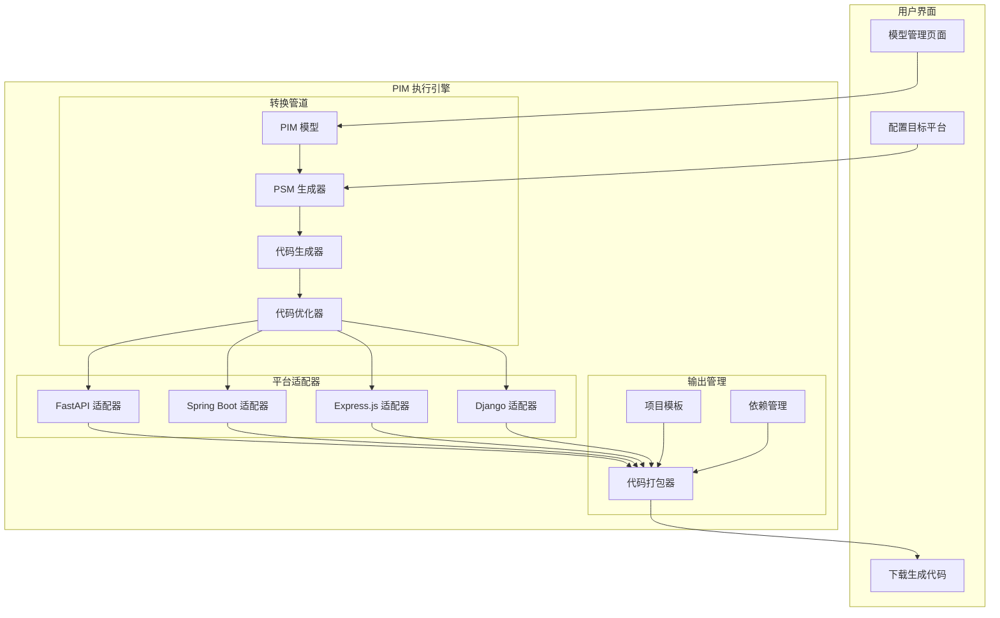

# PIM → PSM → Code 集成架构设计

## 概述

将整个 MDA 转换链（PIM → PSM → Code）集成到 PIM 执行引擎内部，让用户无需了解技术细节即可获得可部署的代码。

## 架构设计



## 核心组件设计

### 1. PSM 生成器

```python
class PSMGenerator:
    """将 PIM 模型转换为特定平台的 PSM"""
    
    def __init__(self, target_platform: str):
        self.platform = target_platform
        self.platform_config = self._load_platform_config()
    
    def generate_psm(self, pim_model: PIMModel) -> PSMModel:
        """生成平台特定模型"""
        psm = PSMModel(
            platform=self.platform,
            base_model=pim_model
        )
        
        # 转换实体
        for entity in pim_model.entities:
            psm_entity = self._transform_entity(entity)
            psm.entities.append(psm_entity)
        
        # 转换服务
        for service in pim_model.services:
            psm_service = self._transform_service(service)
            psm.services.append(psm_service)
        
        # 添加平台特定配置
        psm.platform_config = self._generate_platform_config(pim_model)
        
        return psm
    
    def _transform_entity(self, entity: Entity) -> PSMEntity:
        """转换实体到平台特定格式"""
        if self.platform == "fastapi":
            return self._to_fastapi_entity(entity)
        elif self.platform == "spring":
            return self._to_spring_entity(entity)
        # ... 其他平台
```

### 2. 代码生成器

```python
class CodeGenerator:
    """从 PSM 生成实际代码"""
    
    def __init__(self):
        self.generators = {
            "fastapi": FastAPICodeGenerator(),
            "spring": SpringBootCodeGenerator(),
            "express": ExpressCodeGenerator(),
            "django": DjangoCodeGenerator()
        }
    
    async def generate_code(
        self, 
        psm_model: PSMModel,
        output_format: str = "project"
    ) -> CodePackage:
        """生成完整的项目代码"""
        
        generator = self.generators.get(psm_model.platform)
        if not generator:
            raise ValueError(f"Unsupported platform: {psm_model.platform}")
        
        # 生成代码文件
        code_files = await generator.generate_files(psm_model)
        
        # 生成项目结构
        project_structure = await generator.generate_project_structure()
        
        # 生成配置文件
        config_files = await generator.generate_configs(psm_model)
        
        # 打包
        package = CodePackage(
            files=code_files + config_files,
            structure=project_structure,
            platform=psm_model.platform
        )
        
        return package
```

### 3. 平台适配器示例

```python
class FastAPICodeGenerator:
    """FastAPI 代码生成器"""
    
    async def generate_files(self, psm: PSMModel) -> List[CodeFile]:
        files = []
        
        # 生成模型文件
        models_code = self._generate_models(psm.entities)
        files.append(CodeFile("models.py", models_code))
        
        # 生成 API 路由
        routes_code = self._generate_routes(psm.services)
        files.append(CodeFile("routes.py", routes_code))
        
        # 生成服务层
        services_code = self._generate_services(psm.services)
        files.append(CodeFile("services.py", services_code))
        
        # 生成主应用
        main_code = self._generate_main_app(psm)
        files.append(CodeFile("main.py", main_code))
        
        return files
    
    def _generate_models(self, entities: List[PSMEntity]) -> str:
        """生成 SQLAlchemy 模型"""
        code = """from sqlalchemy import Column, String, Integer, DateTime
from sqlalchemy.ext.declarative import declarative_base
from pydantic import BaseModel

Base = declarative_base()
"""
        
        for entity in entities:
            # 生成 SQLAlchemy 模型
            code += f"\n\nclass {entity.name}(Base):\n"
            code += f'    __tablename__ = "{entity.table_name}"\n\n'
            
            for attr in entity.attributes:
                code += f"    {attr.name} = Column({attr.db_type}"
                if attr.primary_key:
                    code += ", primary_key=True"
                if attr.unique:
                    code += ", unique=True"
                code += ")\n"
            
            # 生成 Pydantic 模型
            code += f"\n\nclass {entity.name}Schema(BaseModel):\n"
            for attr in entity.attributes:
                code += f"    {attr.name}: {attr.python_type}\n"
            code += "\n    class Config:\n"
            code += "        orm_mode = True\n"
        
        return code
```

## 用户界面集成

### 1. 模型管理页面增强

```javascript
// 添加代码生成功能到模型卡片
function renderModelCard(model) {
    return `
        <div class="model-card">
            <!-- 现有内容 -->
            
            <div class="code-generation">
                <select class="platform-select" id="platform-${model.name}">
                    <option value="fastapi">FastAPI (Python)</option>
                    <option value="spring">Spring Boot (Java)</option>
                    <option value="express">Express.js (Node)</option>
                    <option value="django">Django (Python)</option>
                </select>
                
                <button class="btn btn-primary" 
                        onclick="generateCode('${model.name}')">
                    生成代码
                </button>
                
                <button class="btn btn-secondary" 
                        onclick="previewCode('${model.name}')">
                    预览代码
                </button>
            </div>
        </div>
    `;
}

async function generateCode(modelName) {
    const platform = document.getElementById(`platform-${modelName}`).value;
    
    try {
        const response = await fetch('/api/v1/code/generate', {
            method: 'POST',
            headers: { 'Content-Type': 'application/json' },
            body: JSON.stringify({
                model_name: modelName,
                platform: platform,
                options: {
                    include_tests: true,
                    include_docker: true,
                    include_docs: true
                }
            })
        });
        
        if (response.ok) {
            // 下载生成的代码包
            const blob = await response.blob();
            downloadFile(blob, `${modelName}-${platform}.zip`);
        }
    } catch (error) {
        showAlert('代码生成失败: ' + error.message, 'error');
    }
}
```

### 2. 代码预览界面

```html
<!-- 代码预览模态框 -->
<div id="codePreviewModal" class="modal">
    <div class="modal-content code-preview">
        <div class="modal-header">
            <h2>代码预览</h2>
            <button class="close-btn" onclick="closeCodePreview()">&times;</button>
        </div>
        
        <div class="code-tabs">
            <button class="tab-btn active" data-file="models.py">模型</button>
            <button class="tab-btn" data-file="routes.py">路由</button>
            <button class="tab-btn" data-file="services.py">服务</button>
            <button class="tab-btn" data-file="main.py">主程序</button>
        </div>
        
        <div class="code-content">
            <pre><code id="codeDisplay"></code></pre>
        </div>
        
        <div class="modal-footer">
            <button class="btn btn-primary" onclick="downloadCurrentCode()">
                下载完整项目
            </button>
        </div>
    </div>
</div>
```

## API 设计

### 1. 代码生成 API

```python
@router.post("/api/v1/code/generate")
async def generate_code(request: CodeGenerationRequest):
    """生成项目代码"""
    # 获取 PIM 模型
    engine = PIMEngine.get_instance()
    pim_model = engine.models.get(request.model_name)
    
    if not pim_model:
        raise HTTPException(404, "Model not found")
    
    # 生成 PSM
    psm_generator = PSMGenerator(request.platform)
    psm_model = psm_generator.generate_psm(pim_model)
    
    # 生成代码
    code_generator = CodeGenerator()
    code_package = await code_generator.generate_code(
        psm_model,
        output_format=request.output_format
    )
    
    # 打包为 ZIP
    zip_buffer = await code_package.to_zip()
    
    return StreamingResponse(
        zip_buffer,
        media_type="application/zip",
        headers={
            "Content-Disposition": f"attachment; filename={request.model_name}-{request.platform}.zip"
        }
    )

@router.post("/api/v1/code/preview")
async def preview_code(request: CodePreviewRequest):
    """预览生成的代码"""
    # 类似生成过程，但只返回预览
    # ...
    
    return {
        "files": {
            "models.py": models_code,
            "routes.py": routes_code,
            "services.py": services_code,
            "main.py": main_code
        },
        "structure": project_structure
    }
```

### 2. 平台配置 API

```python
@router.get("/api/v1/platforms")
async def list_platforms():
    """列出支持的目标平台"""
    return {
        "platforms": [
            {
                "id": "fastapi",
                "name": "FastAPI",
                "language": "Python",
                "description": "高性能异步 Web 框架"
            },
            {
                "id": "spring",
                "name": "Spring Boot",
                "language": "Java",
                "description": "企业级 Java 框架"
            },
            # ...
        ]
    }

@router.get("/api/v1/platforms/{platform_id}/options")
async def get_platform_options(platform_id: str):
    """获取平台特定的配置选项"""
    return {
        "options": {
            "database": ["PostgreSQL", "MySQL", "SQLite"],
            "authentication": ["JWT", "OAuth2", "Basic"],
            "api_style": ["REST", "GraphQL"],
            # ...
        }
    }
```

## 配置示例

```yaml
# config/platforms/fastapi.yaml
platform:
  id: fastapi
  name: FastAPI
  version: "0.100+"
  
templates:
  project_structure:
    - app/
      - __init__.py
      - main.py
      - models.py
      - schemas.py
      - routes/
      - services/
      - core/
        - config.py
        - security.py
    - tests/
    - requirements.txt
    - Dockerfile
    - docker-compose.yml
    - README.md
    
dependencies:
  required:
    - fastapi>=0.100.0
    - uvicorn[standard]
    - sqlalchemy>=2.0
    - pydantic>=2.0
  optional:
    - pytest
    - black
    - flake8
    
code_style:
  indent: 4
  quotes: double
  line_length: 88
```

## 优势

1. **用户友好**：业务用户只需选择目标平台，无需了解技术细节
2. **一键生成**：从 PIM 模型直接生成可运行的项目代码
3. **多平台支持**：支持主流的 Web 框架和语言
4. **最佳实践**：生成的代码遵循各平台的最佳实践
5. **完整项目**：包含测试、文档、部署配置等

## 实施步骤

1. **Phase 1**：实现 FastAPI 的完整生成链
2. **Phase 2**：添加 Spring Boot 支持
3. **Phase 3**：添加更多平台（Express.js、Django）
4. **Phase 4**：支持自定义模板和配置

这样，PIM 执行引擎就不仅是一个运行时引擎，还是一个完整的 MDA 平台，让业务建模到代码生成完全自动化！