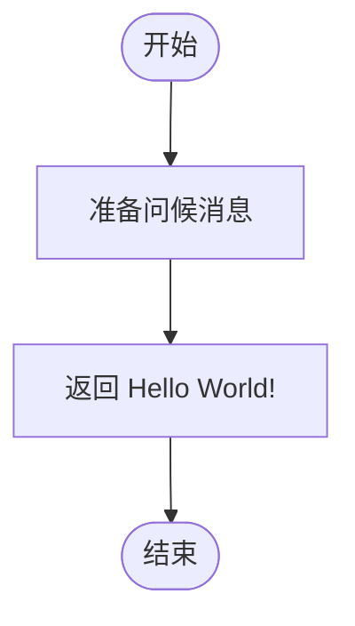

# Hello World Service

## 领域信息
- **领域名称**: hello-world
- **版本**: 1.0.0
- **描述**: 一个简单的 Hello World 服务示例

## 业务服务

### HelloService
提供简单的问候服务。

#### 服务方法

##### sayHello
返回一个友好的问候消息。

**输入参数**：
- 无

**返回值**：
- message: string - 问候消息

**业务规则**：
- 始终返回 "Hello World!"

**流程**：

## 业务规则

### greeting_rule
**规则描述**: 问候消息规则
**条件**: 当调用 sayHello 方法时
**动作**: 返回标准的 "Hello World!" 消息

## 元数据
- **作者**: PIM Engine Demo
- **创建日期**: 2025-01-23
- **标签**: [demo, hello-world, simple-service]