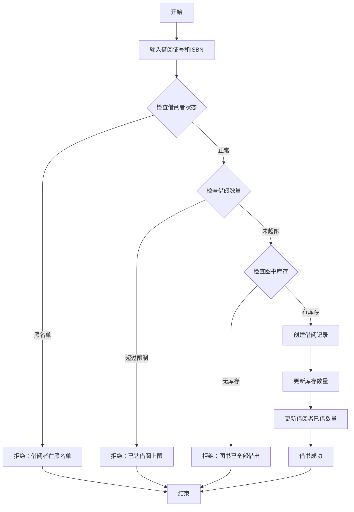
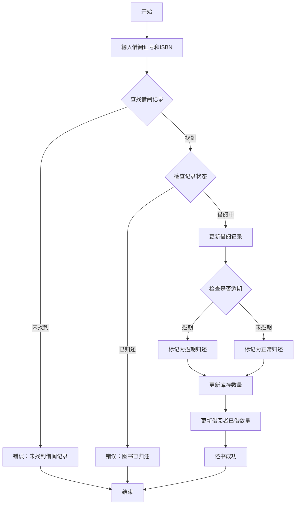

# 图书管理系统

## 系统概述

一个简单的图书管理系统，用于管理图书信息、借阅者信息，以及处理借书和还书流程。

## 业务实体

### 图书
图书是系统的核心实体，包含以下信息：
- **书名**（必填）- 图书的标题
- **作者**（必填）- 图书的作者
- **ISBN**（必填，唯一）- 国际标准书号
- **出版社** - 出版社名称
- **出版年份** - 出版的年份
- **库存数量**（必填）- 可借阅的数量
- **总数量**（必填）- 图书馆拥有的总数量
- **状态**（可借阅、全部借出）- 自动计算

### 借阅者
借阅者是能够借阅图书的人员，包含：
- **姓名**（必填）- 借阅者的姓名
- **借阅证号**（必填，唯一）- 借阅证编号
- **电话**（必填）- 联系电话
- **邮箱** - 电子邮箱
- **状态**（正常、黑名单）- 借阅者状态
- **已借数量** - 当前已借图书数量

### 借阅记录
记录每次借阅的详细信息：
- **借阅者**（关联到借阅者）- 谁借的书
- **图书**（关联到图书）- 借了哪本书
- **借阅日期**（必填）- 借书时间
- **应还日期**（必填）- 应该归还的日期
- **实际归还日期** - 实际还书时间
- **状态**（借阅中、已归还、已逾期）- 借阅状态

## 业务流程

### 借书流程

### 还书流程

## 业务规则

### 借阅规则
1. **借阅者状态检查**：黑名单用户不能借书
2. **借阅数量限制**：每人最多同时借阅5本图书
3. **库存检查**：库存数量必须大于0才能借出
4. **借阅期限**：默认借阅期限为30天
5. **自动计算应还日期**：借阅日期 + 30天

### 归还规则
1. **逾期检查**：实际归还日期晚于应还日期即为逾期
2. **逾期处理**：逾期超过7天的借阅者自动加入黑名单
3. **状态更新**：归还后立即更新借阅记录状态

### 库存管理规则
1. **库存计算**：库存数量 = 总数量 - 借出数量
2. **状态更新**：库存为0时，图书状态变为"全部借出"
3. **库存不能为负**：借出时必须检查库存

## 系统功能

### 图书管理
- 添加新图书
- 修改图书信息
- 删除图书（仅当无借阅记录时）
- 查询图书（按书名、作者、ISBN搜索）
- 查看图书借阅历史

### 借阅者管理
- 注册新借阅者
- 修改借阅者信息
- 注销借阅者（仅当无未还图书时）
- 查询借阅者
- 查看借阅历史

### 借还书管理
- 借书操作
- 还书操作
- 查询借阅记录
- 逾期提醒
- 统计报表（借阅排行、逾期统计等）