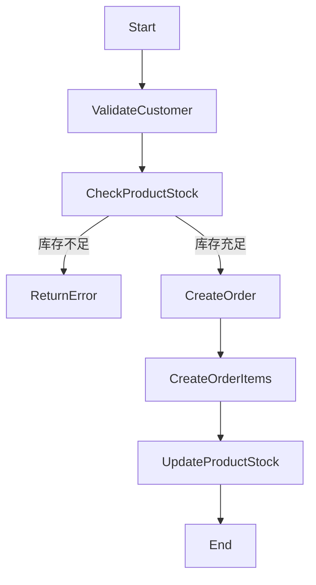

# 引擎测试模型 PIM

## 领域模型

### 实体

#### Product
- id: 整数, 主键, 自增
- name: 字符串, 必填, 最大长度100
- price: 小数, 必填, 大于0
- stock: 整数, 默认0

#### Order
- id: 整数, 主键, 自增
- customerName: 字符串, 必填
- totalAmount: 小数, 必填
- status: 枚举[pending, paid, shipped, completed]
- createdAt: 日期时间, 必填

#### OrderItem
- id: 整数, 主键, 自增
- orderId: 整数, 外键(Order)
- productId: 整数, 外键(Product)
- quantity: 整数, 必填, 大于0
- price: 小数, 必填

## 服务接口

### ProductService
#### 方法
1. **createProduct(productData)**
   - 输入: Product数据
   - 输出: 创建的Product对象

2. **getProduct(id)**
   - 输入: Product ID
   - 输出: Product对象

3. **updateStock(id, quantity)**
   - 输入: Product ID, 数量
   - 输出: 更新后的Product对象

### OrderService
#### 方法
1. **createOrder(orderData)**
   - 输入: Order数据
   - 输出: 创建的Order对象
   - 流程: OrderService.createOrder

2. **getOrder(id)**
   - 输入: Order ID
   - 输出: Order对象及其OrderItems

## 业务流程

### 创建订单流程

## 业务规则

1. **库存检查**: 创建订单时必须检查产品库存
2. **价格验证**: 产品价格必须大于0
3. **数量验证**: 订单项数量必须大于0