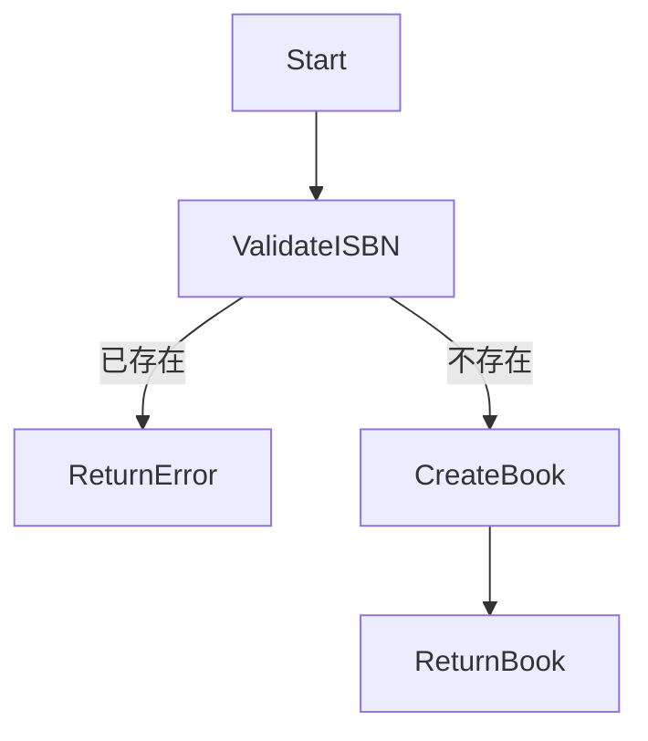

# 测试编译器 PIM

## 领域模型

### 实体

#### Book
- id: 整数, 主键, 自增
- title: 字符串, 必填, 最大长度200
- author: 字符串, 必填, 最大长度100
- isbn: 字符串, 唯一, 长度13
- price: 小数, 必填, 大于0
- stock: 整数, 默认0, 大于等于0

## 服务接口

### BookService

#### 方法

1. **createBook(bookData)**
   - 输入: Book数据（不含id）
   - 输出: 创建的Book对象
   - 业务规则: ISBN必须唯一

2. **getBook(id)**
   - 输入: Book ID
   - 输出: Book对象或null

3. **listBooks()**
   - 输入: 无
   - 输出: Book对象列表

4. **updateStock(id, quantity)**
   - 输入: Book ID, 数量变化（正数增加，负数减少）
   - 输出: 更新后的Book对象
   - 业务规则: 库存不能为负

## 业务流程

### 创建图书流程

## 业务规则

1. **ISBN唯一性**: 系统中每本书的ISBN必须唯一
2. **库存非负**: 图书库存不能为负数
3. **价格验证**: 图书价格必须大于0