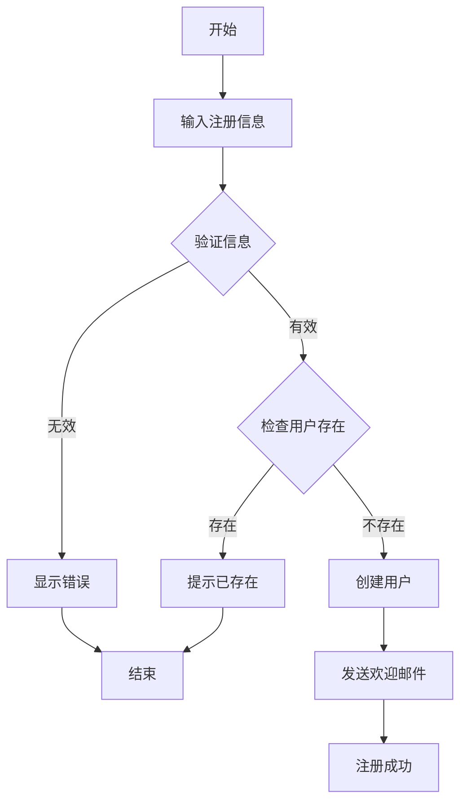

# 用户管理系统 PIM

## 实体定义

### 用户 (User)
用户是系统的核心实体，代表使用系统的人员。

属性：
- 用户ID (userId): 字符串，唯一标识
- 用户名 (username): 字符串，唯一，3-20字符
- 邮箱 (email): 字符串，唯一，邮箱格式
- 密码 (password): 字符串，加密存储
- 姓名 (name): 字符串，真实姓名
- 手机号 (phone): 字符串，11位手机号
- 状态 (status): 枚举[active, inactive, locked]
- 创建时间 (createdAt): 日期时间
- 更新时间 (updatedAt): 日期时间

### 角色 (Role)
角色定义用户的权限集合。

属性：
- 角色ID (roleId): 字符串，唯一标识
- 角色名称 (name): 字符串，唯一
- 描述 (description): 字符串
- 权限列表 (permissions): 字符串数组
- 创建时间 (createdAt): 日期时间

## 业务规则

1. 用户注册规则
   - 用户名必须唯一且长度3-20字符
   - 邮箱必须是有效格式且唯一
   - 密码必须至少8位，包含字母和数字
   - 新用户默认状态为 active

2. 用户认证规则
   - 连续5次登录失败，账户锁定
   - 密码必须加密存储（bcrypt）
   - 支持邮箱或用户名登录

3. 角色管理规则
   - 每个用户可以有多个角色
   - 角色可以继承其他角色的权限
   - 系统预设管理员角色不可删除

## 业务流程

### 用户注册流程

## 接口定义

### 用户管理接口
- POST /api/v1/users/register - 用户注册
- POST /api/v1/users/login - 用户登录
- GET /api/v1/users/{userId} - 获取用户信息
- PUT /api/v1/users/{userId} - 更新用户信息
- DELETE /api/v1/users/{userId} - 删除用户
- GET /api/v1/users - 获取用户列表

### 角色管理接口
- POST /api/v1/roles - 创建角色
- GET /api/v1/roles/{roleId} - 获取角色信息
- PUT /api/v1/roles/{roleId} - 更新角色
- DELETE /api/v1/roles/{roleId} - 删除角色
- GET /api/v1/roles - 获取角色列表
