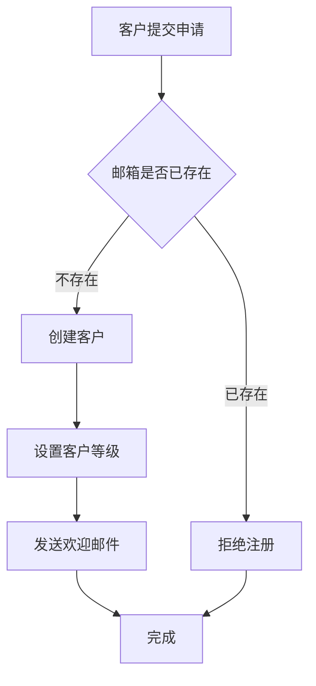
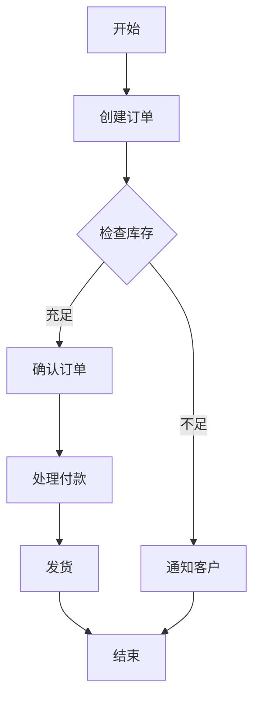
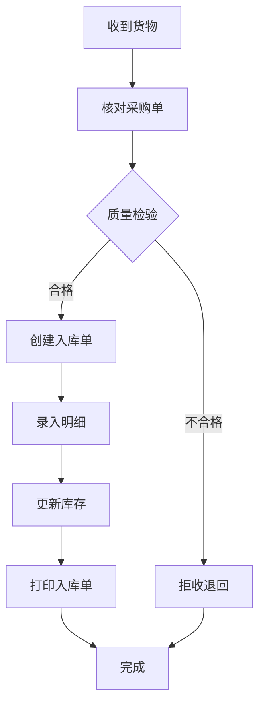
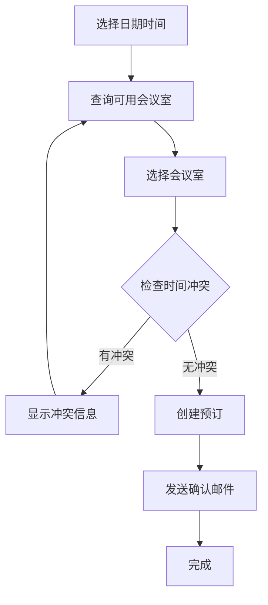
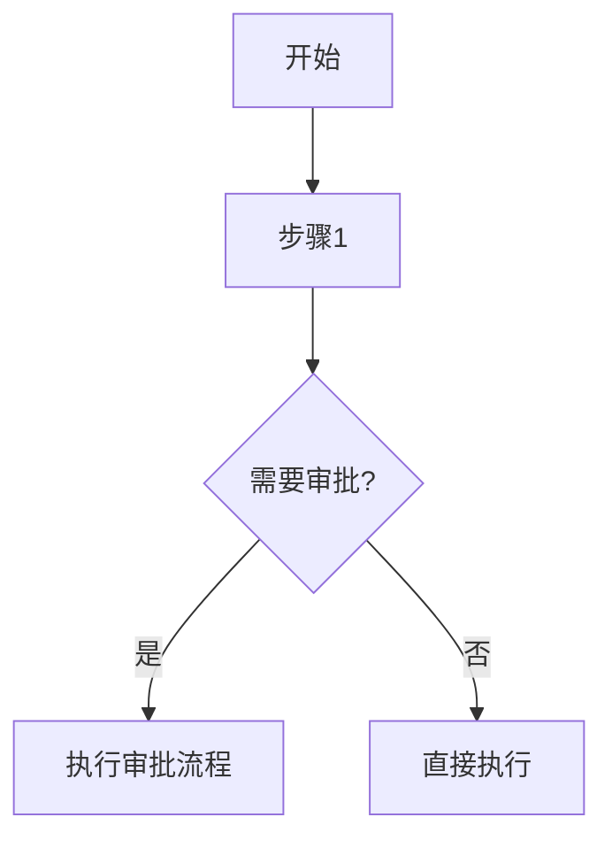
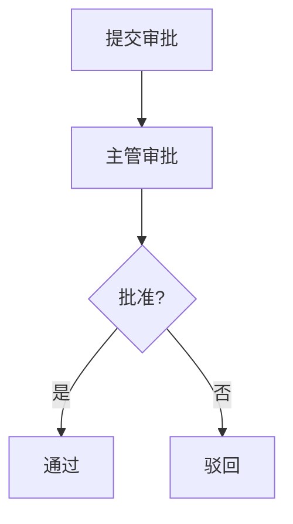

# MDA无代码平台 - 业务专家使用手册

> 让业务专家用自然语言直接构建企业应用系统

## 快速开始

### 什么是MDA无代码平台？

这是一个让业务专家无需编程即可创建企业应用的平台。您只需要：
1. 用Markdown编写业务文档（就像写Word文档）
2. 用Mermaid绘制流程图（简单的文本格式）
3. 用自然语言描述业务规则

系统会自动理解您的需求并：
- **直接执行模型**：PIM执行引擎可以直接运行您的业务模型，无需生成代码
- **AI增强生成**：当需要更复杂的实现时，使用AI（Gemini）生成生产级代码
- **实时调试**：提供可视化的流程执行和调试界面

### 为什么选择Markdown？

- **熟悉易用**：像写普通文档一样自然
- **可视化强**：支持表格、列表、流程图
- **版本管理**：纯文本格式，便于追踪变更
- **工具丰富**：可用任何文本编辑器编写

### 三步创建应用

#### 第1步：编写业务文档

创建一个 `.md` 文件，用自然语言描述您的业务：

```markdown
# 客户管理系统

## 系统概述

我们需要一个客户管理系统来管理公司的客户信息、跟踪销售机会，并维护客户关系。

## 业务实体

### 客户
我们的客户包含以下信息：
- **公司名称**（必填）
- **联系人姓名**（必填）
- **联系电话**
- **电子邮箱**（必填，且必须唯一）
- **公司地址**
- **所属行业**（制造业、零售业、服务业、金融业、其他）
- **客户等级**（VIP客户、重要客户、普通客户）
- **客户状态**（潜在客户、正式客户、流失客户）

### 销售机会
每个销售机会记录：
- **机会名称**（必填）
- **所属客户**（关联到客户）
- **预计金额**
- **成功概率**（百分比）
- **当前阶段**（初步接触、需求确认、方案报价、商务谈判、合同签订）

## 业务流程

### 新客户注册流程



## 业务规则

### 客户管理规则
1. **邮箱唯一性**：每个客户的邮箱必须是唯一的
2. **客户分级**：年营收超过1亿的自动设为VIP客户
3. **状态变更**：超过6个月没有跟进的客户自动标记为流失
```

将文件保存为 `客户管理系统.md` 并放入 `models/` 目录

#### 第2步：启动平台

**方式一：使用Docker（推荐）**
```bash
cd pim-engine
docker compose up -d
```

**方式二：本地运行（需要配置代理）**
```bash
cd pim-engine
./start_local_bg.sh
```

系统会自动：
- 读取您的Markdown文档
- 理解业务需求
- 创建数据库表
- 生成API接口
- 准备调试界面

#### 第3步：访问您的应用

- **应用地址**：http://localhost:8000
- **API文档**：http://localhost:8000/docs
- **调试界面**：http://localhost:8000/debug/ui
- **模型管理**：http://localhost:8000/models
- **数据库管理**：http://localhost:8080 (Adminer)

## Markdown编写指南

### 1. 文档结构

使用标题来组织内容：

```markdown
# 系统名称

## 系统概述
简要描述系统的目的和功能

## 业务实体
定义系统中的核心对象

## 业务流程
描述主要的业务操作流程

## 业务规则
列出重要的业务约束和规则

## 系统功能
描述系统应该提供的功能
```

### 2. 定义实体

使用三级标题定义实体，用列表描述属性：

```markdown
### 订单
订单是客户购买产品的记录，包含：
- **订单编号**（必填，唯一）
- **客户名称**（必填）
- **订单金额**
- **订单状态**（待付款、已付款、已发货、已完成）
- **下单时间**（自动记录）
```

**属性说明技巧**：
- 用 **加粗** 标记属性名
- 在括号中说明约束（必填、唯一、自动生成等）
- 枚举值用顿号分隔
- 关联其他实体用"关联到"说明

### 3. 绘制流程图

使用Mermaid语法绘制流程图：

```markdown
### 订单处理流程



**流程图要点**：
- 使用中文标签，更直观
- 方框 `[]` 表示操作步骤
- 菱形 `{}` 表示判断条件
- 箭头 `-->` 连接步骤
- 条件分支用 `|条件|` 标注

### 4. 描述业务规则

用编号列表清晰表达规则：

```markdown
## 业务规则

### 库存管理规则
1. **最低库存**：产品库存低于10件时自动预警
2. **库存扣减**：订单支付成功后立即扣减库存
3. **库存恢复**：订单取消后库存自动恢复

### 价格规则
1. **会员折扣**：VIP会员享受9折优惠
2. **批量折扣**：单次购买超过100件享受95折
3. **折扣叠加**：多重折扣不可叠加，取最优惠价格
```

### 5. 功能描述

列出系统应该提供的功能：

```markdown
## 系统功能

### 客户管理功能
- 添加新客户
- 修改客户信息
- 查询客户（支持按名称、行业筛选）
- 导出客户列表到Excel
- 查看客户360度视图

### 订单管理功能
- 创建订单
- 修改订单（仅限未付款状态）
- 取消订单
- 查询订单历史
- 打印订单
```

## 实际案例

### 案例1：库存管理系统

```markdown
# 库存管理系统

## 系统概述

帮助仓库管理人员追踪产品库存，处理入库出库，并及时预警库存不足。

## 业务实体

### 产品
- **产品编码**（必填，唯一）
- **产品名称**（必填）
- **产品分类**（原材料、半成品、成品）
- **单位**（个、箱、吨、米）
- **当前库存**
- **最低库存**
- **最高库存**

### 入库单
- **入库单号**（自动生成）
- **入库日期**（自动记录）
- **供应商名称**
- **入库类型**（采购入库、生产入库、退货入库）
- **操作员**
- **备注**

### 入库明细
- **所属入库单**（关联到入库单）
- **产品**（关联到产品）
- **入库数量**
- **单价**
- **批次号**

## 业务流程

### 采购入库流程



## 业务规则

### 库存规则
1. **库存预警**：当前库存低于最低库存时发出预警
2. **库存上限**：入库后库存不能超过最高库存
3. **先进先出**：出库时优先使用早期批次

### 入库规则
1. **质检要求**：采购入库必须经过质量检验
2. **单据审核**：金额超过10万的入库单需要主管审批
3. **批次管理**：食品类产品必须记录批次号和保质期
```

### 案例2：会议室预订系统

```markdown
# 会议室预订系统

## 系统概述

方便员工预订会议室，避免冲突，提高会议室使用效率。

## 业务实体

### 会议室
- **会议室名称**（必填，唯一）
- **所在楼层**
- **容纳人数**
- **设备配置**（投影仪、白板、视频会议）
- **状态**（可用、维护中）

### 预订记录
- **预订人**（必填）
- **会议室**（关联到会议室）
- **预订日期**（必填）
- **开始时间**（必填）
- **结束时间**（必填）
- **会议主题**（必填）
- **参会人数**
- **预订状态**（待确认、已确认、已取消）

## 业务流程

### 预订会议室流程



## 业务规则

### 预订规则
1. **提前预订**：至少提前30分钟预订
2. **预订时长**：单次预订不超过4小时
3. **取消规则**：开始前1小时内不可取消
4. **预订限制**：每人每天最多预订3个会议室
```

## 常见问题

### Q: 如何表示复杂的数据关系？
A: 使用"关联到"来表示引用关系：
```markdown
### 订单明细
- **所属订单**（关联到订单）
- **产品**（关联到产品）
- **数量**
```

### Q: 如何定义计算字段？
A: 在描述中说明计算方式：
```markdown
### 订单
- **小计**（单价×数量，自动计算）
- **总金额**（所有明细小计之和，自动计算）
```

### Q: 如何表示可选值？
A: 用括号列出所有选项：
```markdown
- **付款方式**（现金、支付宝、微信、银行转账）
- **配送方式**（快递、自提、同城配送）
```

### Q: 流程图太复杂怎么办？
A: 可以拆分成多个子流程：
```markdown
### 主流程


### 审批流程


## 最佳实践

### 1. 命名要清晰
- ✅ **客户姓名**、**订单编号**、**产品库存**
- ❌ name、num、qty

### 2. 描述要完整
- ✅ "订单是客户购买产品的记录，一个订单可以包含多个产品"
- ❌ "订单"

### 3. 规则要明确
- ✅ "库存低于10件时发送预警邮件给仓库主管"
- ❌ "库存不足时预警"

### 4. 流程要完整
- ✅ 包含正常流程和异常处理
- ❌ 只考虑正常情况

### 5. 使用中文
- ✅ 全程使用中文描述，系统会自动转换
- ❌ 中英文混用造成理解困难

## 进阶技巧

### 1. 使用表格展示复杂信息

```markdown
### 用户权限对照表

| 角色 | 查看订单 | 创建订单 | 修改订单 | 删除订单 |
|------|----------|----------|----------|----------|
| 客户 | 自己的   | ✓        | ✓        | ✗        |
| 销售 | 所有     | ✓        | ✓        | ✗        |
| 经理 | 所有     | ✓        | ✓        | ✓        |
```

### 2. 添加示例数据

```markdown
### 产品分类示例
- 电子产品：手机、电脑、平板
- 服装：男装、女装、童装
- 食品：零食、饮料、生鲜
```

### 3. 分阶段实施

```markdown
## 实施计划

### 第一阶段：基础功能
- 客户信息管理
- 产品目录管理

### 第二阶段：核心业务
- 订单处理流程
- 库存管理

### 第三阶段：增值功能
- 数据分析报表
- 客户关系管理
```

## 获取帮助

### 在线资源
- 示例文档：查看 `models/examples/` 目录
- Mermaid教程：https://mermaid.js.org/
- Markdown语法：https://www.markdownguide.org/

### 模型格式支持
- **Markdown格式**（.md）：适合业务专家，自然语言描述
- **YAML格式**（.yaml/.yml）：适合技术人员，结构化定义

### YAML模型示例
如果您更喜欢结构化的格式，也可以使用YAML：

```yaml
domain: customer-management
version: 1.0.0
description: 客户管理系统

entities:
  - name: Customer
    description: 客户信息
    attributes:
      company_name:
        type: string
        required: true
        description: 公司名称
      email:
        type: string
        required: true
        unique: true
        description: 电子邮箱
      level:
        type: enum
        values: [VIP客户, 重要客户, 普通客户]
        description: 客户等级

services:
  - name: CustomerService
    methods:
      - name: registerCustomer
        parameters:
          customerData: Customer
        flow: CustomerService.registerCustomer
        rules:
          - validate_email_uniqueness
          - auto_set_customer_level

rules:
  validate_email_uniqueness: 邮箱必须在系统中唯一
  auto_set_customer_level: 年营收超过1亿自动设为VIP客户
```

### 社区支持
- 提问前先查看本手册
- 提供完整的业务文档
- 说明遇到的具体问题

### 专业服务
- 业务分析咨询
- 文档编写培训
- 定制化开发

### 最新功能

#### AI代码生成（2025年7月更新）
系统现在支持使用AI（Gemini）生成真实的生产级代码：
- 自动生成完整的FastAPI服务实现
- 包含数据库模型、业务逻辑、API接口
- 生成时间约100-120秒
- 无需手动编写任何代码

使用方法：
1. 在模型管理界面选择模型
2. 点击"生成代码"按钮
3. 选择"使用AI生成"选项
4. 等待生成完成后下载代码包

---

*让业务创新更简单 - 只需要会写文档，就能创建应用系统！*

更新日期：2025年7月20日