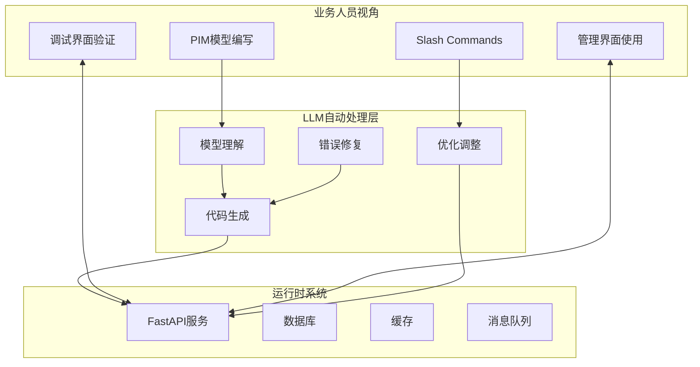

# 业务驱动无代码平台方案

基于MDA和LLM的纯业务人员开发平台，完全屏蔽代码层面的复杂性。

## 核心理念

> "业务人员看不到代码，就像Python程序员看不到机器码"

- 业务人员只需要：编写PIM模型 → 使用系统界面 → 通过调试器验证流程
- 所有技术实现由LLM自动处理，无需人工编码

## 架构设计



## 增强的PIM模型设计

### 1. 业务规则表达

```markdown
### 订单 (Order)

**业务规则**：
```rules
规则：订单金额计算
  当 客户.会员等级 = "金牌" 时
    订单.折扣 = 0.9
  当 客户.会员等级 = "银牌" 时  
    订单.折扣 = 0.95
  否则
    订单.折扣 = 1.0
  
  订单.最终金额 = 订单.原始金额 * 订单.折扣

规则：订单可取消条件
  订单可取消 当且仅当：
    - 订单.状态 = "待支付" 或 "已支付"
    - 订单.创建时间 < 24小时前
    - 不存在 发货记录
```
```

### 2. 数据验证声明

```markdown
**数据约束**：
- 订单金额：必须大于0
- 客户邮箱：必须符合邮箱格式
- 手机号：必须是11位数字
- 订单状态：只能是 [待支付, 已支付, 已发货, 已完成, 已取消]
```

### 3. 界面定义

```markdown
**界面需求**：
```ui
列表页面：订单列表
  显示字段：订单号, 客户名, 金额, 状态, 创建时间
  筛选条件：状态, 日期范围, 客户名
  操作按钮：查看详情, 取消订单, 导出

详情页面：订单详情  
  布局：
    - 基本信息区：订单号, 状态, 时间
    - 客户信息区：姓名, 电话, 地址
    - 商品列表区：商品明细表格
    - 操作历史区：状态变更时间线
```
```

### 4. 集成声明

```markdown
**外部集成**：
- 支付系统：
  - 类型：支付宝/微信支付
  - 触发：用户选择支付时
  - 数据：订单号, 金额
  - 回调：更新订单状态为"已支付"

- 物流系统：
  - 类型：顺丰API
  - 触发：订单发货时
  - 数据：收件人信息, 商品信息
  - 返回：物流单号
```

## 新的Slash Commands

### /bug-report
报告业务流程问题，LLM自动定位和修复：

```bash
/bug-report issue="创建订单时，金牌会员没有折扣" flow="创建订单"
```

执行流程：
1. LLM分析问题描述
2. 检查相关PIM模型和规则
3. 定位问题（规则未执行/规则错误）
4. 自动修复并重新部署
5. 通知业务人员验证

### /pim-assistant
帮助业务人员编写PIM模型：

```bash
/pim-assistant request="我想添加一个退货流程，客户可以在收货后7天内申请退货"
```

### /flow-test
自动化测试业务流程：

```bash
/flow-test flow="创建订单" scenario="金牌会员购买商品"
```

### /ui-preview
预览生成的界面：

```bash
/ui-preview page="订单列表"
```

## 完整工作流程

### 业务人员日常工作

1. **定义业务模型**
   ```bash
   # 使用自然语言描述需求
   /pim-assistant request="创建一个会员管理系统，包含会员等级和积分"
   
   # 查看生成的PIM
   cat models/domain/会员管理_pim.md
   ```

2. **验证业务流程**
   ```bash
   # 生成并启动服务（自动完成，业务人员不可见）
   /deploy-pim pim=会员管理_pim
   
   # 打开调试界面验证流程
   open http://localhost:8000/debug/ui
   ```

3. **使用管理界面**
   ```bash
   # 访问自动生成的管理界面
   open http://localhost:8000/admin
   ```

4. **报告问题**
   ```bash
   /bug-report issue="会员升级时积分没有正确计算"
   # LLM自动修复并重新部署
   ```

## 技术实现要点

### 1. 完全自动化的代码生成

- 移除所有MDA-CUSTOM标记
- 所有逻辑从PIM模型派生
- 使用LLM实时解释业务规则

### 2. 智能错误处理

```python
# LLM自动生成的错误处理
try:
    result = execute_business_rule(rule_name, context)
except BusinessRuleError as e:
    # LLM理解错误并生成友好提示
    error_message = llm_explain_error(e, context, user_language)
    return user_friendly_error(error_message)
```

### 3. 实时规则引擎

```python
class LLMRuleEngine:
    async def execute_rule(self, rule_text: str, context: dict):
        """LLM实时解释并执行业务规则"""
        # 将自然语言规则转换为执行逻辑
        execution_plan = await llm.understand_rule(rule_text)
        result = await self.run_plan(execution_plan, context)
        return result
```

### 4. 自动化UI生成

基于PIM中的UI定义，自动生成：
- 管理后台（增删改查）
- 业务流程界面
- 报表和数据分析
- 移动端界面

## 优势与局限

### 优势
1. **业务人员自主**：不依赖技术团队
2. **快速迭代**：修改PIM立即生效
3. **一致性保证**：所有代码由LLM生成
4. **自动优化**：LLM持续改进实现

### 局限性与解决方案

| 局限性 | 解决方案 |
|--------|----------|
| 复杂算法实现 | 提供算法模板库，用自然语言选择和配置 |
| 特殊UI需求 | 提供丰富的UI组件库和布局模板 |
| 性能优化 | LLM自动分析瓶颈并优化 |
| 第三方集成 | 预定义主流系统的集成模板 |

## 实施路线图

### Phase 1: 基础平台（1-2月）
- 增强PIM表达能力
- 实现规则引擎
- 基础UI生成

### Phase 2: 智能化（2-3月）
- bug自动修复
- 性能自动优化
- 测试自动生成

### Phase 3: 生态建设（3-6月）
- 组件市场
- 模板库
- 最佳实践库

## 示例：完整的业务人员工作流

```bash
# 1. 描述需求
/pim-assistant request="创建一个请假管理系统，员工可以提交请假申请，主管审批"

# 2. 查看生成的模型
/show-pim domain=请假管理

# 3. 添加业务规则
/add-rule domain=请假管理 rule="年假天数根据工龄计算：工龄<1年5天，1-5年10天，>5年15天"

# 4. 部署系统
/deploy-pim pim=请假管理_pim

# 5. 验证流程
open http://localhost:8000/debug/ui
# 选择"请假申请流程"进行调试

# 6. 使用系统
open http://localhost:8000/admin

# 7. 发现问题
/bug-report issue="主管审批后，员工没有收到通知"

# 8. 查看修复状态
/check-fix status=latest
```

## 结论

这个方案完全可行，特别适合：
- 标准业务系统（ERP、CRM、OA等）
- 流程驱动的应用
- 数据管理系统
- 内部管理工具

通过LLM的能力，我们可以真正实现"业务人员的编程语言就是自然语言"的愿景。