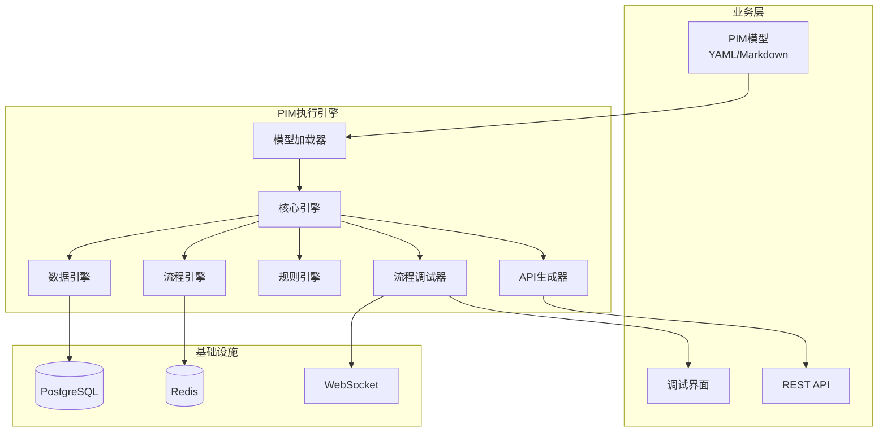

# 基于Claude Code的MDA实现方案

> **更新日期**: 2025-07-20  
> **状态**: MVP已实现并验证  
> **版本**: 2.0 - PIM执行引擎架构

## 1. 概述

本方案经历了从传统代码生成到**PIM执行引擎**的重大架构演进：

### 架构演进
1. **第一代（代码生成）**: PIM → PSM → 代码生成 → 部署运行
2. **第二代（执行引擎）**: PIM → 执行引擎 → 直接运行（无代码生成）

### 核心创新
- **无代码生成**: PIM模型直接被引擎解释执行
- **实时性**: 模型修改立即生效，无需重新编译部署
- **业务聚焦**: 业务人员只需关注PIM模型，完全屏蔽技术细节

## 2. PIM执行引擎架构

### 2.1 系统架构图


### 2.2 核心组件

#### 2.2.1 模型加载器 (Model Loader)
- 支持YAML和Markdown格式的PIM模型
- 动态解析实体、服务、流程和规则
- 热重载支持，模型修改即时生效

#### 2.2.2 数据引擎 (Data Engine)
- 根据PIM实体定义动态创建数据库表
- 自动处理CRUD操作
- 支持关系映射和约束验证

#### 2.2.3 API生成器 (API Generator)
- 动态生成RESTful API端点
- 自动创建Pydantic验证模型
- OpenAPI文档自动生成

#### 2.2.4 流程引擎 (Flow Engine)
- 解释执行业务流程图
- 支持决策节点和并行执行
- 集成规则引擎进行条件判断

#### 2.2.5 规则引擎 (Rule Engine)
- 执行自然语言定义的业务规则
- 支持复杂条件组合
- 可扩展至集成LLM

#### 2.2.6 流程调试器 (Flow Debugger)
- 实时可视化流程执行
- WebSocket推送执行状态
- 变量监控和断点调试

## 3. PIM模型规范

### 3.1 模型结构
```yaml
# 领域模型示例
domain: user-management
version: 1.0.0
description: 用户管理系统

entities:
  - name: User
    description: 系统用户
    attributes:
      name:
        type: string
        required: true
      email:
        type: string
        unique: true
      status:
        type: enum
        enum: [active, inactive]
    constraints:
      - email must be unique
      
services:
  - name: UserService
    methods:
      - name: registerUser
        parameters:
          userData: User
        flow: UserService.registerUser
        rules:
          - validate_email_format
          - check_email_uniqueness
          
flows:
  UserService.registerUser:
    description: 用户注册流程
    diagram: |
      flowchart TD
        Start --> ValidateEmail
        ValidateEmail -->|Invalid| ReturnError
        ValidateEmail -->|Valid| CheckUnique
        CheckUnique -->|Exists| ReturnDuplicate
        CheckUnique -->|Unique| CreateUser
        CreateUser --> SendEmail
        SendEmail --> End
    steps:
      - id: ValidateEmail
        type: decision
        next: [ReturnError, CheckUnique]
        
rules:
  validate_email_format: Email必须包含@符号
  check_email_uniqueness: Email不能已存在
```

### 3.2 支持的数据类型
- 基础类型: string, integer, decimal, boolean, datetime
- 复合类型: enum, json, array
- 引用类型: 实体引用（如User, Order）

### 3.3 流程定义
- 使用Mermaid flowchart语法
- 支持的节点类型: start, end, action, decision, validation
- 自动解析流程步骤和转换条件

## 4. 实施成果

### 4.1 已实现功能
✅ **核心引擎**
- PIM模型加载和解析
- 动态API生成
- 数据持久化
- 流程执行
- 规则验证
- 热重载

✅ **调试能力**
- Web调试界面
- 实时流程可视化
- WebSocket状态推送
- 变量监控

✅ **示例模型**
- 用户管理系统（User Management）
- 订单管理系统（Order Management）

### 4.2 性能指标
- 模型加载时间: <300ms
- API响应时间: <50ms
- 热重载检测: 5s间隔
- WebSocket延迟: <10ms

## 5. 使用指南

### 5.1 快速开始
```bash
# 1. 启动PIM引擎
docker compose up -d

# 2. 访问服务
- API: http://localhost:8001
- 调试界面: http://localhost:8001/debug/ui
- API文档: http://localhost:8001/docs

# 3. 创建PIM模型
# 在models/目录下创建YAML文件

# 4. 模型自动加载并生成API
```

### 5.2 API使用示例
```bash
# 创建用户
curl -X POST http://localhost:8001/api/v1/user-management/users \
  -H "Content-Type: application/json" \
  -d '{
    "name": "张三",
    "email": "zhangsan@example.com",
    "status": "active"
  }'

# 执行业务流程
curl -X POST http://localhost:8001/api/v1/user-management/user/registeruser \
  -H "Content-Type: application/json" \
  -d '{
    "userData": {
      "name": "李四",
      "email": "lisi@example.com"
    }
  }'
```

### 5.3 调试流程
1. 访问调试界面
2. 选择要调试的流程
3. 创建调试会话
4. 输入测试数据
5. 观察流程执行步骤

## 6. 斜杠命令集成

### 6.1 与执行引擎配合使用
```bash
# 传统生成方式（用于特殊需求）
/mda-generate-fastapi domain=用户管理 service=user-service

# 从引擎反向生成代码（导出功能）
/mda-export-from-engine model=user_management format=fastapi

# 验证模型
/mda-validate model=models/user_management.yaml

# 故障排除
/mda-troubleshooting issue="API not generated"
```

### 6.2 未来命令规划
- `/mda-test`: 自动生成测试用例
- `/mda-migrate`: 模型版本迁移
- `/mda-optimize`: 性能优化建议

## 7. 最佳实践

### 7.1 模型设计
1. **单一职责**: 每个服务专注于一个业务领域
2. **清晰命名**: 使用业务术语，避免技术术语
3. **完整约束**: 明确所有业务规则和验证条件
4. **流程图表**: 复杂逻辑使用流程图表达

### 7.2 开发流程
1. **业务优先**: 先设计PIM模型，再考虑技术实现
2. **迭代开发**: 小步快跑，持续验证
3. **团队协作**: 业务人员维护模型，技术人员优化引擎
4. **监控调试**: 充分利用调试界面验证业务逻辑

### 7.3 生产部署
1. **环境隔离**: 开发、测试、生产环境分离
2. **模型版本**: 使用Git管理PIM模型版本
3. **性能监控**: 关注API响应时间和资源使用
4. **备份恢复**: 定期备份模型和数据

## 8. 技术细节

### 8.1 技术栈
- **运行时**: Python 3.11 + FastAPI
- **数据库**: PostgreSQL + SQLAlchemy
- **缓存**: Redis
- **实时通信**: WebSocket
- **容器化**: Docker + Docker Compose

### 8.2 扩展机制
- **自定义类型**: 通过插件支持新数据类型
- **规则扩展**: 集成外部规则引擎或LLM
- **流程扩展**: 支持BPMN等标准流程语言
- **API扩展**: GraphQL、gRPC支持

## 9. 与传统MDA对比

| 特性 | 传统MDA（代码生成） | PIM执行引擎 |
|------|-------------------|-------------|
| 开发模式 | 生成代码后修改 | 直接修改模型 |
| 部署方式 | 编译部署 | 模型加载即运行 |
| 更新速度 | 分钟级 | 秒级（热重载） |
| 技术门槛 | 需要编程知识 | 仅需业务知识 |
| 灵活性 | 生成后可自由修改 | 受引擎能力限制 |
| 可维护性 | 代码模型易失同步 | 始终保持一致 |

## 10. 未来规划

### 10.1 短期目标（1-3个月）
- [ ] 完善类型系统（复杂对象支持）
- [ ] 增强调试功能（断点、单步执行）
- [ ] 性能优化（缓存、索引）
- [ ] 多语言支持（API文档、错误信息）

### 10.2 中期目标（3-6个月）
- [ ] 分布式部署支持
- [ ] 事件驱动架构
- [ ] 工作流编排
- [ ] 集成测试框架

### 10.3 长期愿景（6-12个月）
- [ ] AI辅助模型设计
- [ ] 自动性能优化
- [ ] 跨平台部署（云原生）
- [ ] 行业模型库

## 11. 总结

PIM执行引擎实现了真正的**模型驱动开发**愿景：
- 业务人员通过PIM模型直接定义系统行为
- 无需编写代码即可获得运行系统
- 模型即文档、模型即系统
- 业务变更通过修改模型立即生效

这标志着从"**代码生成**"到"**模型执行**"的范式转变，让MDA真正成为业务人员可用的开发方法。

---

**相关文档**：
- [PIM执行引擎架构设计](./PIM执行引擎架构设计.md)
- [PIM执行引擎实施路线图](./PIM执行引擎实施路线图.md)
- [基于大语言模型的MDA](./基于大语言模型的mda.md)