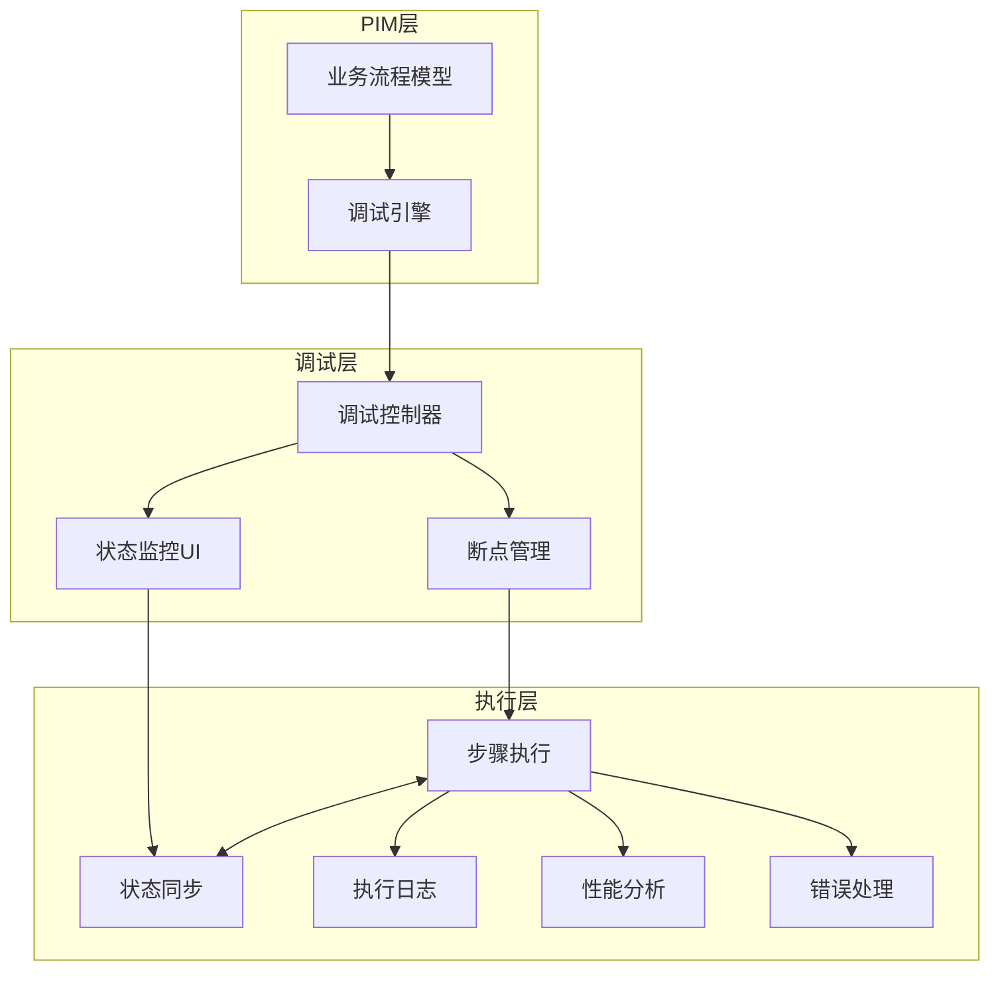

# 基于认知调试的业务流程调试系统

## 概述

基于PIM（Platform Independent Model）的业务流程调试系统，通过认知调试技术实现对业务流程的智能调试和可视化分析。

## 核心概念

### 1. 业务流程模型
基于PIM的业务流程模型包含以下核心要素：
- **流程步骤**：业务流程中的每个执行单元
- **决策节点**：条件判断和分支逻辑
- **数据转换**：业务数据的处理和转换
- **执行控制**：流程的执行顺序和条件

### 2. 调试架构



## 技术实现

### 1. 核心数据结构

```python
from typing import List, Dict, Any, Optional
from enum import Enum
from pydantic import BaseModel

class StepType(Enum):
    ACTION = "action"          # 执行动作
    DECISION = "decision"      # 决策判断
    VALIDATION = "validation"  # 数据验证
    TRANSFORM = "transform"    # 数据转换

class FlowStep(BaseModel):
    """流程步骤定义"""
    id: str
    name: str
    type: StepType
    description: str
    inputs: Dict[str, Any]
    outputs: Dict[str, Any]
    next_steps: List[str]  # 下一步骤列表
    conditions: Optional[Dict[str, Any]]  # 条件判断

class BusinessFlow(BaseModel):
    """业务流程定义"""
    name: str
    description: str
    steps: List[FlowStep]
    start_step: str
    end_steps: List[str]
    context_schema: Dict[str, Any]  # 上下文数据模式
```

### 2. 调试引擎实现

```python
import asyncio
from datetime import datetime
from typing import Optional, Callable

class CognitiveDebugger:
    """认知调试器"""
    
    def __init__(self, flow: BusinessFlow):
        self.flow = flow
        self.current_step: Optional[str] = None
        self.context: Dict[str, Any] = {}
        self.breakpoints: Set[str] = set()
        self.execution_history: List[Dict] = []
        self.watchers: Dict[str, Callable] = {}
        
    async def start(self, initial_context: Dict[str, Any]):
        """启动调试会话"""
        self.context = initial_context
        self.current_step = self.flow.start_step
        self.execution_history = []
        await self._execute_step(self.current_step)
        
    async def _execute_step(self, step_id: str):
        """执行单个步骤"""
        step = self._get_step(step_id)
        
        # 记录执行前状态
        pre_state = {
            "step_id": step_id,
            "timestamp": datetime.now(),
            "context_before": self.context.copy(),
            "type": "pre_execution"
        }
        self.execution_history.append(pre_state)
        
        # 断点检查
        if step_id in self.breakpoints:
            await self._handle_breakpoint(step)
            
        # 执行步骤逻辑
        result = await self._process_step(step)
        
        # 记录执行后状态
        post_state = {
            "step_id": step_id,
            "timestamp": datetime.now(),
            "context_after": self.context.copy(),
            "result": result,
            "type": "post_execution"
        }
        self.execution_history.append(post_state)
        
        # 通知观察者
        await self._notify_watchers(step_id, result)
        
        # 确定下一步
        next_step = await self._determine_next_step(step, result)
        if next_step and next_step not in self.flow.end_steps:
            await self._execute_step(next_step)
            
    async def _handle_breakpoint(self, step: FlowStep):
        """处理断点"""
        # 发送断点事件到UI
        await self.emit_event("breakpoint_hit", {
            "step": step.dict(),
            "context": self.context,
            "history": self.execution_history[-10:]  # 最近10条记录
        })
        
        # 等待继续执行
        await self.wait_for_continue()
```

### 3. 用户界面组件

```typescript
// React界面组件
interface DebuggerUIProps {
    flow: BusinessFlow;
    debugger: CognitiveDebugger;
}

const FlowDebuggerUI: React.FC<DebuggerUIProps> = ({ flow, debugger }) => {
    const [currentStep, setCurrentStep] = useState<string | null>(null);
    const [context, setContext] = useState<any>({});
    const [history, setHistory] = useState<ExecutionRecord[]>([]);
    const [breakpoints, setBreakpoints] = useState<Set<string>>(new Set());
    
    return (
        <div className="flow-debugger">
            {/* 流程可视化 */}
            <FlowDiagram 
                flow={flow}
                currentStep={currentStep}
                breakpoints={breakpoints}
                onStepClick={handleStepClick}
            />
            
            {/* 控制面板 */}
            <ControlPanel
                onStart={handleStart}
                onContinue={handleContinue}
                onStepOver={handleStepOver}
                onStop={handleStop}
            />
            
            {/* 上下文查看器 */}
            <ContextViewer 
                context={context}
                onEdit={handleContextEdit}
            />
            
            {/* 执行历史 */}
            <ExecutionHistory 
                records={history}
                onSelectRecord={handleHistorySelect}
            />
            
            {/* 断点管理 */}
            <BreakpointManager
                breakpoints={breakpoints}
                onToggle={handleBreakpointToggle}
            />
        </div>
    );
};
```

### 4. 流程可视化

使用D3.js或Mermaid.js实现流程的可视化展示：

```javascript
class FlowVisualizer {
    constructor(containerId, flow) {
        this.container = d3.select(`#${containerId}`);
        this.flow = flow;
        this.simulation = null;
    }
    
    render() {
        // 创建SVG容器
        const svg = this.container.append('svg')
            .attr('width', '100%')
            .attr('height', '600px');
            
        // 创建节点数据
        const nodes = this.flow.steps.map(step => ({
            id: step.id,
            label: step.name,
            type: step.type,
            x: Math.random() * 800,
            y: Math.random() * 600
        }));
        
        // 创建连接数据
        const links = [];
        this.flow.steps.forEach(step => {
            step.next_steps.forEach(next => {
                links.push({
                    source: step.id,
                    target: next,
                    condition: step.conditions?.[next]
                });
            });
        });
        
        // 设置力导向布局
        this.simulation = d3.forceSimulation(nodes)
            .force('link', d3.forceLink(links).id(d => d.id))
            .force('charge', d3.forceManyBody().strength(-300))
            .force('center', d3.forceCenter(400, 300));
            
        // 渲染连接线
        this.renderLinks(svg, links);
        this.renderNodes(svg, nodes);
    }
    
    highlightCurrentStep(stepId) {
        // 高亮当前执行步骤
        d3.selectAll('.flow-node')
            .classed('current', d => d.id === stepId);
    }
    
    markBreakpoint(stepId, enabled) {
        // 标记断点
        d3.select(`#node-${stepId}`)
            .classed('breakpoint', enabled);
    }
}
```

## 应用示例

### 1. PIM业务模型

```markdown
### 用户注册流程
1. 接收用户信息
2. 验证用户数据
   - 验证邮箱格式 → 通过
   - 验证手机号 → 通过
3. 检查用户存在性
   - 邮箱已存在 → 返回错误
   - 邮箱不存在 → 继续
4. 创建用户账户
5. 发送确认邮件
6. 返回注册结果
   - 注册成功 → 返回成功信息
   - 注册失败 → 返回错误信息
```

### 2. 调试器实现

```python
# 用户注册调试器
class CreateUserFlowDebugger(CognitiveDebugger):
    def __init__(self):
        flow = BusinessFlow(
            name="用户注册流程",
            description="用户注册业务处理流程",
            steps=[
                FlowStep(
                    id="receive_info",
                    name="接收用户信息",
                    type=StepType.ACTION,
                    description="接收并解析用户提交的注册信息",
                    inputs={"user_data": "dict"},
                    outputs={"parsed_data": "dict"},
                    next_steps=["validate_info"]
                ),
                FlowStep(
                    id="validate_info",
                    name="验证用户数据",
                    type=StepType.VALIDATION,
                    description="验证用户输入数据的有效性",
                    inputs={"parsed_data": "dict"},
                    outputs={"is_valid": "bool", "errors": "list"},
                    next_steps=["check_email", "return_error"],
                    conditions={
                        "check_email": "is_valid == True",
                        "return_error": "is_valid == False"
                    }
                ),
                # ... 更多步骤
            ],
            start_step="receive_info",
            end_steps=["return_success", "return_error"],
            context_schema={
                "user_data": "dict",
                "parsed_data": "dict",
                "validation_errors": "list",
                "user_id": "str",
                "created_at": "datetime"
            }
        )
        super().__init__(flow)
```

### 3. 使用示例

```python
# 创建调试器
debugger = CreateUserFlowDebugger()

# 设置断点
debugger.add_breakpoint("validate_info")
debugger.add_breakpoint("save_user")

# 添加数据观察器
debugger.watch("user_data.email", lambda value: print(f"Email changed to: {value}"))

# 启动调试
await debugger.start({
    "user_data": {
        "name": "张三",
        "email": "test@example.com",
        "phone": "13812345678"
    }
})

# 调试操作
await debugger.continue_execution()  # 继续执行
await debugger.step_over()          # 单步执行
await debugger.inspect_context()     # 检查上下文
await debugger.modify_context({"user_data.email": "new@example.com"})  # 修改数据
```

## 高级功能

### 1. 时间旅行调试
```python
class TimeTravel:
    """时间旅行调试功能"""
    
    def __init__(self, debugger: CognitiveDebugger):
        self.debugger = debugger
        self.snapshots: List[Dict] = []
        
    def save_snapshot(self):
        """保存执行快照"""
        self.snapshots.append({
            "timestamp": datetime.now(),
            "step": self.debugger.current_step,
            "context": self.debugger.context.copy(),
            "history": self.debugger.execution_history.copy()
        })
        
    def restore_snapshot(self, index: int):
        """恢复到指定快照"""
        snapshot = self.snapshots[index]
        self.debugger.current_step = snapshot["step"]
        self.debugger.context = snapshot["context"].copy()
        self.debugger.execution_history = snapshot["history"].copy()
```

### 2. 智能断点
```python
class SmartBreakpoint:
    """智能断点条件判断"""
    
    def __init__(self, condition: str, description: str):
        self.condition = condition
        self.description = description
        
    def should_break(self, context: Dict) -> bool:
        """判断是否应该断点"""
        return eval(self.condition, {"context": context})

# 使用示例
debugger.add_smart_breakpoint(
    SmartBreakpoint(
        condition="context.get('validation_errors') and len(context['validation_errors']) > 0",
        description="验证错误时断点"
    )
)
```

### 3. 性能分析
```python
class PerformanceProfiler:
    """流程性能分析器"""
    
    def analyze_execution(self, history: List[Dict]) -> Dict:
        """分析执行性能"""
        metrics = {
            "total_duration": 0,
            "step_durations": {},
            "bottlenecks": [],
            "average_step_time": 0
        }
        
        for i in range(0, len(history) - 1, 2):
            pre = history[i]
            post = history[i + 1]
            duration = (post["timestamp"] - pre["timestamp"]).total_seconds()
            
            step_id = pre["step_id"]
            metrics["step_durations"][step_id] = duration
            metrics["total_duration"] += duration
            
            if duration > 1.0:  # 超过1秒的步骤
                metrics["bottlenecks"].append({
                    "step": step_id,
                    "duration": duration
                })
                
        return metrics
```

## 集成方案

### 1. VS Code扩展
```typescript
// VS Code调试扩展
export class FlowDebuggerExtension {
    private debugger: CognitiveDebugger;
    private panel: vscode.WebviewPanel;
    
    activate(context: vscode.ExtensionContext) {
        // 注册调试命令
        context.subscriptions.push(
            vscode.commands.registerCommand('flow.debug', () => {
                this.startDebugging();
            })
        );
        
        // 创建调试面板
        this.panel = vscode.window.createWebviewPanel(
            'flowDebugger',
            'Flow Debugger',
            vscode.ViewColumn.Two,
            { enableScripts: true }
        );
    }
}
```

### 2. Web IDE集成
```javascript
// Web IDE调试插件
class FlowDebuggerPlugin {
    constructor(ide) {
        this.ide = ide;
        this.debuggerView = null;
    }
    
    install() {
        // 添加调试面板
        this.ide.addPanel({
            id: 'flow-debugger',
            title: 'Flow Debugger',
            component: FlowDebuggerUI,
            position: 'bottom'
        });
        
        // 注册快捷键
        this.ide.registerShortcut({
            key: 'F5',
            action: () => this.continue(),
            when: 'debuggerActive'
        });
    }
}
```

## 命令行工具

### 1. 命令行接口
```bash
# 从PIM生成调试器
flow-debug generate --pim models/domain/用户管理_pim.md --output debuggers/

# 启动调试会话
flow-debug start --flow 用户注册流程 --input test_data.json

# 交互式调试
flow-debug repl --flow 用户注册流程
```

### 2. API接口
```python
# FastAPI接口
@app.post("/debug/start")
async def start_debug_session(flow_name: str, initial_context: dict):
    session_id = str(uuid.uuid4())
    debugger = create_debugger(flow_name)
    sessions[session_id] = debugger
    await debugger.start(initial_context)
    return {"session_id": session_id}

@app.websocket("/debug/session/{session_id}")
async def debug_websocket(websocket: WebSocket, session_id: str):
    debugger = sessions.get(session_id)
    await websocket.accept()
    
    # 处理调试命令
    while True:
        command = await websocket.receive_json()
        result = await process_debug_command(debugger, command)
        await websocket.send_json(result)
```

## 最佳实践

1. **流程设计原则**
   - 保持步骤粒度适中
   - 明确数据流转
   - 合理设置断点

2. **调试策略**
   - 从关键节点开始
   - 逐步深入分析
   - 记录调试过程

3. **性能优化**
   - 避免过度断点
   - 合理使用快照
   - 监控执行时间

## 未来展望

1. **AI辅助调试**
   - 智能断点推荐
   - 异常模式识别
   - 自动修复建议

2. **可视化增强**
   - 3D流程展示
   - 实时数据流图
   - 交互式调试

3. **协作调试**
   - 多人同时调试
   - 调试会话共享
   - 远程调试支持
